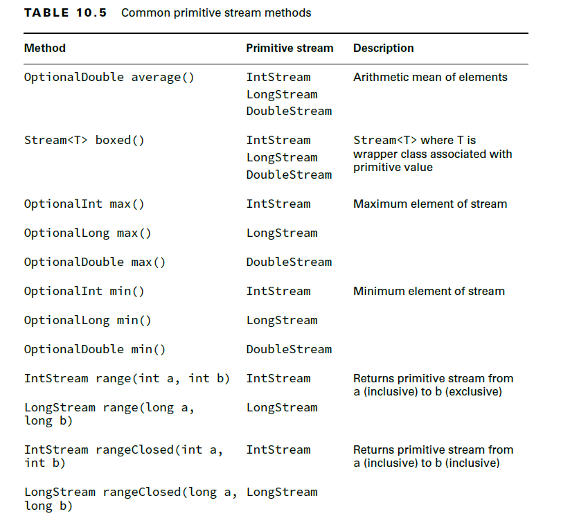
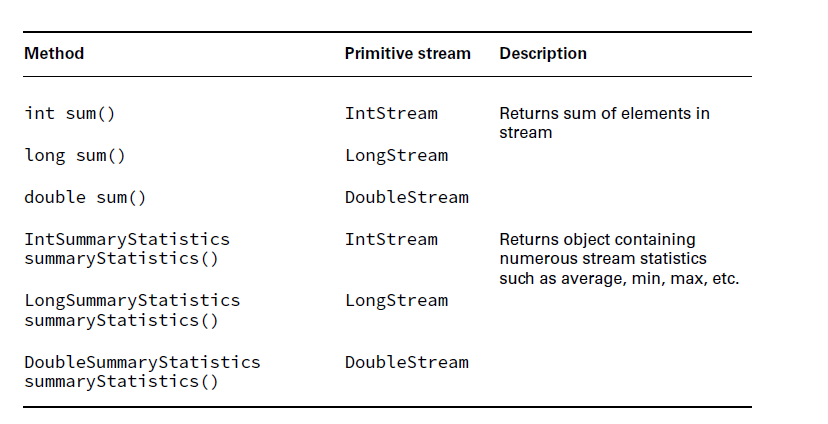
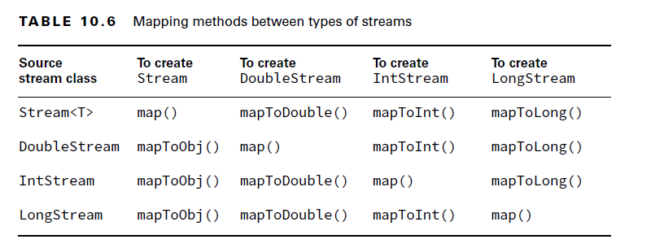
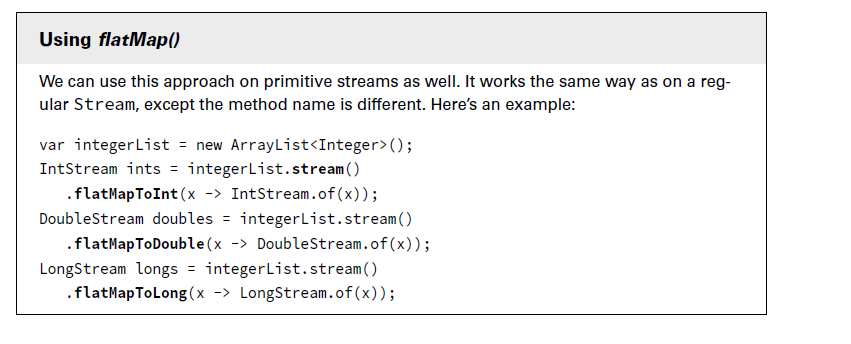
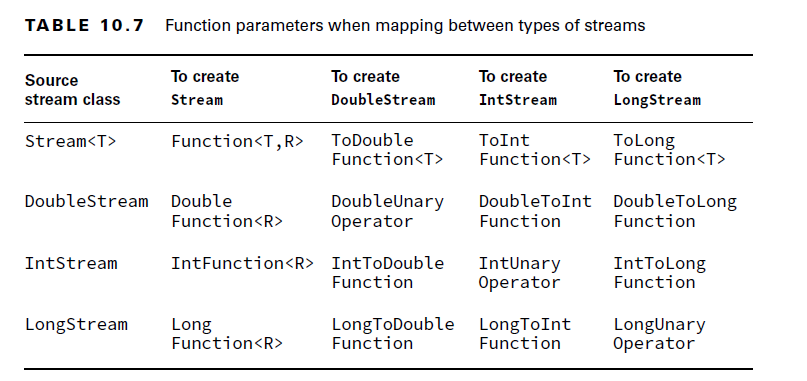

# 10. Streams

## 10.1 Optional:
- A container object which may or may not contain a non-null value.


- How to create optional?
````java
public static <T> Optional<T> empty();
public static <T> Optional<T> of(T value);
public static <T> Optional<T> ofNullable(T value);
````

- Methods on Optional


- Practices:
````java
Optional<String> optStr = null; //Compiles
//Optional<String> nullOpt1 = Optional.of(null); // NullPointerException: Internally uses Objects.requireNonNull()
Optional<String> nullOpt2 = Optional.ofNullable(null); //Compiles
//System.out.println(nullOpt2.get()); // java.util.NoSuchElementException: No value present

Optional<String> emptyStrOpt = Optional.of(""); //Compiles
System.out.println("empty: "+ emptyStrOpt.get()); //Compiles

Optional<String> greetOpt = Optional.of("Hello");
System.out.println("greet: "+greetOpt.get());
greetOpt.ifPresent(System.out::println);

System.out.println(nullOpt2.orElse("Hey")); //Hey
System.out.println(greetOpt.orElse("Hey")); //Hello
System.out.println(nullOpt2.orElseGet(()-> "HeySupplier")); //HeySupplier
//System.out.println(nullOpt2.orElseThrow()); //java.util.NoSuchElementException: No value present
System.out.println(nullOpt2.orElseThrow(()-> new IllegalArgumentException("Optional is Empty"))); //java.lang.IllegalArgumentException: Optional is Empty

````


## 10.2 Steams and Operations:
- A stream in Java is a sequence of data. 
- A stream pipeline consists of the operations that run on a stream to produce a result.
- With streams, the data isn’t generated up front; it is created when needed. 
- Streams are an example of lazy evaluation, which delays execution until necessary.
- There are three parts to a stream pipeline


- __Source:__ Where the stream comes from.
- __Intermediate operations:__
  - Transforms the stream into another stream. 
  - There can be as few or as many intermediate operations as you’d like. 
  - Since streams use lazy evaluation, the intermediate operations do not run until the terminal operation runs.
- __Terminal operation:__ 
  - Produces a result. 
  - Since streams can be used only once, the stream is no longer valid after a terminal operati


### Types of Steams:
  
    1. Finite Streams
    2. Infinite Streams

### 10.2.1 Finite Streams:
- Creating finite Streams
````java
//static methods from Stream class
public static <T> Stream<T> empty();
public static <T> Stream<T> of(T t);
public static <T> Stream<T> ofNullable(T t);
public static <T> Stream<T> of(T... values);
public static <T> Stream.Builder<T> builder(); //Returns a builder for a Stream.

//Collection:
public default Stream<E>  stream();


//Streams from Arrays:
public static DoubleStream stream(double[] array);
public static DoubleStream stream(double[] array, int startInclusive, int endExclusive);

public static IntStream stream(int[] array);
public static IntStream stream(int[] array, int startInclusive, int endExclusive);

public static LongStream stream(long[] array);
public static LongStream stream(long[] array, int startInclusive, int endExclusive);

public static <T> Stream<T> stream(T[] array);
public static <T> Stream<T> stream(T[] array, int startInclusive, int endExclusive);
````
- Practices:
````java
// Stream.of(null); //java.lang.NullPointerException: Cannot read the array length because "array" is null
// internallly uses Arrays.stream(values);
Stream.empty();
Stream.of("Hello");
Stream.of("Hello","hi", "hey");
Stream.ofNullable(null);

//From Collections:
var list = List.of("a", "b", "c");
//stream() method is from java.util.Collection class
Stream<String> fromList = list.stream();

private static void createStreamsUsingBuilder() {
  Stream.Builder<Integer> builder1 = Stream.builder();
  builder1.add(10).add(20);
  builder1.build().forEach(System.out::println);

  Stream.Builder<String> builder2 = Stream.builder();
  builder2.accept("hey");
  builder2.accept("how are you?");
  builder2.build().forEach(System.out::println);

}
````


### 10.2.2 Infinite Streams:
- Infinite Streams:
- operations like limit() to turn the infinite stream into a finite stream.
- How to create Infinite Streams?
````java
public static <T> Stream<T> generate(Supplier<? extends T> s);
public static <T> Stream<T> iterate(T seed, UnaryOperator<T> f);
public static <T> Stream<T> iterate(T seed, Predicate<? super T> hasNext, UnaryOperator<T> next); //seed, predicate, unary
````

- Practice:

````java

import java.util.stream.Stream;

Stream<Double> randoms = Stream.generate(Math::random);
Stream<Integer> oddNumbers = Stream.iterate(1, n -> n + 2);
Stream<Integer> firstTen = Stream.iterate(1, n->n<=10, n->n+1);

randoms.limit(2).forEach(System.out::println);
oddNumbers.skip(2).limit(2).forEach(System.out::println);
firstTen.forEach(System.out::print);

````
- For infinite streams, if you call forEach(System.out::println), the program executes until you kill it.


### Terminal Operations
- You can perform a terminal operation without any intermediate operations but not the other way around.
- **_Reductions_** are a special type of terminal operation where all the contents of the stream are combined into a single primitive or Object. 
- For example, you might have an int or a Collection.


#### Count:
- The count() method determines the number of elements in a finite stream. For an infinite stream, it never terminates.
- The count() method is a reduction because it looks at each element in the stream and returns a single value. 
````java
  public long count();
Stream<String> s = Stream.of("monkey", "gorilla", "bonobo");
System.out.println(s.count()); // 3
````

#### Min and Max
- The min() and max() methods allow you to pass a custom comparator and find the smallest or largest value in a finite stream according to that sort order.
- min() and max() hang on an infinite stream because they cannot be sure that a smaller or larger value isn’t coming later in the stream.
- Both methods are reductions because they return a single value after looking at the entire stream.
- If the stream is empty, the comparator is never called, and no value is present in the Optional.
````java
public Optional<T> min(Comparator<? super T> comparator);
public Optional<T> max(Comparator<? super T> comparator);
````

- Practice:
````java
Stream<String> s = Stream.of("monkey", "ape", "bonobo");
Optional<String> min = s.min((s1, s2) -> s1.length()-s2.length());
min.ifPresent(System.out::println); // ape

Optional<?> minEmpty = Stream.empty().min((s1, s2) -> 0);
System.out.println(minEmpty.isPresent()); // false
````
- What if you need both the min() and max() values of the same stream?
- TBD

#### Finding a Value
- The ___findAny()___ and ___findFirst()___ methods return an element of the stream unless the stream is empty. 
- If the stream is empty, they return an empty Optional. 
- It can terminate with an infinite stream. Since Java generates only the amount of stream you need, the infinite stream needs to generate only one element.
- These methods are terminal operations but not reductions. The reason is that they sometimes return without processing all the elements. 
- This means that they return a value based on the stream but do not reduce the entire stream into one value.

````java
public Optional<T> findAny();
public Optional<T> findFirst();
````

- practice:
````java
Stream<String> s = Stream.of("monkey", "gorilla", "bonobo");
Stream<String> infinite = Stream.generate(() -> "chimp");

s.findAny().ifPresent(System.out::println); // monkey (usually)
infinite.findAny().ifPresent(System.out::println); // chimp

````

#### Matching: allMatch() , anyMatch() , and noneMatch()
- The allMatch(), anyMatch(), and noneMatch() methods search a stream and return information about how the stream pertains to the predicate.
- These may or may not terminate for infinite streams. It depends on the data.

````java
public boolean anyMatch(Predicate <? super T> predicate);
public boolean allMatch(Predicate <? super T> predicate);
public boolean noneMatch(Predicate <? super T> predicate);
````

- Practice:
````java
Stream<String> infinite = Stream.generate(() -> "chimp");
Predicate<String> pred = x -> Character.isLetter(x.charAt(0));

System.out.println(list.stream().anyMatch(pred)); // true
System.out.println(list.stream().allMatch(pred)); // false
System.out.println(list.stream().noneMatch(pred)); // false
System.out.println(infinite.anyMatch(pred)); // true
````
- On the infinite stream, one match is found, so the call terminates. If we called allMatch(), it would run until we killed the program.
- Remember that allMatch(), anyMatch(), and noneMatch() return a boolean. By contrast, the find methods return an Optional because they return an element of the stream.

#### Iterating: forEach()
- calling forEach() on an infinite stream does not terminate
- Since there is no return value, it is not a reduction.
- Notice that this is the only terminal operation with a return type of void.
- Remember that you can call forEach() directly on a Collection or on a Stream
````java
public void forEach(Consumer<? super T> action);
````
-Practice:
````java
Stream<String> s = Stream.of("Monkey", "Gorilla", "Bonobo");
s.forEach(System.out::print); // MonkeyGorillaBonobo
````
- you can’t use a traditional for loop on a stream.
- Streams don’t implement the Iterable interface.
````java
Stream<Integer> s = Stream.of(1);
for (Integer i : s) {} // DOES NOT COMPILE
````

#### Reducing
- The reduce() method combines a stream into a single object. It is a reduction, which means it processes all elements.

````java
public T reduce(T identity, BinaryOperator<T> accumulator);
public Optional<T> reduce(BinaryOperator<T> accumulator);
public <U> U reduce(U identity, BiFunction<U,? super T,U> accumulator, BinaryOperator<U> combiner);
````
- The most common way of doing a reduction is to start with an initial value and keep merging it with the next value.
- Practice:

````java
Stream<String> stream = Stream.of("w", "o", "l", "f");
String word = stream.reduce("", (s, c) -> s + c);
//or
String word = stream.reduce("", String::concat);
System.out.println(word); // wolf
````
- The **_identity_** is the initial value of the reduction, in this case an empty String. 
- The **_accumulator_** combines the current result with the current value in the stream.

- **Method-2:**
- In many cases, the identity isn’t really necessary, so Java lets us omit it. 
- When you don’t specify an identity, an Optional is returned because there might not be any data. 
- There are three choices for what is in the Optional:
  - If the stream is empty, an empty Optional is returned.
  - If the stream has one element, it is returned.
  - If the stream has multiple elements, the accumulator is applied to combine them.

-Practice:

````java
BinaryOperator<Integer> op = (a, b) -> a * b;
Stream<Integer> empty = Stream.empty();
Stream<Integer> oneElement = Stream.of(3);
Stream<Integer> threeElements = Stream.of(3, 5, 6);
empty.reduce(op).ifPresent(System.out::println); // no output
oneElement.reduce(op).ifPresent(System.out::println); // 3
threeElements.reduce(op).ifPresent(System.out::println); // 90
````

- Method-3:
- The third method signature is used when we are dealing with different types. 
- It allows Java to create intermediate reductions and then combine them at the end.

````java
Stream<String> stream = Stream.of("w", "o", "l", "f!");
int length = stream.reduce(0, (i, s) -> i+s.length(), (a, b) -> a+b);
System.out.println(length); // 5
````
- The first parameter (0) is the value for the initializer. If we had an empty stream, this would be the answer. 
- The second parameter is the accumulator. Unlike the accumulators you saw previously, this one handles mixed data types.
- The third parameter is called the combiner, which combines any intermediate totals. In this case, a and b are both Integer values.
- The three-argument reduce() operation is useful when working with parallel streams

#### Collecting
- The collect() method is a special type of reduction called a mutable reduction. 
- It is more efficient than a regular reduction because we use the same mutable object while accumulating.
- Common mutable objects include StringBuilder and Collection

````java
public <R> R collect(Supplier<R> supplier, BiConsumer<R, ? super T> accumulator, BiConsumer<R, R> combiner);
public <R,A> R collect(Collector<? super T, A,R> collector);
````

- Practice:
````java
Stream<String> stream = Stream.of("w", "o", "l", "f");
StringBuilder word = stream.collect(
        StringBuilder::new,
        StringBuilder::append,
        StringBuilder::append);
System.out.println(word); // wolf
````

- The first parameter is the supplier, which creates the object that will store the results as we collect data.
- The second parameter is the accumulator, which is a BiConsumer that takes two parameters and doesn’t return anything. It is responsible for adding one more element to the data collection. In this example, it appends the next String to the StringBuilder.
- The final parameter is the combiner, which is another BiConsumer. It is responsible for taking two data collections and merging them. This is useful when we are processing in parallel. Two smaller collections are formed and then merged into one.

````java
Stream<String> stream = Stream.of("w", "o", "l", "f");
TreeSet<String> set = stream.collect(
TreeSet::new,
TreeSet::add,
TreeSet::addAll);
System.out.println(set); // [f, l, o, w]
````

- Java provides a class with common collectors cleverly named Collectors.
- This approach also makes the code easier to read because it is more expressive.
````java
Stream<String> stream = Stream.of("w", "o", "l", "f");
TreeSet<String> set = stream.collect(Collectors.toCollection(TreeSet::new));
System.out.println(set); // [f, l, o, w]
````
### Common Intermediate Operations:
- an intermediate operation produces a stream as its result. 
- An intermediate operation can also deal with an infinite stream simply by returning another infinite stream. 
- Since elements are produced only as needed, this works fine.

#### Filtering: filter()
- The filter() method returns a Stream with elements that match a given expression.

````java
public Stream<T> filter(Predicate<? super T> predicate);
````
- Practice
````java
Stream<String> s = Stream.of("monkey", "gorilla", "bonobo");
s.filter(x -> x.startsWith("m")).forEach(System.out::print); // monkey
````

#### Removing Duplicates: distinct()
- The distinct() method returns a stream with duplicate values removed.
- Java calls equals() to determine whether the objects are equivalent.

````java
public Stream<T> distinct();
````
- Practice:
````java
Stream<String> s = Stream.of("duck", "duck", "duck", "goose");
s.distinct().forEach(System.out::print); // duckgoose
````
#### Restricting by Position: limit() , skip()
- The limit() and skip() methods can make a Stream smaller, or limit() could make a finite stream out of an infinite stream.

````java
public Stream<T> limit(long maxSize);
public Stream<T> skip(long n);
````
- Practice:
````java
Stream<Integer> s = Stream.iterate(1, n -> n + 1);
s.skip(5).limit(2).forEach(System.out::print); // 67
````

#### Mapping: map(), flatMap()
- map()
- The map() method creates a one-to-one mapping from the elements in the stream to the elements of the next step in the stream.
````java
public <R> Stream<R> map(Function<? super T, ? extends R> mapper);
````
- Practice:
````java
Stream<String> s = Stream.of("monkey", "gorilla", "bonobo");
s.map(String::length).forEach(System.out::print); // 676
````
- **flatMap():**
- The flatMap() method takes each element in the stream and makes any elements it contains top-level elements in a single stream.
- This is helpful when you want to remove empty elements from a stream or combine a stream of lists

````java
public <R> Stream<R> flatMap(Function<? super T, ? extends Stream<? extends R>> mapper);
````

- Practice:
````java
List<String> zero = List.of();
var one = List.of("Bonobo");
var two = List.of("Mama Gorilla", "Baby Gorilla");
Stream<List<String>> animals = Stream.of(zero, one, two);
animals.flatMap(m -> m.stream()).forEach(System.out::println);
/*Here’s the output:
Bonobo
Mama Gorilla
Baby Gorilla*/
````
- As you can see, it removed the empty list completely and changed all elements of each list to be at the top level of the stream.

#### Concatenating Streams: concat()
- While flatMap() is good for the general case, there is a more convenient way to concatenate two streams:
````java
static <T> Stream<T> concat(Stream<? extends T> a, Stream<? extends T> b);
````

- Practice:
- 
 ````java
var one = Stream.of("Bonobo");
var two = Stream.of("Mama Gorilla", "Baby Gorilla");
Stream.concat(one, two).forEach(System.out::println);
````
- This produces the same three lines as the previous example. The two streams are concatenated, and the terminal operation, forEach(), is called.

#### Sorting: sorted()
- The sorted() method returns a stream with the elements sorted. 
- Just like sorting arrays, Java uses natural ordering unless we specify a comparator.

````java
public Stream<T> sorted();
public Stream<T> sorted(Comparator<? super T> comparator);
````

- Practice:
````java
Stream<String> s = Stream.of("brown-", "bear-");
s.sorted().forEach(System.out::print); // bear-brown-

Stream<String> s = Stream.of("brown bear-",
        "grizzly-");
s.sorted(Comparator.reverseOrder())
        .forEach(System.out::print); // grizzly-brown bear-

Stream<String> s = Stream.of("brown bear-", "grizzly-");
s.sorted(Comparator::reverseOrder); // DOES NOT COMPILE
````
- Because reverseOrder() takes no arguments and returns a value.
- the method reference is equivalent to () -> Comparator.reverseOrder(), which is really a Supplier<Comparator>. 
- This is not compatible with sorted(Comparator) method.

#### Peek():

- It is useful for debugging because it allows us to perform a stream operation without changing the stream.
````java
public Stream<T> peek(Consumer<? super T> action);
````
- Think of peek() as an intermediate version of forEach() that returns the original stream to you.

- Practice:
````java
var stream = Stream.of("black bear", "brown bear", "grizzly");
long count = stream.filter(s -> s.startsWith("g")).peek(System.out::println).count(); // grizzly
System.out.println(count); //1
````
- Note:
- Remember that peek() is intended to perform an operation without changing the result.
````java
var numbers = new ArrayList<>();
var letters = new ArrayList<>();
numbers.add(1);
letters.add('a');

Stream<List<?>> stream = Stream.of(numbers, letters);
stream.map(List::size).forEach(System.out::print); // 11

//Now we add a peek() call and note that Java doesn’t prevent us from writing bad peek code:

Stream<List<?>> bad = Stream.of(numbers, letters);
bad.peek(x -> x.remove(0)).map(List::size).forEach(System.out::print); // 00
````
- This example is bad because peek() is modifying the data structure that is used in the stream, which causes the result of the stream pipeline to be different than if the peek wasn’t present.

#### Stream Pipeline:
- Streams allow you to use chaining and express what you want to accomplish rather than how to do so. 
- Let’s say that we wanted to get the first two names of our friends alphabetically that are four characters long.

````java
var list = List.of("Toby", "Anna", "Leroy", "Alex");
List<String> filtered = new ArrayList<>();
for (String name: list)
    if (name.length() == 4) filtered.add(name);

Collections.sort(filtered);
var iter = filtered.iterator();
if (iter.hasNext()) System.out.println(iter.next());
if (iter.hasNext()) System.out.println(iter.next());
````
- streams:
````java
var list = List.of("Toby", "Anna", "Leroy", "Alex");
list.stream().filter(n -> n.length() == 4).sorted().limit(2).forEach(System.out::println);

//we can format it.

var list = List.of("Toby", "Anna", "Leroy", "Alex");
list.stream()
.filter(n -> n.length() == 4)
.sorted()
.limit(2)
.forEach(System.out::println);
````

- Practice:
````java
long count = Stream.of("goldfish", "finch")
.filter(s -> s.length()> 5)
.collect(Collectors.toList())
.stream()
.count();
System.out.println(count); // 1
````
- When you see chained pipelines, note where the source and terminal operations are. This will help you keep track of what is going on.


## 10.3 Primitive Streams: IntStream, LongStream and DoubleStream:
- Up until now, all of the streams we’ve created used the Stream interface with a generic type, like Stream<String>, Stream<Integer>, and so on. 
- For numeric values, we have been using wrapper classes.
- Java actually includes other stream classes besides Stream that you can use to work with select primitives: int, double, and long
- An IntStream has many of the same intermediate and terminal methods as a Stream but includes specialized methods for working with numeric data.
- The primitive streams know how to perform certain common operations automatically like min(), max(), average(), sum() etc.

### Types of Primitive Streams:
Here are the three types of primitive streams:

    IntStream: Used for the primitive types int, short, byte, and char
    LongStream: Used for the primitive type long
    DoubleStream: Used for the primitive types double and float
- Common Primitive Stream Methods:





#### 10.3.1 Creating Primitive Streams:
- Some of the methods for creating a primitive stream are equivalent to how we created the source for a regular Stream.

- Syntax:

````java
//All the regular Stream methods:

import java.util.stream.IntStream;

empty();
of(int);
of(int ... ints);

generate();
iterate();

mapToInt();
mapToDouble();
mapToLong();

````

- Practice:
````java
import java.util.Random;
import java.util.stream.DoubleStream;
import java.util.stream.LongStream;

DoubleStream empty = DoubleStream.empty();
DoubleStream oneValue = DoubleStream.of(3.14);
DoubleStream varargs = DoubleStream.of(1.0, 1.1, 1.2);
var random = DoubleStream.generate(Math::random);
var fractions = DoubleStream.iterate(.5, d -> d / 2);

//Using java.util.Random class
var random = new Random(); //there are 3 overloaded methods are there
IntStream ints = random.ints();
LongStream longs = random.longs();
DoubleStream doubles =random.doubles();

````

#### Mapping Streams:
- Another way to create a primitive stream is by mapping from another stream type.

- Syntax:
````java
DoubleStream mapToDouble(ToDoubleFunction<? super T> mapper);
IntStream mapToInt(ToIntFunction<? super T> mapper);
LongStream mapToLong(ToLongFunction<? super T> mapper);
//mapMulti is other methods

DoubleStream flatMapToDouble(Function<? super T,? extends DoubleStream> mapper);
IntStream flatMapToInt(Function<? super T,? extends IntStream> mapper);
LongStream flatMapToLong(Function<? super T,? extends LongStream> mapper);
````






- Funtion Types for mappings:



- Primitive to Object Streams
- 2 ways: mapToObj() and boxed()
````java

private static Stream<Integer> mapping(IntStream stream) {
    return stream.mapToObj(x -> x);
}
private static Stream<Integer> boxing(IntStream stream) {
    return stream.boxed();
}
````

- Practice:
- This function takes an Object, which is a String in this case. The function returns an int.
````java
Stream<String> objStream = Stream.of("penguin", "fish");
IntStream intStream = objStream.mapToInt(s -> s.length());
````

#### Using Optional with Primitive Streams:

- The difference is that OptionalDouble is for a primitive and Optional<Double> is for the Double wrapper class. 
- Working with the primitive optional class looks similar to working with the Optional class itself.


- Practice:
````java
var stream = IntStream.rangeClosed(1,10);
OptionalDouble optional = stream.average();
optional.ifPresent(System.out::println); // 5.5
System.out.println(optional.getAsDouble()); // 5.5
System.out.println(optional.orElseGet(() ->Double.NaN)); // 5.5

````
- The only noticeable difference is that we called getAsDouble() rather than get().
- This makes it clear that we are working with a primitive. 
- Also, orElseGet() takes a DoubleSupplier instead of a Supplier.

- Primitive Optional classes methods:


- Practice:

````java
LongStream longs = LongStream.of(5, 10);
long sum = longs.sum();
System.out.println(sum); // 15
````

### Summarizing Statistics:
- Summary statistics include the following:
 
  - **getCount():** Returns a long representing the number of values.
  - **getAverage():** Returns a double representing the average. If the stream is empty, returns 0.
  - **getSum():** Returns the sum as a double for DoubleSummaryStream and long for IntSummaryStream and LongSummaryStream.
  - **getMin():** Returns the smallest number (minimum) as a double, int, or long, depending on the type of the stream. If the stream is empty, returns the largest numeric value based on the type.
  - **getMax():** Returns the largest number (maximum) as a double, int, or long depending on the type of the stream. If the stream is empty, returns the smallest numeric value based on the type.
  
- Syntax:

````java
DoubleSummaryStatistics summaryStatistics(); //DoubleStream
IntSummaryStatistics summaryStatistics(); //IntStream
LongSummaryStatistics summaryStatistics(); //LongStream

````

- Practice:
````java

````


## Advanced Stream Pipeline Concepts:


##### References:
1. Optional: https://docs.oracle.com/en/java/javase/17/docs/api/java.base/java/util/Optional.html
2. 