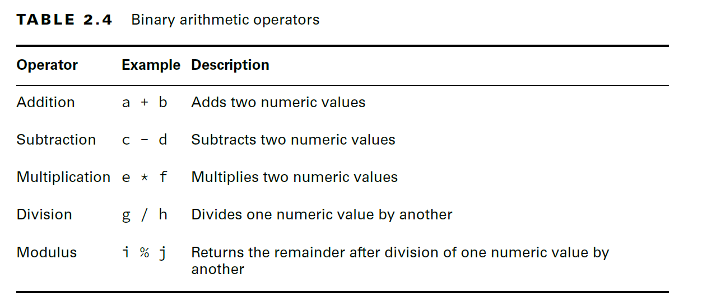

# Operators

- A Java operator is a special symbol that can be applied to a set of variables, values, or literals—referred to as operands—and that returns a result.
- The term operand, which we use throughout this chapter, refers to the value or variable the operator is being applied to.


- Java supports three flavors of operators: 
    
        - unary, 
        - binary, 
        - and ternary. 
- These types of operators can be applied to one, two, or three operands.
- Java operators are not necessarily evaluated from left-to-right order.

### Operator Precedence:
- Determining which operators are evaluated in what order is referred to as operator precedence.
- Unless overridden with parentheses, Java operators follow order of operation, listed in the below image, by decreasing order of operator precedence.
- If two operators have the same level of precedence, then Java guarantees left-to-right evaluation for most operators other than the ones marked in the table.


#### Unary Operators:

- By definition, a unary operator is one that requires exactly one operand, or variable, to function.


- The logical complement operator (!) flips the value of a boolean expression. 
- For example, if the value is true, it will be converted to false, and vice versa.
- bitwise complement operator (~), which flips all of the 0s and 1s in a number. 
- It can only be applied to integer numeric types such as byte, short, char, int, and long.
- you cannot apply a negation operator (-) to a boolean expression, nor can you apply a logical complement operator (!) to a numeric expression.

````java
int pelican = !5; // DOES NOT COMPILE
boolean penguin = -true; // DOES NOT COMPILE
boolean peacock = !0; // DOES NOT COMPILE
````

#### Increment and Decrement Operators:

- Increment and decrement operators, ``++`` and ``--`` respectively, can be applied to numeric variables and have a high order of precedence compared to binary operators. 
- In other words, they are often applied first in an expression.


````java
int parkAttendance = 0;
System.out.println(parkAttendance); // 0
System.out.println(++parkAttendance); // 1
System.out.println(parkAttendance); // 1
System.out.println(parkAttendance--);// 1
System.out.println(parkAttendance); // 0
````

- The first pre-increment operator updates the value for parkAttendance and outputs the new value of 1. 
- The next post-decrement operator also updates the value of parkAttendance but outputs the value before the decrement occurs.
- Increment and Decrement operators works with all the numeric data types + char. cannot be used for boolean and string

___

### Binary Arithmetic Operators

- Operators that take two operands, called binary operators.
- They can be used to perform mathematical operations on variables, create logical expressions, and perform basic variable assignments.

#### Arithmetic Operators:
- Arithmetic operators are those that operate on numeric values.
- All the arithmetic operators may be applied to any Java primitives except boolean.



#### Adding Parentheses:

- you can change the order of operation explicitly by wrapping parentheses around the sections you want evaluated first.
- When working with parentheses, you need to make sure they are always valid and balanced.
- Java does not allow brackets `[]` to be used in place of parentheses.
````java
int price = 2 * ((5 + 3) * 4 -8);
long pigeon = 1 + ((3 * 5) / 3; // DOES NOT COMPILE
int blueJay = (9 + 2) + 3) / (2 * 4; // DOES NOT COMPILE
short robin = 3 + [(4 * 2) + 4]; // DOES NOT COMPILE

````

- The modulus operation is not limited to positive integer values in Java; it may also be applied to negative integers and floating-point numbers.
- For the exam, though, you are not required to be able to take the modulus of a negative integer or a floating-point number.


___

### Numeric Promotion:

- Numeric Promotion Rules:

    
    1. If two values have different data types, Java will automatically promote one of the values to the larger of the two data types.

    2. If one of the values is integral and the other is floating-point, Java will automatically promote the integral value to the floating-point value’s data type.

    3. Smaller data types namely byte, short, and char are first promoted to int any time they’re used with a Java binary arithmetic operator with a variable (as opposed to a value), even if neither of the operands is int.
 
    4. After all promotion has occurred and the operands have the same data type, the resulting value will have the same data type as its promoted operands.

- The last two rules are the ones most people have trouble with and the ones likely to trip you up on the exam.
- For the third rule, note that unary operators are excluded from this rule. For example, applying ++ to a short value results in a short value.

````java
//What is the data type of x * y?
int x = 1;
long y = 33;
var z = x * y; // z is long

//What is the data type of x + y?
double x = 39.21;
float y = 2.1; // DOES NOT COMPILE  incompatible types: possible lossy conversion from double to float 
//without mentioning F/f it is considered as double
float m = 2.1f;
var z = x + m;// z is double

//What is the data type of x * y?
short x = 10;
short y = 3;
var z = x * y;
// x and y will both be promoted to int before the binary multiplication operation, resulting in an output of type int.

//What is the data type of w * x / y?
short w = 14;
float x = 13;
double y = 30;
var z = w * x / y;
/*
 * First, w will automatically be promoted to
int solely because it is a short and is being used in an arithmetic binary operation. The
promoted w value will then be automatically promoted to a float so that it can be multiplied
with x. The result of w * x will then be automatically promoted to a double so
that it can be divided by y, resulting in a double value.
 * 
 * */
````
- When working with arithmetic operators in Java, you should always be aware of the data type of variables, intermediate values, and resulting values.

### Assignment Operator:

- Compilation errors from assignment operators are often overlooked on the exam
- To be successful with the assignment operators, you should be fluent in understanding how the compiler handles numeric promotion and when casting is required.
- An assignment operator is a binary operator that modifies, or assigns, the variable on the left side of the operator with the result of the value on the right side of the equation.
- the assignment operator is evaluated from right to left.
- Java will automatically promote from smaller to larger data types
- it will throw a compiler exception if it detects that you are trying to convert from larger to smaller data types without casting.

#### Casting Values:

- Casting is a unary operation where one data type is explicitly interpreted as another data type.
- Casting is optional and unnecessary when converting from smaller to a larger or widening data type
- Casting is required when converting from a larger data type to a smaller or narrowing data type.
- Spaces between the cast and the value are optional.
- Casting is performed by placing the data type, enclosed in parentheses, to the left of the value you want to cast.
````java
String type = (String) "Bird";
short tail = (short)(4 + 10);
long feathers = 10(long); // DOES NOT COMPILE
````
- compiler automatically casts smaller data types to larger ones.
````java
//All of these examples involve putting a larger value into a smaller data type.
float egg = 2.0 / 9; // DOES NOT COMPILE
int tadpole = (int)5 * 2L; // DOES NOT COMPILE
short frog = 3 -2.0; // DOES NOT COMPILE
````
- casting a numeric value may change the data type, while casting an object only changes the reference to the object, not the object itself.

#### Reviewing Primitive Assignments:
- Casting primitives is required any time you are going from a larger numerical data type to a smaller numerical data type, or converting from a floating-point number to an integral value.
````java
int fish = 1.0; // DOES NOT COMPILE: incompatible types: possible lossy conversion from double to int 
short bird = 1921222; // DOES NOT COMPILE: out of range
int mammal = 9f; // DOES NOT COMPILE: float is trying to assign to int
long reptile = 192_301_398_193_810_323; // DOES NOT COMPILE:  integer number too large
// Java interprets the literal as an int: value is more than int max, use L or l to compile

//Fix:

int fish = (int)1.0;
short bird = (short)1921222; // Stored as 20678
int mammal = (int)9f;
long reptile = (long)192301398193810323; // DOES NOT COMPILE: This still does not compile because the value is first interpreted as an int by the compiler and is out of range.
long reptile = 192301398193810323L; //works

````

#### Overflow and Underflow:
- **_Overflow_** is when a number is so large that it will no longer fit within the data type, so the system “wraps around” to the lowest negative value and counts up from there, similar to how modulus arithmetic works. 
- There’s also an analogous **_underflow_**, when the number is too low to fit in the data type, such as storing -200 in a byte field.
````java
System.out.print(2147483647+1); // -2147483648
````
- Since 2147483647 is the maximum int value, adding any strictly positive value to it will cause it to wrap to the smallest negative number.

````java
short mouse = 10;
short hamster = 3;
short capybara = mouse * hamster; // DOES NOT COMPILE
//short values are automatically promoted to int when applying any arithmetic operator, with the resulting value being of type int.
short capybara = (short)mouse * hamster; // DOES NOT COMPILE
short capybara = (short)(mouse * hamster);//works
short capybara = 1 + (short)(mouse * hamster); // DOES NOT COMPILE
//In the example, casting is performed successfully, but the resulting value is automatically promoted to int because it is used with the binary arithmetic operator (+).
````
- By casting a larger value into a smaller data type, you instruct the compiler to ignore its default behavior. 
- In other words, you are telling the compiler that you have taken additional steps to prevent overflow or underflow.

#### Casting Values vs. Variables:

- the compiler doesn’t require casting when working with literal values that fit into the data type.

````java
byte hat = 1;
byte gloves = 7 * 10;
short scarf = 5;
short boots = 2 + 1;
````

````java
short boots = 2 + hat; // DOES NOT COMPILE: does not compile because hat is a variable
byte gloves = 7 * 100; // DOES NOT COMPILE: out of range: 700 triggers an overflow for byte, byte has a maximum value of 127.
````
- ``boots`` does not compile because ``hat`` is a variable, not a value, and both operands are automatically promoted to ``int``.
- When working with values, the compiler had enough information to determine the writer’s intent. 
- When working with variables, though, there is ambiguity about how to proceed, so the compiler reports an error. 

#### Compound Assignment Operators:


- Compound operators are useful for more than just shorthand—they can also save you from having to explicitly cast a value.
````java
long goat = 10;
int sheep = 5;
sheep = sheep * goat; // DOES NOT COMPILE: We are trying to assign a long value to an int variable.
sheep *= goat; //works: 
/*The compound operator will first cast sheep to a long, apply the multiplication of two
long values, and then cast the result to an int. Unlike the previous example, in which the
compiler reported an error, the compiler will automatically cast the resulting value to the
data type of the value on the left side of the compound operator.
 */

````

#### Return Value of Assignment Operators:

- the result of an assignment is an expression in and of itself equal to the value of the assignment.

````java
long wolf = 5;
long coyote = (wolf=3);
System.out.println(wolf); // 3
System.out.println(coyote); // 3
````

- The key here is that (wolf=3) does two things. First, it sets the value of the variable wolf to be 3. 
- Second, it returns a value of the assignment, which is also 3.

````java
boolean healthy = false;
if(healthy = true)
    System.out.print("Good!"); //Good! printed
````

- it’s actually assigning healthy a value of true. The result of the assignment is the value of the assignment, which is true, resulting in this snippet printing Good!.


### Comparing Values:
- They can be used to check if two values are the same, check if one numeric value is less than or greater than another, and perform Boolean arithmetic.

#### Equality Operators:


- The equality operator can be applied to numeric values, boolean values, and objects (including String and null). 
- When applying the equality operator, you cannot mix these types.

````java
boolean monkey = true == 3; // DOES NOT COMPILE
boolean ape = false != "Grape"; // DOES NOT COMPILE
boolean gorilla = 10.2 == "Koko"; // DOES NOT COMPILE
````
- Pay close attention to the data types when you see an equality operator on the exam.
- For object comparison, the equality operator is applied to the references to the objects, not the objects they point to. 
- Two references are equal if and only if they point to the same object or both point to null.

````java
var monday = new File("schedule.txt");
var tuesday = new File("schedule.txt");
var wednesday = tuesday;
System.out.println(monday == tuesday); // false
System.out.println(tuesday == wednesday); // true
````
#### Relational Operators:

- which compare two expressions and return a boolean value.


- If the two numeric operands are not of the same data type, the smaller one is promoted
- It is considered a good coding practice to use the instanceof operator prior to casting from one object to a narrower type.
- Invalid instanceof:
````java
public void openZoo(Number time) {
    if(time instanceof String) // DOES NOT COMPILE: Number caanot hold String
        System.out.print(time);
}
````

- If the compiler can determine that a variable cannot possibly be cast to a specific class, it reports an error.
- null and the instanceof operator: calling instanceof on the null literal or a null reference always returns false.
````java
System.out.print(null instanceof Object); // false
Object noObjectHere = null;
System.out.print(noObjectHere instanceof String); // false
````
- It almost doesn’t matter what the right side of the expression is. We say “almost” because there are exceptions. 
- Below example does not compile, since null is used on the right side of the instanceof operator:
````java
System.out.print(null instanceof null); // DOES NOT COMPILE
````

#### Logical Operators:

- The logical operators, (&), (|), and (^), may be applied to both numeric and boolean data types;
- When they’re applied to boolean data types, they’re referred to as logical operators.
- Alternatively, when they’re applied to numeric data types, they’re referred to as bitwise operators, as they perform bitwise comparisons of the bits that compose the number.


- Below x and y are assumed to be boolean data types.


- **AND** is only true if both operands are true.
- **Inclusive OR** is only false if both operands are false.
- **Exclusive OR** is only true if the operands are different.

#### Conditional Operators:
- The conditional operators, often called short-circuit operators, are nearly identical to the logical operators, & and |.
- Except that the right side of the expression may never be evaluated if the final result can be determined by the left side of the expression.


````java
int hour = 10;
boolean zooOpen = true || (hour < 4);
System.out.println(zooOpen); // true
````

- Since we know the left side is true, there’s no need to evaluate the right side, since no value of hour will ever make this code print false.

````java
//The issue is that the logical AND (&) operator evaluates both sides of the expression.

if(duck!=null & duck.getAge()<5) { // Could throw a NullPointerException
// Do something
}

// An easy-to-read solution is to use the conditional AND operator (&&)
if(duck!=null && duck.getAge()<5) {
    // Do something
}
//In this example, if duck is null, the conditional prevents a NullPointerException
````
- Unperformed Side Effects
````java
int rabbit = 6;
boolean bunny = (rabbit >= 6) || (++rabbit <= 7); //the right side of the expression that may never be reached.
System.out.println(rabbit);

//Because rabbit >= 6 is true, the increment operator on the right side of the expression is never evaluated, so the output is 6.
````

#### Making Decisions with the Ternary Operator:

- It is notable in that it is the only operator that takes three operands. 
- The ternary operator has the following form: `` booleanExpression ? expression1 : expression2``
- The first operand must be a boolean expression, 
- and the second and third operands can be any expression that returns a value. 
- The ternary operation is really a condensed form of a combined if and else statement that returns a value.

````java
int stripes = 7;
//Both expressions evaluate similar boolean values and return an int and a String, although only the first one will compile. 
// System.out.print() does not care that the expressions are completely different types, because it can convert both to Object values and call toString() on them.
System.out.print((stripes > 5) ? 21 : "Zebra");//works

int animal = (stripes < 9) ? 3 : "Horse"; // DOES NOT COMPILE: String data type and cannot be assigned to an int
```` 

- Examples on Side Effects:
````java
int sheep = 1;
int zzz = 1;
int sleep = zzz<10 ? sheep++ : zzz++;
System.out.print(sheep + "," + zzz); // 2,1

int sheep = 1;
int zzz = 1;
int sleep = sheep>=10 ? sheep++ : zzz++;
System.out.print(sheep + "," + zzz); // 1,2
````