# Making Decisions

### Control flow statements:
- Control flow statements break up the flow of execution by using decision-making, looping, and branching, allowing the application to selectively execute particular segments of code.
- These statements can be applied to single expressions as well as a block of Java code
- a block of code in Java is a group of zero or more statements between balanced braces ({}) and can be used anywhere a single statement is allowed.
- the following two snippets are equivalent
````java
// Single statement
patrons++;

// Statement inside a block
{
    patrons++;
}
````

#### If Statement:

- execute a particular block of code if and only if a boolean expression evaluates to true at runtime.
-  
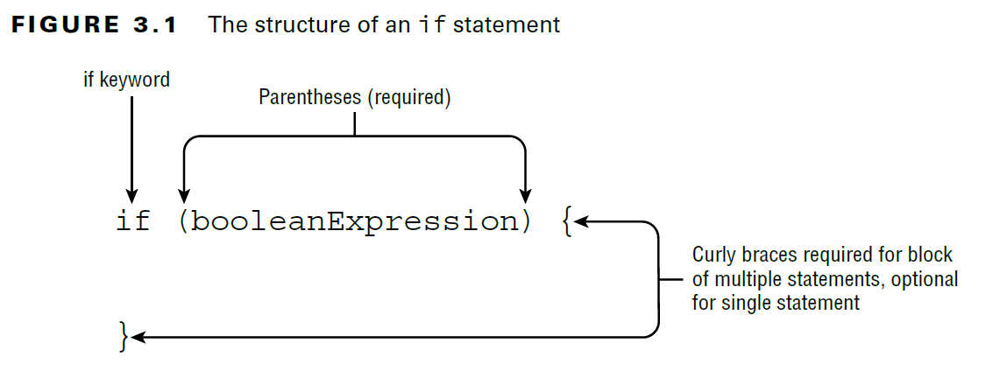

- Be careful:
- It will execute the print statement only if the condition is met, but it will always execute the increment operation.
````java
if(hourOfDay < 11)
    System.out.println("Good Morning");// Only this statement executed when condiation is true
    morningGreetingCount++;//this is nothing to do with if statement it always executed
````

- Tabs are just whitespace and are not evaluated as part of the execution. 
- When you see a control flow statement in a question, be sure to trace the open and close braces of the block, ignoring any indentation you may come across.

#### if-else:

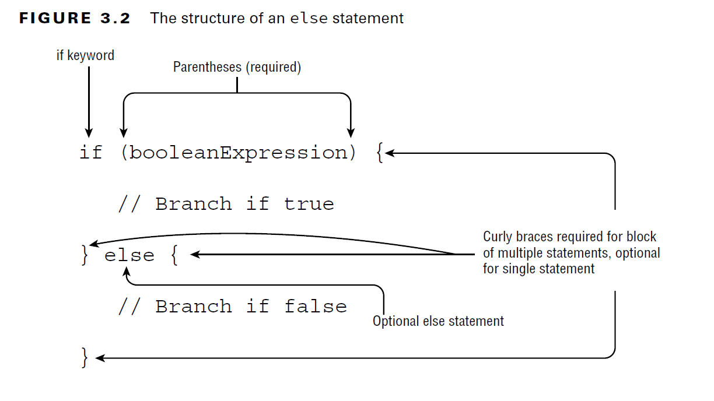

- we can append additional if statements to an else block

````java
if(hourOfDay < 11) {
    System.out.println("Good Morning");
} else if(hourOfDay < 15) {
    System.out.println("Good Afternoon");
} else {
    System.out.println("Good Evening");
}
````

#### Pattern Matching:

- Java 16 officially introduced pattern matching with if statements and the instanceof operator.
- Pattern matching is a technique of controlling program flow that only executes a section of code that meets certain criteria. 
- It is used in conjunction with if statements for greater program control.
- Pattern matching is used to reduce boilerplate in your code.
- Boilerplate code is code that tends to be duplicated throughout a section of code over and over again in a similar manner.
- Before Pattern Matching:
````java
void compareIntegers(Number number) {
    if(number instanceof Integer) {
        Integer data = (Integer)number;
        System.out.print(data.compareTo(5));
    }
}
````
- The cast is needed since the compareTo() method is defined on Integer, but not on Number.
- Code that first checks if a variable is of a particular type and then immediately casts it to that type
- With Pattern Matching:
````java
void compareIntegers(Number number) {
    if(number instanceof Integer data) {
        System.out.print(data.compareTo(5));
    }
}
````

- The variable data in this example is referred to as the pattern variable.
- Notice that this code also avoids any potential ClassCastException because the cast operation is executed only if the implicit instanceof operator returns true.
- Reassigning Pattern Variables:
- While possible, it is a bad practice to reassign a pattern variable since doing so can lead to ambiguity about what is and is not in scope.
- The reassignment can be prevented with a final modifier, but it is better not to reassign the variable at all.
  
````java
if(number instanceof Integer data) {
    data = 10;
}
if(number instanceof final Integer data) {
    data = 10; // DOES NOT COMPILE final variable cannot be reassigned
}
````

- Pattern Variables and Expressions:
````java
void printIntegersGreaterThan5(Number number) {
if(number instanceof Integer data && data.compareTo(5)>0)//works
    System.out.print(data);
}
````

#### Subtypes:
- The type of the pattern variable must be a subtype of the variable on the left side of the expression. 
- It also cannot be the same type. This rule does not exist for traditional instanceof operator expressions.
- pattern matching requires that the pattern variable type should be a strict subtype.
````java
Integer value = 123;
if(value instanceof Integer) {}
if(value instanceof Integer data) {} // DOES NOT COMPILE: value is same type not a subtype of Integer
````

- Limitations of Subtype Enforcement:
- The compiler has some limitations on enforcing pattern matching types when we mix classes and interfaces
- For example, given the non-final class Number and interface List, this does compile even though they are unrelated:
- 
````java
//Non-Final class works
Number value = 123;
if(value instanceof List) {}
if(value instanceof List data) {}

//Final class won't work
String name = "Hello";
if(name instanceof List){}
if(name instanceof List data){}//DOES NOT COMPILE:  incompatible types: String cannot be converted to List
````

####  Flow Scoping
- Flow scoping means the variable is only in scope when the compiler can definitively determine its type.
- It is determined by the compiler based on the branching and flow of the program.

````java
void printIntegersOrNumbersGreaterThan5(Number number) {
    if(number instanceof Integer data || data.compareTo(5)>0)//DOES NOT COMPILE: cannot find symbol data
        System.out.print(data);
}
````
- If the input does not inherit Integer, the data variable is undefined. Since the compiler cannot guarantee that data is an instance of Integer, data is not in scope, and the code does not compile.
````java
void printIntegerTwice(Number number) {
    if (number instanceof Integer data)
        System.out.print(data.intValue());
    System.out.print(data.intValue()); // DOES NOT COMPILE
}
````
- Since the input might not have inherited Integer, data is no longer in scope after the if statement.

````java
void printOnlyIntegers(Number number) {
    if (!(number instanceof Integer data))
        return;
    System.out.print(data.intValue()); //WORKS
}
````
- The method returns if the input does not inherit Integer. 
- This means that when the last line of the method is reached, the input must inherit Integer, and therefore data stays in scope even after the if statement ends.
- Flow Scoping and else Branches:
- Rewrite the above logic to something equivalent that uses an else statement:
- 
````java
void printOnlyIntegers(Number number) {
  if (!(number instanceof Integer data))
    return;
  else
    System.out.print(data.intValue());
}
````
- We can now go one step further and reverse the if and else branches by inverting the boolean expression:
````java
  void printOnlyIntegers(Number number) {
    if (number instanceof Integer data)
        System.out.print(data.intValue());
    else
        return;
}
```` 
- Our new code is equivalent to our original and better demonstrates how the compiler was able to determine that data was in scope only when number is an Integer.
- it is possible to use a pattern variable outside of the if statement, but only when the compiler can definitively determine its type.

___

### The switch Statement:

- A switch statement, is a complex decision-making structure in which a single value is evaluated and flow is redirected to the first matching branch, known as a case statement.
- If no such case statement is found that matches the value, an optional default statement will be called. 
- If no such default option is available, the entire switch statement will be skipped. 
- case values can be combined into a single case statement using commas.

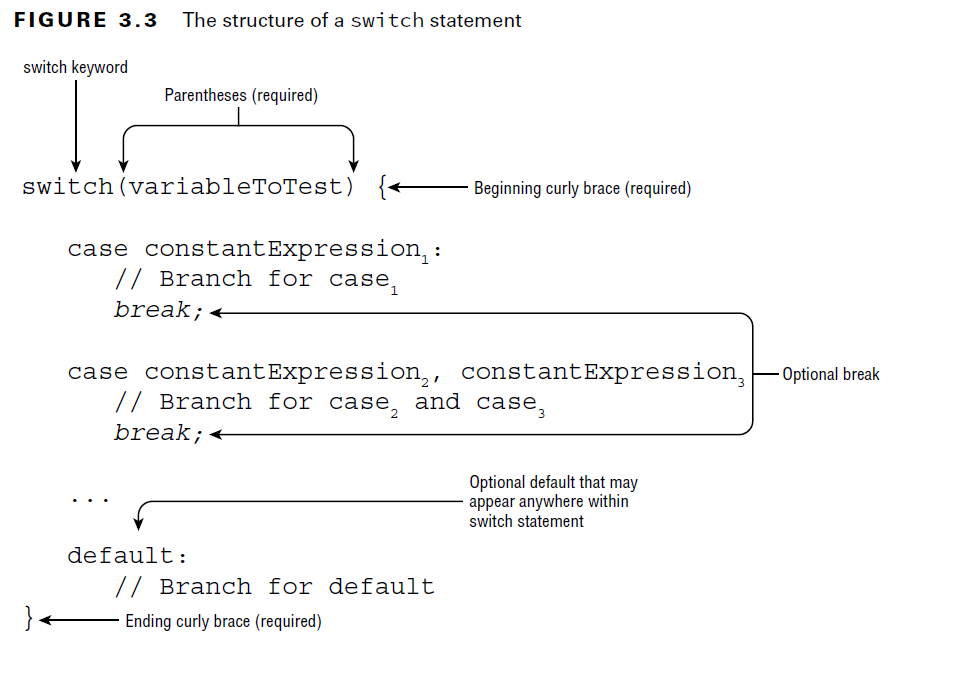

- a switch statement is not required to contain any case statements. For example, this statement is perfectly valid:
````java
switch(month) {} //WORKS
````

- Starting with Java 14, case values can now be combined:
````java
switch(animal) {
  case 1,2: System.out.print("Lion");
  case 3: System.out.print("Tiger");
}
//OLD:
//Prior to Java 14, the equivalent code would have been the following:
switch(animal) {
    case 1: case 2: System.out.print("Lion");
    case 3: System.out.print("Tiger");
}
````

- Invalid Syntaxes:
````java
int month = 5;
switch month { // DOES NOT COMPILE: Parenthesis missing
    case 1: System.out.print("January");
}
switch(month) // DOES NOT COMPILE: {} braces are missing for body
    case 1: System.out.print("January");

switch(month) {
    case 1: 2: System.out.print("January"); // DOES NOT COMPILE: it should be comma separated not colon
}
````

- Example:
````java
public void printDayOfWeek(int day) {
    switch(day) {
        case 0:
            System.out.print("Sunday");
            break;
        case 1:
            System.out.print("Monday");
            break;
        case 2:
            System.out.print("Tuesday");
            break;
        case 3:
            System.out.print("Wednesday");
            break;
        case 4:
            System.out.print("Thursday");
            break;
        case 5:
            System.out.print("Friday");
            break;
        case 6:
            System.out.print("Saturday");
            break;
        default:
            System.out.print("Invalid value");
            break;
    } 
}
````

#### Exiting with break Statements
- break statement ends the switch statement immediately.
- The break statements are optional, but without them the code will execute every branch following a matching case statement, including any default statements it finds. 
- Without break statements in each branch, the order of case and default statements is now extremely important.

#### Selecting switch Data Types:
- a switch statement has a target variable that is not evaluated until runtime. 
- The type of this target can include select primitive data types (int, byte, short, char) and their associated wrapper classes (Integer, Byte, Short, Character). 
- The following is a list of all data types supported by switch statements:

    
        - int and Integer
        - byte and Byte
        - short and Short
        - char and Character
        - String
        - enum values
        - var (if the type resolves to one of the preceding types)

- Invalid Types:
- boolean, long, float, and double are excluded from switch statements, as are their associated Boolean, Long, Float, and Double classes. 
- The reasons are varied, such as boolean having too small a range of values and floating-point numbers having quite a wide range of values.

#### Determining Acceptable Case Values:
- the data type for case statements must match the data type of the switch variable.
- Not just any variable or value can be used in a case statement.
- First, the values in each case statement must be **_compile-time constant values_** of the same data type as the switch value. 
- This means you can use only literals, enum constants, or final constant variables of the same data type. 
- By final constant, we mean that the variable must be marked with the final modifier and initialized with a literal value in the same expression in which it is declared. 
- For example, you can’t have a case statement value that requires executing a method at runtime, even if that method always returns the same value. 
- For these reasons, only the first and last case statements in the following example compile:

````java
final int getCookies() { return 4; }
void feedAnimals() {
    final int bananas = 1;
    int apples = 2;
    int numberOfAnimals = 3;
    final int cookies = getCookies();
    switch(numberOfAnimals) {
        case bananas:
        case apples: // DOES NOT COMPILE: not a compile time constant
        case getCookies(): // DOES NOT COMPILE
        case cookies : // DOES NOT COMPILE: not a compile time constant
        case 3 * 5 : //WORKS: literals are allowed
    }
}
````
- The bananas variable is marked final, and its value is known at compile-time, so it is valid. 
- The apples variable is not marked final, even though its value is known, so it is not permitted. 
- The next two case statements, with values getCookies() and cookies, do not compile. Methods are not evaluated until runtime, so they cannot be used as the value of a case statement, even if one of the values is stored in a final variable. 
- The last case statement, with value 3 * 5, does compile, as expressions are allowed as case values, provided the value can be resolved at compile-time.
- They also must be able to fit in the switch data type without an explicit cast.

#### The switch Expression:
- the new switch expressions that were officially added to Java 14.
- A switch expression is a much more compact form of a switch statement, capable of returning a value.
- we can now assign the result of a switch expression to a variable result. 
- For this to work, all case and default branches must return a data type that is compatible with the assignment. 
- The switch expression supports two types of branches: an expression and a block. 
- Each has different syntactical rules on how it must be created.

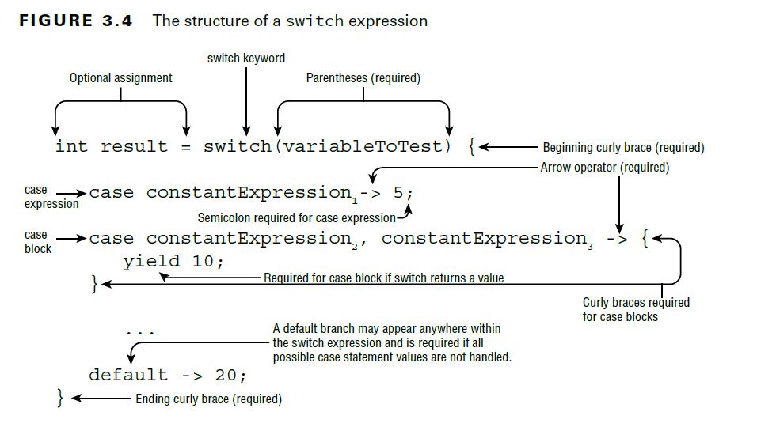

- Like a traditional switch statement, a switch expression supports zero or many case
  branches and an optional default branch. Both also support the new feature that allows
  case values to be combined with a single case statement using commas. Unlike a traditional
  switch statement, though, switch expressions have special rules around when the
  default branch is required.

- We can rewrite our previous printDayOfWeek() method in a much more concise manner using case expressions:

````java
public void printDayOfWeek(int day) {
var result = switch(day) {
    case 0 -> "Sunday";
    case 1 -> "Monday";
    case 2 -> "Tuesday";
    case 3 -> "Wednesday";
    case 4 -> "Thursday";
    case 5 -> "Friday";
    case 6 -> "Saturday";
    default -> "Invalid value";
};
    System.out.print(result);
}
````

- Compare this code with the switch statement we wrote earlier. 
- Both accomplish the same task, but a lot of the boilerplate code has been removed, leaving the behavior we care most about.
- Notice that a semicolon is required after each switch expression. For example, the following code does not compile. 
- How many semicolons is it missing?

````java
var result = switch(bear) {
                case 30 -> "Grizzly" //1
                default -> "Panda" //2
            }//3
````

- case statements can take multiple values, separated by commas.
- Let’s rewrite our printSeason() method from earlier using a switch expression:

````java
public void printSeason(int month) {
    switch(month) {
        case 1, 2, 3 -> System.out.print("Winter");
        case 4, 5, 6 -> System.out.print("Spring");
        case 7, 8, 9 -> System.out.print("Summer");
        case 10, 11, 12 -> System.out.print("Fall");
    } 
}
````
- This time we don’t have to worry about break statements, since only one branch is executed.
- Switch statement may or maynot return the value.
- All of the previous rules around switch data types and case values still apply, although we have some new rules.


        1. All of the branches of a switch expression that do not throw an exception must return a consistent data type (if the switch expression returns a value).

        2. If the switch expression returns a value, then every branch that isn’t an expression must yield a value.

        3. A default branch is required unless all cases are covered or no value is returned.

- Java 17 also supports pattern matching within switch expressions, but since this is a Preview feature, it is not in scope for the exam.

##### Rule-1: Returning Consistent Data Types
- You can’t return incompatible or random data types.

````java
int measurement = 10;
int size = switch(measurement) {
    case 5 ->  1;
    case 10 -> (short)2;
    default -> 5;
    case 20 -> "3"; // DOES NOT COMPILE
    case 40 -> 4L; // DOES NOT COMPILE
    case 50 -> null; // DOES NOT COMPILE
};
````

- Notice that the second case expression returns a short, but that can be implicitly cast to an int.

##### Rule-2: Applying a case Block:
- A switch expression supports both an expression and a block in the case and default branches. 
- Like a regular block, a case block is one that is surrounded by braces ({}). It also includes a yield statement if the switch expression returns a value.

````java
int fish = 5;
int length = 12;
var name = switch(fish) {
    case 1 -> "Goldfish";
    case 2 -> {yield "Trout";}
    case 3 -> {
        if(length > 10) yield "Blobfish";
        else yield "Green";
        }
    default -> "Swordfish";
};
````

- The yield keyword is equivalent to a return statement within a switch expression and is used to avoid ambiguity about whether you meant to exit the block or method around the switch expression.
- yield statements are not optional if the switch statement returns a value.
- Invalid yields:
````java
int fish = 5;
int length = 12;
var name = switch(fish) {
    case 1 -> "Goldfish";
    case 2 -> {} // DOES NOT COMPILE : does not return a value using yield.
    case 3 -> {
        if(length > 10) yield "Blobfish";
    } // DOES NOT COMPILE: no yield for else block: all branches must yield a value within the case block.
    default -> "Swordfish";
};
````

- Watch Semicolons in switch Expressions:
- Unlike a regular switch statement, a switch expression can be used with the assignment operator and requires a semicolon when doing so.
- Furthermore, semicolons are required for case expressions but cannot be used with case blocks.

````java
var name = switch(fish) {
    case 1 -> "Goldfish" // DOES NOT COMPILE (missing semicolon)
    case 2 -> {yield "Trout";}; // DOES NOT COMPILE (extra semicolon)
    ...
} // DOES NOT COMPILE (missing semicolon)
````

#### Rule-3: Covering All Possible Values:
- a switch expression that returns a value must handle all possible input values, when it does not return a value, it is optional.

````java
int canis = 5;
String type = switch(canis) { // DOES NOT COMPILE
    case 1 -> "dog";
    case 2 -> "wolf";
    case 3 -> "coyote";
};
````

- There’s no case branch to cover 5 (or 4, -1, 0, etc.), so should the switch expression return null, the empty string, undefined, or some other value?
- the authors decided this behavior would be unsupported. 
- Every switch expression must handle all possible values of the switch variable. 
- As a developer, there are two ways to address this:
  - Add a default branch.
  - If the switch expression takes an enum value, add a case branch for every possible enum value.
- You can try writing case statements for all possible int values, but we promise it doesn’t work! The compiler does not permit even smaller types like byte  , despite there being only 256 possible values.
- For enums, the second solution works well when the number of enum values is relatively small.

````java
enum Season {WINTER, SPRING, SUMMER, FALL}
String getWeather(Season value) {
    return switch(value) {
        case WINTER -> "Cold";
        case SPRING -> "Rainy";
        case SUMMER -> "Hot";
        case FALL -> "Warm";
    };
}
````

- Since all possible permutations of Season are covered, a default branch is not required in this switch expression. 
- You can include an optional default branch, though, even if you cover all known values.
- consider including a default branch in every switch expression, even those that involve enum values.

___

### Writing while Loops:
- A loop is a repetitive control structure that can execute a statement of code multiple times in succession.
- Like all repetition control structures, it has a termination condition, implemented as a boolean expression, that will continue as long as the expression evaluates to true.

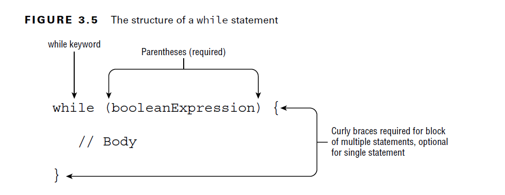

- During execution, the boolean expression is evaluated before each iteration of the loop and exits if the evaluation returns false.
````java
int counter = 0;
while (counter < 10) {
    double price = counter * 10;
    System.out.println(price);
    counter++;
}
````

- while loops are often used in places where you expect zero or more executions of the loop.

#### The do/while Statement:

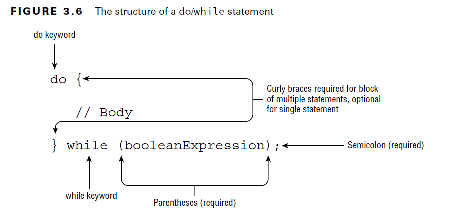

- a do/while loop guarantees that the statement or block will be executed at least once.

````java
int lizard = 0;
do {
    lizard++;
} while(false);

System.out.println(lizard); // 1
````
- Java will execute the statement block first and then check the loop condition. 
- Even though the loop exits right away, the statement block is still executed once.

#### Infinite Loops:
- An infinite loop is a loop whose termination condition is never reached during runtime.
- Failure to terminate a loop can lead to numerous problems in practice, including overflow exceptions, memory leaks, slow performance, and even bad data.

````java
int pen = 2;
int pigs = 5;
while(pen < 10)
    pigs++;
````
- the expression (pen < 10) will always evaluate to true. The result is that the loop will never end, creating what is commonly referred to as an infinite loop. 

___

### for Loops
- If you know that exactly how many times a loop has to execute then using while/do-while creates a lot of boilerplate of code. Instead of that we can use for loops.
- There are two types of for loops, although both use the same for keyword. 

        - basic for loop: for 
        - enhanced for loop: for-each
- 
#### Basic for loop:

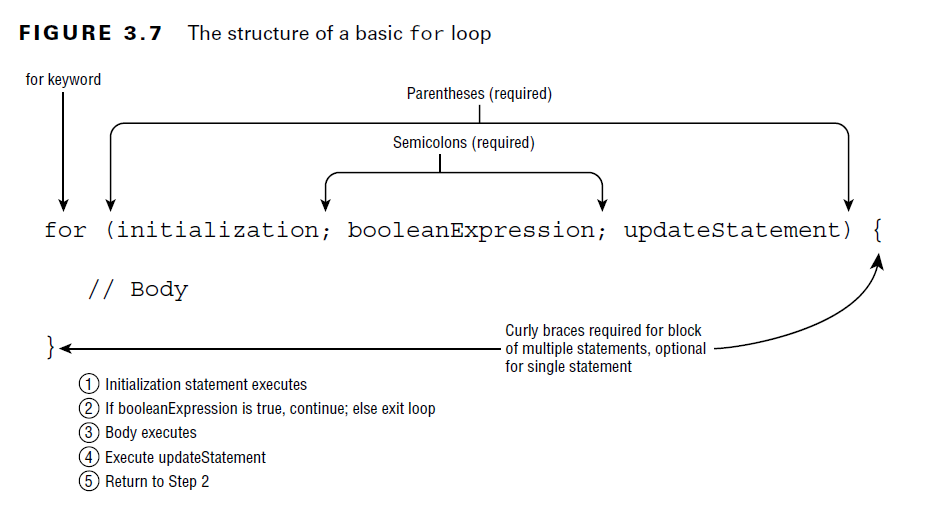

- A basic for loop has the same conditional boolean expression and statement, or block of statements, as the while loops, as well as two new sections: an initialization block and an update statement.
- Each of the three sections is separated by a semicolon. 
- In addition, the initialization and update sections may contain multiple statements, separated by commas.
- Variables declared in the initialization block of a for loop have limited scope and are accessible only within the for loop.
- When you see a for loop on the exam, pay close attention to the loop variable and operations if the decrement operator(--) is used. 
- In fact, if you do see a for loop with a decrement operator on the exam, you should assume they are trying to test your knowledge of loop operations.

#### For loop Variations:

##### 1. Creating an Infinite Loop

````java
for( ; ; )
    System.out.println("Hello World");
````
- it will in fact compile and run without issue. 
- It is actually an infinite loop that will print the same statement repeatedly.
- This example reinforces the fact that the components of the for loop are each optional.
- Note that the semicolons separating the three sections are required, as ``for( )`` without any semicolons will not compile.

##### 2. Adding Multiple Terms to the for Statement

````java
int x = 0;
for(long y = 0, z = 4; x < 5 && y < 10; x++, y++) {
    System.out.print(y + " "); 
}
System.out.print(x + " ");
````

- This code demonstrates three variations of the for loop you may not have seen.
- First, you can declare a variable, such as x in this example, before the loop begins and use it after it completes. 
- Second, your initialization block, boolean expression, and update statements can include extra variables that may or may not reference each other. 
- For example, z is defined in the initialization block and is never used. Finally,
- The update statement can modify multiple variables. This code will print the following when executed: 0 1 2 3 4 5

##### 3. Redeclaring a Variable in the Initialization Block:
- we can re-assign the value but we cannot re-declare the same variable
````java
int x = 0;
for(int x = 4; x < 5; x++) // DOES NOT COMPILE: duplicate variable declaration
    System.out.print(x + " ");
````
- it does not compile because of the initialization block. 
- The difference is that x is repeated in the initialization block after already being declared before the loop, resulting in the compiler stopping because of a duplicate variable declaration.

````java
int x = 0;
for(x = 0; x < 5; x++)//WORKS: initialization block simply assigns a value to x and does not declare it.
    System.out.print(x + " ");

````

##### 4. Using Incompatible Data Types in the Initialization Block:
- The variables in the initialization block must all be of the same type.
- If initialization block is declaring some variables then it should be only of same type.
- If initialization block is re-assigning the variables then mutliple types are allowed
````java
static void variation4(){
    int q = 0;
    int x = 0;

    //for(long y=0,long z=1;x<5;x++)// DOES NOT COMPILE
    //for(long y=0,int z=1;x<5;x++)// DOES NOT COMPILE
    //for(long y=0, z=1, x=3;x<5;x++)// DOES NOT COMPILE:variable x is already defined 
    //for(x=3,long y=0, z=1;x<5;x++)// DOES NOT COMPILE
    //for(x=3,q=5;x<5;x++)// WORKS
    long p=1;
    for(x=3,p=5;x<5;x++)// WORKS
        System.out.println("Loop Executed...");
}
````

##### 5. Using Loop Variables Outside the Loop:

````java
for(long y = 0, x = 4; x < 5 && y < 10; x++, y++)
    System.out.print(y + " ");
System.out.print(x); // DOES NOT COMPILE
````

- If you notice, x is defined in the initialization block of the loop and then used after the loop terminates. 
- Since x was only scoped for the loop, using it outside the loop will cause a compiler error.


#### The for-each Loop:

- The for-each loop is a specialized structure designed to iterate over arrays and various Collections Framework classes.

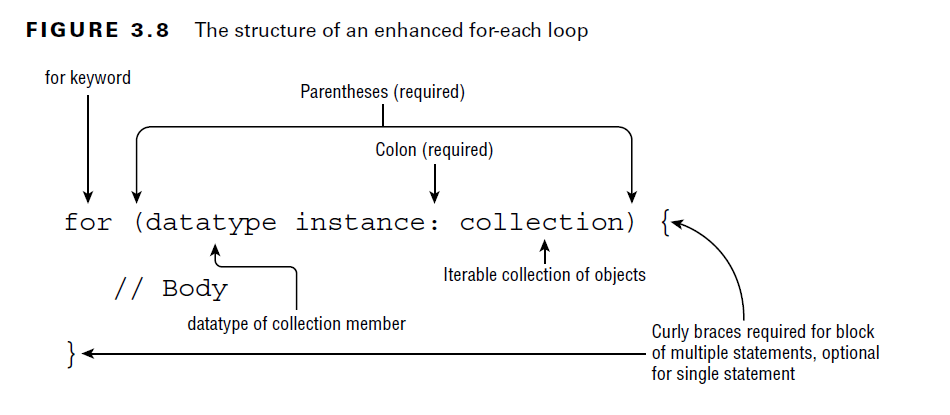

- The for-each loop declaration is composed of an initialization section and an object to be iterated over.
- The right side of the for-each loop must be one of the following:
  
    - A built-in Java array
    - An object whose type implements java.lang.Iterable

- the right side must be an array or collection of items, such as a List or a Set.
- only those that implement or extend that Collection interface.
- Map is not supported in a for-each loop, although Map does include methods that return Collection instances.
- The left side of the for-each loop must include a declaration for an instance of a variable whose type is compatible with the type of the array or collection on the right side of the statement.
- On each iteration of the loop, the named variable on the left side of the statement is assigned a new value from the array or collection on the right side of the statement.

````java
public void printNames(String[] names) {
    for(int counter=0; counter<names.length; counter++)
        System.out.println(names[counter]);
}
public void printNames(String[] names) {
    for(var name : names)
        System.out.println(name);
}
public void printNames(List<String> names) {
    for(var name : names)
        System.out.println(name);
}

````

- Invalid Usages:
````java
String birds = "Jay";
for(String bird : birds) // DOES NOT COMPILE
    System.out.print(bird + " ");

String[] sloths = new String[3];
for(int sloth : sloths) // DOES NOT COMPILE
    System.out.print(sloth + " ");
````

#### Nested Loops

- A nested loop is a loop that contains another loop, including while, do/while, for, and for-each loops.

````java
int[][] myComplexArray = {{5,2,1,3},{3,9,8,9},{5,7,12,7}};
for(int[] mySimpleArray : myComplexArray) {
    for(int i=0; i<mySimpleArray.length; i++) {
        System.out.print(mySimpleArray[i]+"\t");
    }
    System.out.println();
}
````

##### Adding Optional Labels:
- if statements, switch statements and loops is that they can all have optional labels. 
- A label is an optional pointer to the head of a statement that allows the application flow to jump to it or break from it. 
- It is a single identifier followed by a colon (:). 
- For example, we can add optional labels to one of the previous examples:

````java
int[][] myComplexArray = {{5,2,1,3},{3,9,8,9},{5,7,12,7}};
OUTER_LOOP: for(int[] mySimpleArray : myComplexArray) {
    INNER_LOOP: for(int i=0; i<mySimpleArray.length; i++) {
                    System.out.print(mySimpleArray[i]+"\t");
    }
    System.out.println();
}
````

- Labels follow the same rules for formatting as identifiers. 
- For readability, they are commonly expressed using uppercase letters in snake_case with underscores between words.
- When dealing with only one loop, labels do not add any value, but as you learn in the next section, they are extremely useful in nested structures.

- it is possible to add optional labels to control and block statements. 
- For example, the following is permitted by the compiler, albeit extremely uncommon:
````java
int frog = 15;
BAD_IDEA: if(frog>10)
EVEN_WORSE_IDEA: {
    frog++;
}
````

#### The break Statement

- As you saw when working with switch statements, a break statement transfers the flow of control out to the enclosing statement.
- The same holds true for a break statement that appears inside a while, do/while, or for loop, as it will end the loop early

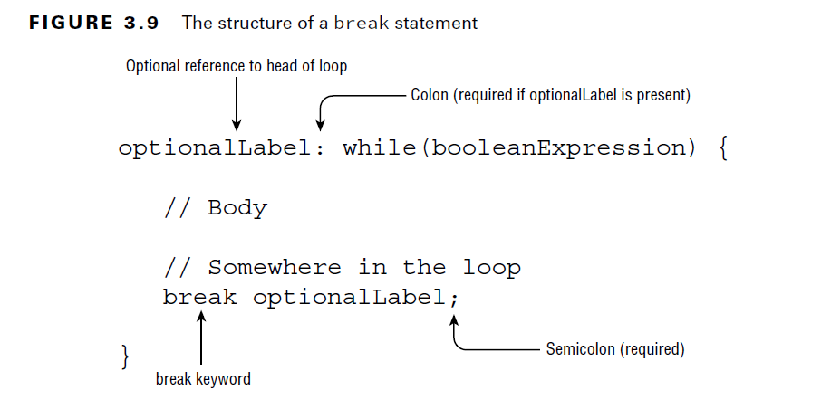

- Without a label parameter, the break statement will terminate the nearest inner loop it is currently in the process of executing. 
- The optional label parameter allows us to break out of a higher-level outer loop.
- In the following example, we search for the first (x,y) array index position of a number within an unsorted two-dimensional array:

````java
public class FindInMatrix {
    public static void main(String[] args) {
        int[][] list = {{1,13},{5,2},{2,2}};
        int searchValue = 2;
        int positionX = -1;
        int positionY = -1;
        PARENT_LOOP: for(int i=0; i<list.length; i++) {
            for(int j=0; j<list[i].length; j++) {
                if(list[i][j]==searchValue) {
                positionX = i;
                    positionY = j;
                    break PARENT_LOOP;
                }
            }
        }
        if(positionX==-1 || positionY==-1) {
            System.out.println("Value "+searchValue+" not found");
        } else {
            System.out.println("Value "+searchValue+" found at: " +
                    "("+positionX+","+positionY+")");
        }
    }
}
````
- In the above code if we use normal break statement then ans: (2,0) with label ans: (1,1) and without break ans:(2,1)

#### The continue Statement:

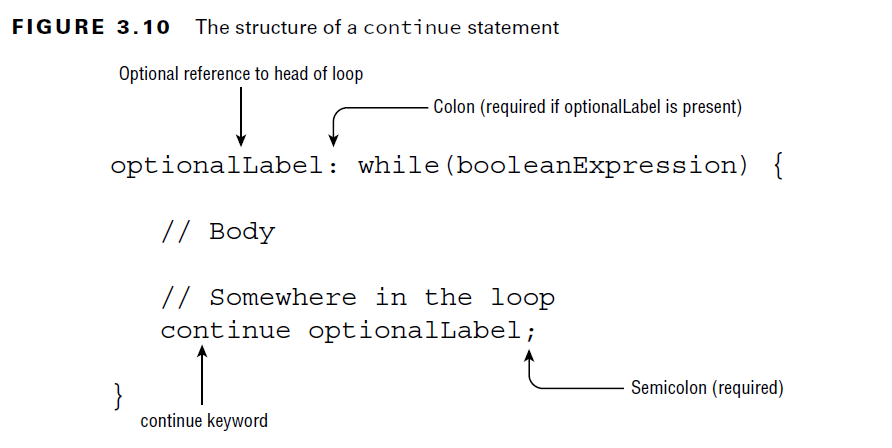

- You may notice that the syntax of the continue statement mirrors that of the break statement.
- In fact, the statements are identical in how they are used, but with different results.
- While the break statement transfers control to the enclosing statement, the continue statement transfers control to the boolean expression that determines if the loop should continue.
- In other words, it ends the current iteration of the loop. 
- Also, like the break statement, the continue statement is applied to the nearest inner loop under execution, using optional label statements to override this behavior.
- Imagine we have a zookeeper who is supposed to clean the first leopard in each of four stables but skip stable b entirely.

````java
public class CleaningSchedule {
    public static void main(String[] args) {
        CLEANING: for(char stables = 'a'; stables<='d'; stables++) {
            for(int leopard = 1; leopard<4; leopard++) {
                if(stables=='b' || leopard==2) {
                    continue CLEANING;
                }
                System.out.println("Cleaning: "+stables+","+leopard);
            }
        }
    } 
}
// Output:
Cleaning: a,1
Cleaning: c,1
Cleaning: d,1
````

#### Unreachable Code
- One facet of break, continue, and return that you should be aware of is that any code placed immediately after them in the same block is considered unreachable and will not compile.

````java
int checkDate = 0;
while(checkDate<10) {
    checkDate++;
    if(checkDate>100) {
        break;
        checkDate++; // DOES NOT COMPILE: Unreachable code
    }
}
````
- Regardless of execution, the compiler will report an error if it finds any code it deems unreachable, in this case any statements immediately following a break, continue, or return statement.

#### Branching Summary:

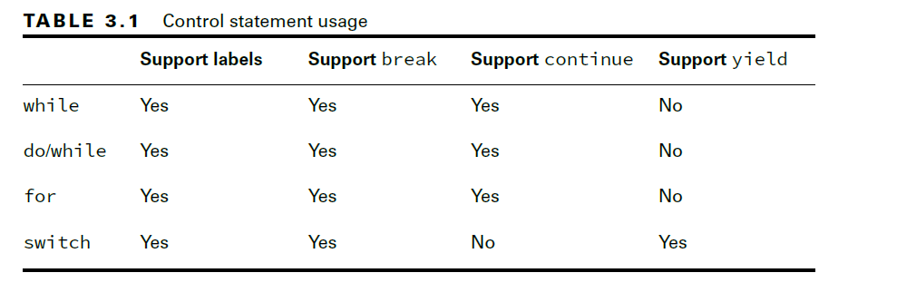


