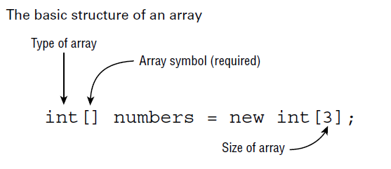
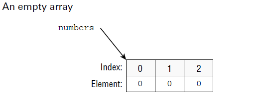
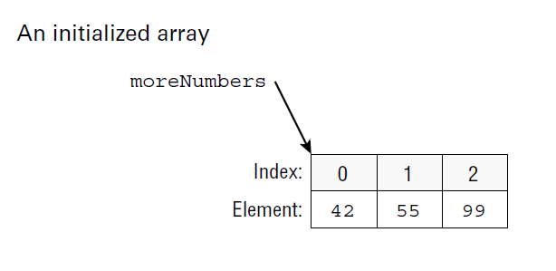
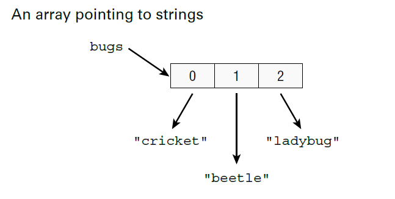
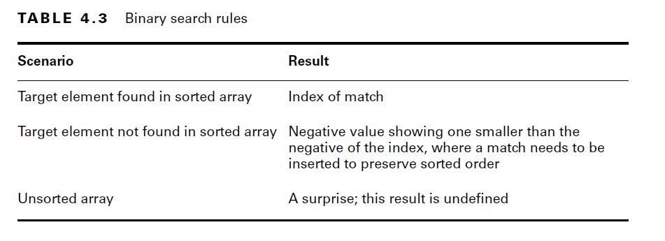
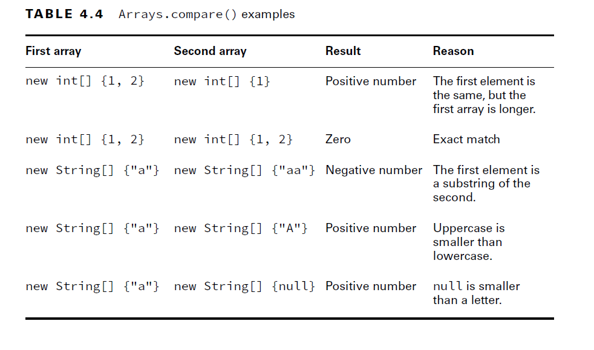
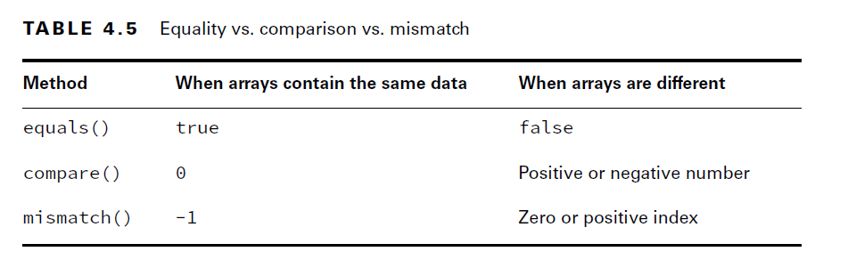
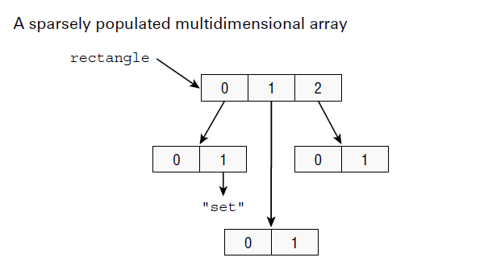
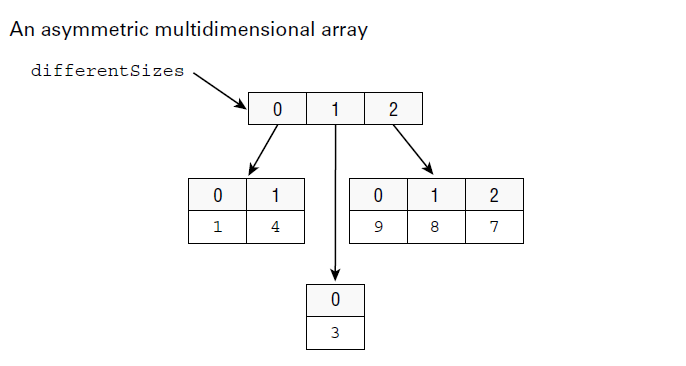

# Arrays:

- In this section, we look at creating an array of primitives and objects, sorting, searching, varargs, and multidimensional arrays.

## Creating an Array of Primitives:

- The most common way to create an array is first specifying the type of the array (int) and the size (3). The brackets tell you this is an array.



- When you use this form to instantiate an array, all elements are set to the default value for that type.
- Since numbers is a reference variable, it points to the array object



````java
int[] numbers = new int[3]; //empty array
int[] moreNumbers = new int[] {42, 55, 99}; //initialized array
int[] moreNumbers = {42, 55, 99}; //anonymous array/shortcut: java already knows it's an int[3] from  left side 
````


- you can type the [] before or after the name, and adding a space is optional. 
- This means that all five of these statements do the exact same thing:
````java
//All are valid
int[] numAnimals;
int [] numAnimals2;
int []numAnimals3;
int numAnimals4[];
int numAnimals5 [];
````

#### Multiple “Arrays” in Declarations:

````java
int[] ids, types; //two variables of type int[]. so two arrays
int ids[], types; //ids[] is an array and types is an int

````

#### Creating an Array with Reference Variables
- You can choose any Java type to be the type of the array.
- Below example The array does not allocate space for the String objects. 
- Instead, it allocates space for a reference to where the objects are really stored.



- Example:

````java
import java.util.Arrays;

String[] bugs = {"cricket", "beetle", "ladybug"};
String[] alias = bugs;
System.out.println(bugs.equals(alias)); // true
System.out.println(bugs.toString()); // [Ljava.lang.String;@160bc7c0
System.out.println(Arrays.toString(bugs)); //[cricket, beetle, ladybug].
````
- We can call equals() because an array is an object. 
- It returns true because of reference equality. 
- The equals() method on arrays does not look at the elements of the array.
- The type int is a primitive; int[] is an object.

````java
String names1[]; //it is not assinged so names1 is null
String names2[] = new String[2]; // is is assigned to an array.
````

#### Casting arrays:

````java
String[] strings = { "stringValue" };
Object[] objects = strings;
String[] againStrings = (String[]) objects;
againStrings[0] = new StringBuilder(); // DOES NOT COMPILE
objects[0] = new StringBuilder(); // Careful! WORKS at compile time: At runtime, the code throws an ArrayStoreException.
````

- Examples:

````java
String[] mammals = {"monkey", "chimp", "donkey"};
System.out.println(mammals.length); // 3
System.out.println(mammals[0]); // monkey
System.out.println(mammals[1]); // chimp
System.out.println(mammals[2]); // donkey
````

- Array Length:
- The length attribute does not consider what is in the array; it only considers how many slots have been allocated.
````java
String[] mammals = {"monkey", "chimp", "donkey"};
System.out.println(mammals.length()); // DOES NOT COMPILE: in arrays length is not method
var birds = new String[6];
System.out.println(birds.length); //6: Even though all six elements of the array are null, there are still six of them.
````

### Sorting:

- Sorting is provided by Arrays utility class

````java
import java.util.Arrays;
int[] numbers = { 6, 9, 1 };
Arrays.sort(numbers); //Natural Sorting Order
for (int i = 0; i < numbers.length; i++)
    System.out.print(numbers[i] + " ");
````
- String sorts in alphabetic order, and 1 sorts before 9. (Numbers sort before letters, and uppercase sorts before lowercase.)
````java
String[] strings = { "10", "9", "100" };
Arrays.sort(strings); //Alphabetical order
for (String s : strings)
    System.out.print(s + " "); // 10,100,9
````

### Searching:

- Java also provides a convenient way to search, but only if the array is already sorted.



- Examples:

````java
int[] numbers = {2,4,6,8};
System.out.println(Arrays.binarySearch(numbers, 2)); // 0
System.out.println(Arrays.binarySearch(numbers, 4)); // 1
System.out.println(Arrays.binarySearch(numbers, 1)); // -1 // 1 should be inserted as 0-index we negate and add -1
System.out.println(Arrays.binarySearch(numbers, 3)); // -2 // 3 should be inserted at index-1 we negate -1 and add -1 = -1+(-1) = -2
System.out.println(Arrays.binarySearch(numbers, 9)); // -5 // 9 should inserted at index-4, = -4+(-1) = -5
````

- Unsorted arrays:
````java
int[] numbers = new int[] {3,2,1};// array is not sorted
System.out.println(Arrays.binarySearch(numbers, 2)); // result undefined
System.out.println(Arrays.binarySearch(numbers, 3));
````

### Comparing:

- Java also provides methods to compare two arrays to determine which is “smaller.” 
#### compare():

- There are a bunch of rules you need to know before calling compare().
- First you need to learn what the return value means. 
- You do not need to know the exact return values, but you do need to know the following:

        - A negative number means the first array is smaller than the second.
        - A zero means the arrays are equal.
        - A positive number means the first array is larger than the second.

````java
System.out.println(Arrays.compare(new int[] {1}, new int[] {2}));//This code prints a negative number.
````

- Comparing Arrays Rules:

    
    - If both arrays are the same length and have the same values in each spot in the same order, return zero.
    
    - If all the elements are the same but the second array has extra elements at the end, return a negative number.

    - If all the elements are the same, but the first array has extra elements at the end, return a positive number.

    - If the first element that differs is smaller in the first array, return a negative number.

    - If the first element that differs is larger in the first array, return a positive number.

- Finally, what does smaller mean? Here are some more rules that apply here and to compareTo():

        - null is smaller than any other value.
        - For numbers, normal numeric order applies.
        - For strings, one is smaller if it is a prefix of another.
        - For strings/characters, numbers are smaller than letters.
        - For strings/characters, uppercase is smaller than lowercase.

- Examples:


- When comparing two arrays, they must be the same array type.
````java
  System.out.println(Arrays.compare(new int[] {1}, new String[] {"a"})); // DOES NOT COMPILE
````

#### mismatch():

- If the arrays are equal, mismatch() returns -1. Otherwise, it returns the first index where they differ.

````java
System.out.println(Arrays.mismatch(new int[] {1}, new int[] {1})); //-1
System.out.println(Arrays.mismatch(new String[] {"a"}, new String[] {"A"}));//0
System.out.println(Arrays.mismatch(new int[] {1, 2}, new int[] {1}));//1
System.out.println(Arrays.mismatch(new int[] {1}, new int[] {1,2}));//1
System.out.println(Arrays.mismatch(new int[] {1,2}, new int[] {1,2,3})); //2
System.out.println(Arrays.mismatch(new int[] {1}, new int[] {0,1,2,3}));//0
````

- In the first example, the arrays are the same, so the result is -1.
- In the second example, the entries at element 0 are not equal, so the result is 0. 
- In the third example, the entries at element 0 are equal, so we keep looking. The element at index 1 is not equal. 
- Or, more specifically, one array has an element at index 1, and the other does not. Therefore, the result is 1.

- Comparision



### Methods with Varargs: variable arguments

````java
public static void main(String[] args)
public static void main(String args[])
public static void main(String... args) // varargs
````

## Multidimensional Arrays:
- In Java array of arrays are called as Multidimensional arrays

````java
int[][] vars1; // 2D array
int vars2 [][]; // 2D array
int[] vars3[]; // 2D array
int[] vars4 [], space [][]; // a 2D AND a 3D array
````

- You can specify the size of your multidimensional array in the declaration if you like:
````java
String [][] rectangle = new String[3][2];

````  
- The result of this statement is an array rectangle with three elements, each of which refers to an array of two elements.


````java
int[][] differentSizes = {{1, 4}, {3}, {9,8,7}};
````


- We still start with an array of three elements. However, this time the elements in the next level are all different sizes. One is of length 2, the next length 1, and the last length 3.
- Another way to create an asymmetric array is to initialize just an array’s first dimension and define the size of each array component in a separate statement:
````java
int [][] args = new int[4][];
args[0] = new int[5];
args[1] = new int[3];
````

````java
for(int i = 0; i < twoD.length; i++) {
    for(int j = 0; j < twoD[i].length; j++)
        System.out.print(twoD[i][j] + " "); // print element
System.out.println(); // time for a new row
}

//for-each
for(int[] inner : twoD) {
    for(int num : inner)
        System.out.print(num + " ");
System.out.println();
}
````


### References:


https://www.baeldung.com/java-slicing-arrays