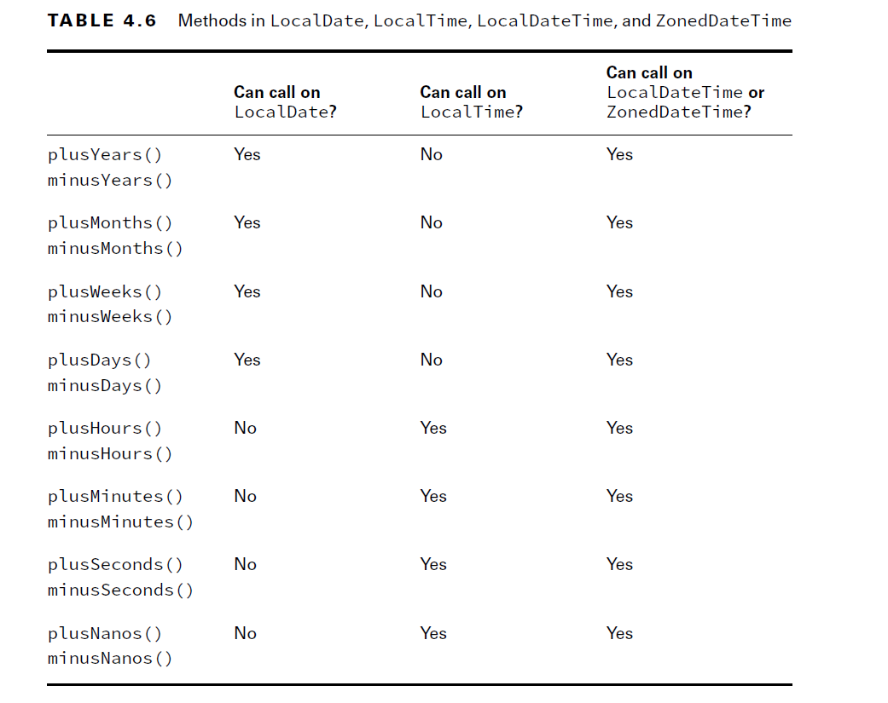
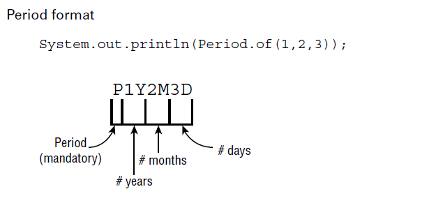
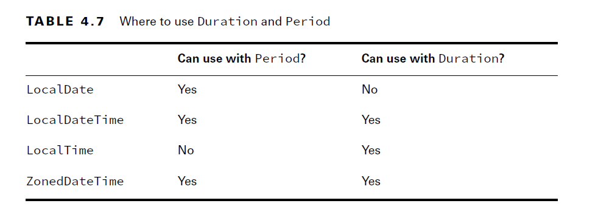
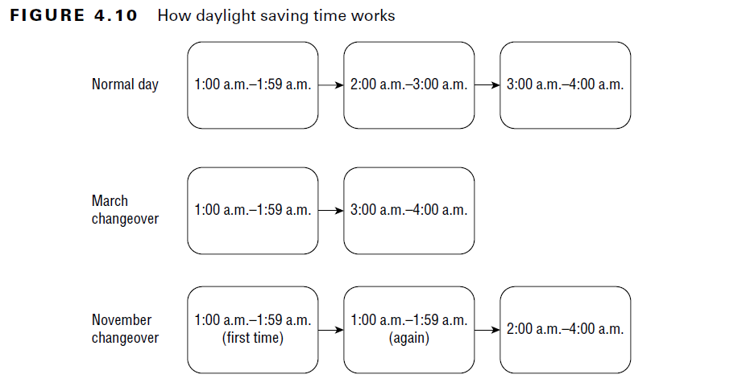

# Working with Dates and Times

- Java provides a number of APIs for working with dates and times. 
- There’s also an old java.util.Date class, but it is not on the exam. 
- You need an import statement to work with the modern date and time classes. 
- To use it, add this import to your program:
````java
  import java.time.*; // import time classes
````
#### Day vs. Date:
- In American English, the word date is used to represent two different concepts. 
- Sometimes, it is the month/day/year combination when something happened, such as January 1, 2000.
- Sometimes, it is the day of the month, such as “Today’s date is the 6th.”
- That’s right; the words day and date are often used as synonyms.

### Creating Dates and Times

- When working with dates and times, the first thing to do is to decide how much information you need. 
- The exam gives you four choices:
- **1.LocalDate:** Contains just a date—no time and no time zone. 
- **2.LocalTime:** Contains just a time—no date and no time zone. 
- **3.LocalDateTime:** Contains both a date and time but no time zone. 
- **4.ZonedDateTime:** Contains a date, time, and time zone. 
    
```java
System.out.println(LocalDate.now());//2021–10–25
System.out.println(LocalTime.now()); //09:13:07.768 : The time displays hours, minutes, seconds,and fractional seconds.
System.out.println(LocalDateTime.now()); //2021–10–25T09:13:07.768
System.out.println(ZonedDateTime.now());// 2021–10–25T09:13:07.769–05:00[America/New_York]
```

- Each of the four classes has a static method called now(), which gives the current date and time. 
- Your output is going to depend on the date/time when you run it and where you live.

- Greenwich Mean Time (GMT).:
- Greenwich Mean Time is a time zone in Europe that is used as time zone zero when discussing offsets. 
- You might have also heard of Coordinated Universal Time, which is a time zone standard. 
- It is abbreviated as UTC, as a compromise between the English and French names (That’s not a typo. UTC isn’t actually the proper acronym in either language!) UTC uses the same time zone zero as GMT.
- First, let’s try to figure out how far apart these moments are in time. Notice how India has a half-hour  offset, not a full hour.
- To approach a problem like this, you subtract the time zone from the time. This gives you the GMT equivalent of the time:
````java
  2022–06–20T06:50+05:30[Asia/Kolkata] // GMT 2022–06–20 01:20
  2022–06–20T07:50-05:00[US/Eastern] // GMT 2022–06–20 12:50

````
- Remember that you need to add when subtracting a negative number. 
- After converting to GMT, you can see that the U.S. Eastern time is 11 and a half hours behind the Kolkata time.
- The time zone offset can be listed in different ways: +02:00, GMT+2, and UTC+2 all mean the same thing.
- Just remember that the month comes before the date.
- Also, Java tends to use a 24-hour clock even though the Countries uses a 12-hour clock with a.m./p.m.

````java
public static LocalDate of(int year, int month, int dayOfMonth);
public static LocalDate of(int year, Month month, int dayOfMonth);
````

````java
var date1 = LocalDate.of(2022, Month.JANUARY, 20);
var date2 = LocalDate.of(2022, 1, 20);
````

- Creating Times:
- When creating a time, you can choose how detailed you want to be. 
- You can specify just the hour and minute, or you can include the number of seconds. 
- You can even include nanoseconds if you want to be very precise. (A nanosecond is a billionth of a second, although you probably won’t need to be that specific.)
````java
public static LocalTime of(int hour, int minute);
public static LocalTime of(int hour, int minute, int second);
public static LocalTime of(int hour, int minute, int second, int nanos);
````

````java
var time1 = LocalTime.of(6, 15); // hour and minute
var time2 = LocalTime.of(6, 15, 30); // + seconds
var time3 = LocalTime.of(6, 15, 30, 200); // + nanoseconds
````

- Date and Time:
- You can combine dates and times into one object:

````java
public static LocalDateTime of(int year, int month, int dayOfMonth, int hour, int minute);
public static LocalDateTime of(int year, int month, int dayOfMonth, int hour, int minute, int second);
public static LocalDateTime of(int year, int month, int dayOfMonth, int hour, int minute, int second, int nanos);
````
- Month reference
````java
public static LocalDateTime of(int year, Month month, int dayOfMonth, int hour, int minute);
public static LocalDateTime of(int year, Month month, int dayOfMonth, int hour, int minute, int second);
public static LocalDateTime of(int year, Month month, int dayOfMonth, int hour, int minute, int second, int nanos);
````

- one takes an existing LocalDate and LocalTime:

````java
public static LocalDateTime of(LocalDate date, LocalTime time);
````

````java
var dateTime1 = LocalDateTime.of(2022, Month.JANUARY, 20, 6, 15, 30);
var dateTime2 = LocalDateTime.of(date1, time1);
````

- Zoned Time:
- In order to create a ZonedDateTime, we first need to get the desired time zone.
- Examples:
- 
````java
var zone = ZoneId.of("US/Eastern");
var zoned1 = ZonedDateTime.of(2022, 1, 20, 6, 15, 30, 200, zone);
var zoned2 = ZonedDateTime.of(date1, time1, zone);
var zoned3 = ZonedDateTime.of(dateTime1, zone);
````
- The first passes all of the fields individually. We don’t recommend this approach—there are too many numbers, and it is hard to read. 
- A better approach is to pass a LocalDate object and a LocalTime object, or a LocalDateTime object.
- Although there are other ways of creating a ZonedDateTime, you only need to know three for the exam:

````java
public static ZonedDateTime of(int year, int month, int dayOfMonth, int hour, int minute, int second, int nanos, ZoneId zone);
public static ZonedDateTime of(LocalDate date, LocalTime time, ZoneId zone);
public static ZonedDateTime of(LocalDateTime dateTime, ZoneId zone);
````
- Notice that there isn’t an option to pass in the Month enum. 
- Also, we did not use a constructor in any of the examples. 
- The date and time classes have private constructors along with static methods that return instances. This is known as the factory pattern. 
- The exam creators may throw something like this at you:
````java
var d = new LocalDate(); // DOES NOT COMPILE
````  
- You are not allowed to construct a date or time object directly
````java
var d = LocalDate.of(2022, Month.JANUARY, 32) // DateTimeException: Invalid value for DayOfMonth (valid values 1-28/31): 32
````

### Manipulating Dates and Times:

- The date and time classes are immutable. 
- Remember to assign the results of these methods to a reference variable so they are not lost.

````java
var date = LocalDate.of(2022, Month.JANUARY, 20);
System.out.println(date); // 2022–01–20
date = date.plusDays(2);
System.out.println(date); // 2022–01–22
date = date.plusWeeks(1);
System.out.println(date); // 2022–01–29
date = date.plusMonths(1);
System.out.println(date); // 2022–02–28
date = date.plusYears(5);
System.out.println(date); // 2027–02–28
````

- Going Backward:
````java
var date = LocalDate.of(2024, Month.JANUARY, 20);
var time = LocalTime.of(5, 15);
var dateTime = LocalDateTime.of(date, time);
System.out.println(dateTime); // 2024–01–20T05:15
dateTime = dateTime.minusDays(1);
System.out.println(dateTime); // 2024–01–19T05:15
dateTime = dateTime.minusHours(10);
System.out.println(dateTime); // 2024–01–18T19:15
dateTime = dateTime.minusSeconds(30);
System.out.println(dateTime); // 2024–01–18T19:14:30
````

- It is common for date and time methods to be chained
````java
var time = LocalTime.of(5, 15);
var dateTime = LocalDateTime.of(date, time).minusDays(1).minusHours(10).minusSeconds(30);
var date = LocalDate.of(2024, Month.JANUARY, 20);

date.plusDays(10);// date is immutable so it won't update old value
System.out.println(date);// January 20 , 2024 

var date = LocalDate.of(2024, Month.JANUARY, 20);
date = date.plusMinutes(1); // DOES NOT COMPILE: minutes is part of Time not Date
````

- Methods Summary:



#### Working with Periods:

````java
public static void main(String[] args) {
var start = LocalDate.of(2022, Month.JANUARY, 1);
var end = LocalDate.of(2022, Month.MARCH, 30);
    performAnimalEnrichment(start, end);
}
private static void performAnimalEnrichment(LocalDate start, LocalDate end) {
    var upTo = start;
    while (upTo.isBefore(end)) { // check if still before end
        System.out.println("give new toy: " + upTo);
        upTo = upTo.plusMonths(1); // add a month
    } 
}
````

- With period:

````java
public static void main(String[] args) {
    var start = LocalDate.of(2022, Month.JANUARY, 1);
    var end = LocalDate.of(2022, Month.MARCH, 30);
    var period = Period.ofMonths(1); // create a period
    performAnimalEnrichment(start, end, period);
}
private static void performAnimalEnrichment(LocalDate start, LocalDate end, Period period) { // uses the generic period
    var upTo = start;
    while (upTo.isBefore(end)) {
        System.out.println("give new toy: " + upTo);
        upTo = upTo.plus(period); // adds the period
    } 
}
````

- The method can add an arbitrary period of time that is passed in. 
- This allows us to reuse the same method for different periods of time as our zookeeper changes their mind.

````java
//There are five ways to create a Period class:
var annually = Period.ofYears(1); // every 1 year
var quarterly = Period.ofMonths(3); // every 3 months
var everyThreeWeeks = Period.ofWeeks(3); // every 3 weeks
var everyOtherDay = Period.ofDays(2); // every 2 days
var everyYearAndAWeek = Period.of(1, 0, 7); // every year and 7 days
````

- the of() method allows you to pass in the number of years, months, and days. They are all included in the same period.
- The of() method takes only years, months, and days. The ability to use another factory method to pass weeks is merely a convenience.
- As you might imagine, the actual period is stored in terms of years, months, and days.



- As you can see, the P always starts out the String to show it is a period measure. 
- Then come the number of years, number of months, and number of days. If any of these are zero, they are omitted.

````java
  System.out.println(Period.ofMonths(3)); //P3M
````
- The output is P3M. Remember that Java omits any measures that are zero.

````java
var date = LocalDate.of(2022, 1, 20);
var time = LocalTime.of(6, 15);
var dateTime = LocalDateTime.of(date, time);
var period = Period.ofMonths(1);
System.out.println(date.plus(period)); // 2022–02–20
System.out.println(dateTime.plus(period)); // 2022–02–20T06:15
System.out.println(time.plus(period)); // Exception: UnsupportedTemporalTypeException
````

#### Working with Durations:

- You’ve probably noticed by now that a Period is a day or more of time.
- There is also Duration, which is intended for smaller units of time. 
- For Duration, you can specify the number of days, hours, minutes, seconds, or nanoseconds.
- And yes, you could pass 365 days to make a year, but you really shouldn’t—that’s what Period is for.
- Duration works roughly the same way as Period, except it is used with objects that have time. 
- Duration is output beginning with PT, which you can think of as a period of time.
- A Duration is stored in hours, minutes, and seconds. The number of seconds includes fractional seconds.

````java
var daily = Duration.ofDays(1); // PT24H
var hourly = Duration.ofHours(1); // PT1H
var everyMinute = Duration.ofMinutes(1); // PT1M
var everyTenSeconds = Duration.ofSeconds(10); // PT10S
var everyMilli = Duration.ofMillis(1); // PT0.001S
var everyNano = Duration.ofNanos(1); // PT0.000000001S
````
- Duration doesn’t have a factory method that takes multiple units like Period does. 
- If you want something to happen every hour and a half, you specify 90 minutes.
- Duration includes another more generic factory method.
- It takes a number and a TemporalUnit. The idea is, say, something like “5 seconds.” 
- However, TemporalUnit is an interface. At the moment, there is only one implementation named ChronoUnit.

````java
var daily = Duration.of(1, ChronoUnit.DAYS);
var hourly = Duration.of(1, ChronoUnit.HOURS);
var everyMinute = Duration.of(1, ChronoUnit.MINUTES);
var everyTenSeconds = Duration.of(10, ChronoUnit.SECONDS);
var everyMilli = Duration.of(1, ChronoUnit.MILLIS);
var everyNano = Duration.of(1, ChronoUnit.NANOS);
````

#### ChronoUnit for Differences:

- ChronoUnit is a great way to determine how far apart two Temporal values are.
- Temporal includes LocalDate, LocalTime, and so on. ChronoUnit is in the _java.time.temporal_ package.
- 
````java
  var one = LocalTime.of(5, 15);
  var two = LocalTime.of(6, 30);
  var date = LocalDate.of(2016, 1, 20);
  System.out.println(ChronoUnit.HOURS.between(one, two)); // 1
  System.out.println(ChronoUnit.MINUTES.between(one, two)); // 75
  System.out.println(ChronoUnit.MINUTES.between(one, date)); // DateTimeException: 
````
- Java will throw an exception if we mix up what can be done on date vs. time objects.
- you can truncate any object with a time element.
- For example:
- 
 ````java
  LocalTime time = LocalTime.of(3,12,45);
  System.out.println(time); // 03:12:45
  LocalTime truncated = time.truncatedTo(ChronoUnit.MINUTES);
  System.out.println(truncated); // 03:12

````
- This example zeroes out any fields smaller than minutes. In our case, it gets rid of the seconds.
- Using a Duration works the same way as using a Period.
- Example:

````java
var date = LocalDate.of(2022, 1, 20);
var time = LocalTime.of(6, 15);
var dateTime = LocalDateTime.of(date, time);
var duration = Duration.ofHours(6);
System.out.println(dateTime.plus(duration)); // 2022–01–20T12:15
System.out.println(time.plus(duration)); // 12:15
System.out.println(date.plus(duration)); // UnsupportedTemporalTypeException
````

#### Period vs. Duration:

- Remember that Period and Duration are not equivalent.
- Example
````java
var date = LocalDate.of(2022, 5, 25);
var period = Period.ofDays(1);
var days = Duration.ofDays(1);
System.out.println(date.plus(period)); // 2022–05–26
System.out.println(date.plus(days)); // Unsupported unit: Seconds
````

- Since we are working with a LocalDate, we are required to use Period.
- Duration has time units in it, even if we don’t see them, and they are meant only for objects with time.




### Working with Instants:
- The Instant class represents a specific moment in time in the GMT time zone.
- Suppose that you want to run a timer:
````java
var now = Instant.now();
// do something time consuming
var later = Instant.now();
var duration = Duration.between(now, later);
System.out.println(duration.toMillis()); // Returns number milliseconds
````

- If you have a ZonedDateTime, you can turn it into an Instant:
````java
 var date = LocalDate.of(2022, 5, 25);
  var time = LocalTime.of(11, 55, 00);
  var zone = ZoneId.of("US/Eastern");
  var zonedDateTime = ZonedDateTime.of(date, time, zone);
  var instant = zonedDateTime.toInstant(); // 2022–05–25T15:55:00Z
  System.out.println(zonedDateTime); // 2022–05–25T11:55–04:00[US/Eastern]
  System.out.println(instant); // 202–05–25T15:55:00Z
````

- The last two lines represent the same moment in time. The ZonedDateTime includes a time zone. 
- The Instant gets rid of the time zone and turns it into an Instant of time in GMT.
- You cannot convert a LocalDateTime to an Instant. 
- Remember that an Instant is a point in time. A LocalDateTime does not contain a time zone, and it is therefore not universally recognized around the world as the same moment in time.

#### Accounting for Daylight Saving Time:

- Some countries observe daylight saving time. 
- This is where the clocks are adjusted by an hour twice a year to make better use of the sunlight.
- Not all countries participate, and those that do use different weekends for the change. 
- You only have to work with U.S. daylight saving time on the exam,
- The question will let you know if a date/time mentioned falls on a weekend when the
  clocks are scheduled to be changed. If it is not mentioned in a question, you can assume that
  it is a normal weekend. The act of moving the clock forward or back occurs at 2:00 a.m.,
  which falls very early Sunday morning.
- Figure 4.10 shows what happens with the clocks. When we change our clocks in March,
  time springs forward from 1:59 a.m. to 3:00 a.m. When we change our clocks in November,
  time falls back, and we experience the hour from 1:00 a.m. to 1:59 a.m. twice. Children
  learn this as “Spring forward in the spring, and fall back in the fall.”



- For example, on March 13, 2022, we move our clocks forward an hour and jump from
  2:00 a.m. to 3:00 a.m. This means that there is no 2:30 a.m. that day. If we wanted to know
  the time an hour later than 1:30, it would be 3:30.

````java
var date = LocalDate.of(2022, Month.MARCH, 13);
var time = LocalTime.of(1, 30);
var zone = ZoneId.of("US/Eastern");
var dateTime = ZonedDateTime.of(date, time, zone);
System.out.println(dateTime); // 2022–03-13T01:30-05:00[US/Eastern]
System.out.println(dateTime.getHour()); // 1
System.out.println(dateTime.getOffset()); // -05:00
dateTime = dateTime.plusHours(1);
System.out.println(dateTime); // 2022–03-13T03:30-04:00[US/Eastern]
System.out.println(dateTime.getHour()); // 3
System.out.println(dateTime.getOffset()); // -04:00
````
 
- Notice that two things change in this example. The time jumps from 1:30 to 3:30. The
  UTC offset also changes. Remember when we calculated GMT time by subtracting the time
  zone from the time? You can see that we went from 6:30 GMT (1:30 minus –5:00) to 7:30
  GMT (3:30 minus –4:00). This shows that the time really did change by one hour from
  GMT’s point of view. We printed the hour and offset fields separately for emphasis.
- Similarly, in November, an hour after the initial 1:30 a.m. is also 1:30 a.m. because at
  2:00 a.m. we repeat the hour. This time, try to calculate the GMT time yourself for all three
  times to confirm that we really do move only one hour at a time.

````java
var time = LocalTime.of(1, 30);
var zone = ZoneId.of("US/Eastern");
var dateTime = ZonedDateTime.of(date, time, zone);
System.out.println(dateTime); // 2022-11-06T01:30-04:00[US/Eastern]
dateTime = dateTime.plusHours(1);
System.out.println(dateTime); // 2022-11-06T0130-05:00[US/Eastern]
dateTime = dateTime.plusHours(1);
System.out.println(dateTime); // 2022-11-06T02:30-05:00[US/Eastern]
````

- Did you get it? We went from 5:30 GMT to 6:30 GMT, to 7:30 GMT.
- Finally, trying to create a time that doesn’t exist just rolls forward:

````java
var date = LocalDate.of(2022, Month.MARCH, 13);
var time = LocalTime.of(2, 30);
var zone = ZoneId.of("US/Eastern");
var dateTime = ZonedDateTime.of(date, time, zone);
System.out.println(dateTime); // 2022–03–13T03:30–04:00[US/Eastern]
````

- Java is smart enough to know that there is no 2:30 a.m. that night and switches over to
  the appropriate GMT offset.
  Yes, it is annoying that Oracle expects you to know this even if you aren’t in the United
  States—or
  for that matter, in a part of the United States that doesn’t follow daylight saving
  time. The exam creators are in the United States, and they decided that everyone needs to
  know how U.S. time zones work.
