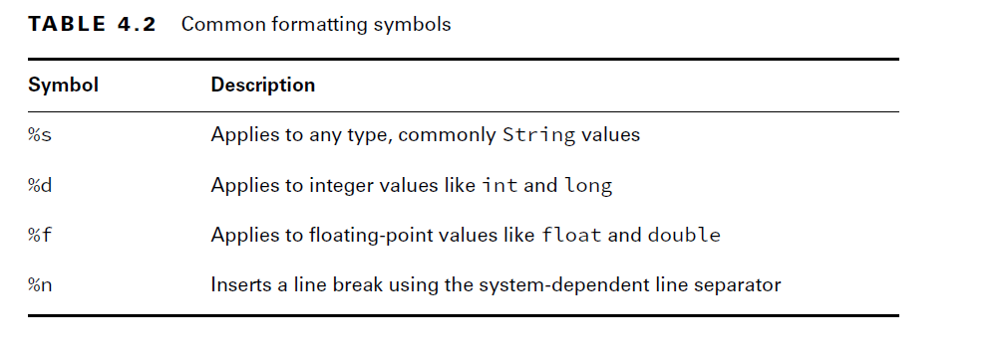
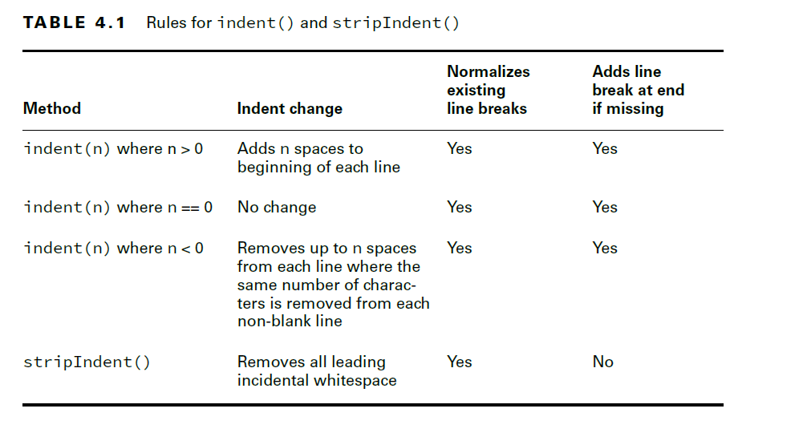

# String related APIs

## String:
- In Java, these two snippets both create a String:
- String implements the interface CharSequence.This interface is a general way of representing several classes, including String and StringBuilder
````java
  String name = "Fluffy";
  String name = new String("Fluffy");
  String name = """
        Fluffy"""; // text blocks
````
- Both give you a reference variable named name pointing to the String object "Fluffy".

### Concatenating:
- Placing one String before the other String and combining them is called string concatenation.
- String uses + operator for concatenation
- Rules for concatenation:

        1. If both operands are numeric, + means numeric addition.
        2. If either operand is a String, + means concatenation.
        3. The expression is evaluated left to right.
- Examples:
````java
System.out.println(1 + 2); // 3
System.out.println("a" + "b"); // ab
System.out.println("a" + "b" + 3); // ab3
System.out.println(1 + 2 + "c"); // 3c
System.out.println("c" + 1 + 2); // c12
System.out.println("c" + null); // cnull

var s = "1"; // s currently holds "1"
s += "2"; // s currently holds "12"
s += 3; // s currently holds "123"
System.out.println(s); //123
````

### Important String Methods:

- The String class has dozens of methods.
- For all these methods, you need to remember that a string is a sequence of characters and Java counts from 0 when indexed.
- String is immutable, or unchangeable. This means calling a method on a String will return a different String object rather than changing the value of the reference.

````java
public int length();
public char charAt(int index);

public int indexOf(int ch);//finds the first index that matches the desired value.
public int indexOf(int ch, int fromIndex);
public int indexOf(String str);
public int indexOf(String str, int fromIndex);

//substrings:
public String substring(int beginIndex); //till end
public String substring(int beginIndex, int endIndex);// endIndex is exclusive

//case
public String toLowerCase();
public String toUpperCase();

//Equality:
public boolean equals(Object obj);
public boolean equalsIgnoreCase(String str);

//Searching 
public boolean startsWith(String prefix);
public boolean endsWith(String suffix);
public boolean contains(CharSequence charSeq);

//replacing
public String replace(char oldChar, char newChar);
public String replace(CharSequence target, CharSequence replacement);

//removing whitespace:
//strip() method does everything that trim() does, but it supports Unicode.
//Unicode whitespace characters is as char ch = '\u2000';
public String strip();// remove whitespace from the beginning and end of a String.
public String stripLeading();// removes whitespace from the beginning of the String and leaves it at the end.
public String stripTrailing();// removes whitespace from end
public String trim();

//empty or blank
public boolean isEmpty();
public boolean isBlank();

//formating
public static String format(String format, Object args...);
public static String format(Locale loc, String format, Object args...);
public String formatted(Object args...);
````

- Examples:
````java
var name = "animals";
System.out.println(name.substring(3)); // mals
System.out.println(name.substring(name.indexOf('m'))); // mals
System.out.println(name.substring(3, 4)); // m
System.out.println(name.substring(3, 7)); //mals

System.out.println(name.substring(3, 3)); // empty string
System.out.println(name.substring(3, 2)); // exception
System.out.println(name.substring(3, 8)); // exception
````
- In Java, String values are case-sensitive. That means "abc" and "ABC" are considered different values.

````java
System.out.println("abc".equals("ABC")); // false
System.out.println("ABC".equals("ABC")); // true
System.out.println("abc".equalsIgnoreCase("ABC")); // true
````
- Replacing:
````java
System.out.println("abcabc".replace('a', 'A')); // AbcAbc
System.out.println("abcabc".replace("a", "A")); // AbcAbc
````

- Removing Whitespaces:

````java
//In terms of the exam, whitespace consists of spaces along with the \t (tab) and \n (newline) characters.
//Other characters, such as \r (carriage return), are also included in what gets trimmed
//strip() method does everything that trim() does, but it supports Unicode.
//Unicode whitespace characters is as char ch = '\u2000';
System.out.println("abc".strip()); // abc
System.out.println("\t a b c\n".strip()); // a b c
String text = " abc\t "; //remember that \t is a single character.
System.out.println(text.trim().length()); // 3
System.out.println(text.strip().length()); // 3
System.out.println(text.stripLeading().length()); // 5
System.out.println(text.stripTrailing().length());// 4
````

- Checking empty or blank:
````java
System.out.println(" ".isEmpty()); // false
System.out.println("".isEmpty()); // true
System.out.println(" ".isBlank()); // true
System.out.println("".isBlank()); // true
````
#### Formatting Values:

- Methods:
````java
public static String format(String format, Object args...);
public static String format(Locale loc, String format, Object args...);
public String formatted(Object args...);
````
- In the format() and formatted() operations, the parameters are inserted and formatted via symbols in the order that they are provided in the vararg.



- Mixing data types may cause exceptions at runtime.
- For example, the following throws an exception because a floating-point number is used when an integer value is expected:
````java
var str = "Food: %d tons".formatted(2.0); // IllegalFormatConversionException
````
- Examples:

````java
var name = "Kate";
var orderId = 5;
// All print: Hello Kate, order 5 is ready
System.out.println("Hello "+name+", order "+orderId+" is ready");
System.out.println(String.format("Hello %s, order %d is ready", name, orderId));
System.out.println("Hello %s, order %d is ready".formatted(name, orderId));
````

##### Using format() with Flags
- Besides supporting symbols, Java also supports optional flags between the % and the symbol character. 
- In the previous example, the floating-point number was printed as 90.250000. By default, %f displays exactly six digits past the decimal. 
- If you want to display only one digit after the decimal, you can use %.1f instead of %f. 
- The format() method relies on rounding rather than truncating when shortening numbers.
- For example, 90.250000 will be displayed as 90.3 (not 90.2) when passed to format() with %.1f.
- The format() method also supports two additional features. 
- You can specify the total length of output by using a number before the decimal symbol. 
- By default, the method will fill the empty space with blank spaces. 
- You can also fill the empty space with zeros by placing a single zero before the decimal symbol. 
- The following examples use brackets, [], to show the start/end of the formatted value:
````java
var pi = 3.14159265359;
System.out.format("[%f]",pi); // [3.141593]
System.out.format("[%12.8f]",pi); // [ 3.14159265]
System.out.format("[%012f]",pi); // [00003.141593]
System.out.format("[%12.2f]",pi); // [ 3.14]
System.out.format("[%.3f]",pi); // [3.142]
````

- The format() method supports a lot of other symbols and flags. You don’t need to know any of them for the exam beyond what we’ve discussed already.


#### Working with Indentation:
- Java supports text blocks, it is helpful to have methods that deal with indentation.

````java
public String indent(int numberSpaces);
public String stripIndent();
````
- The indent() method adds the same number of blank spaces to the beginning of each line if you pass a positive number. 
- If you pass a negative number, it tries to remove that number of whitespace characters from the beginning of the line.it will remove all that it can find.
- If you pass zero, the indentation will not change.
- a line break is added to the end of the string if not already there.
- Second, any line breaks are converted to the \n format. Regardless of whether your operating system uses \r\n (Windows) or\n (Mac/Unix), Java will standardize on \n for you.
- The stripIndent() method is useful when a String was built with concatenation rather than using a text block.
- It gets rid of all incidental whitespace. 
- This means that all non-blank lines are shifted left so the same number of whitespace characters are removed from each line and the first character that remains is not blank. 
- Like indent(), \r\n is turned into \n. However, the stripIndent() method does not add a trailing line break if it is missing.



- Examples:

````java
var block = """
            a
             b
            c""";
var concat = " a\n"
            +" b\n"
            + " c";
System.out.println(block.length()); // 6
System.out.println(concat.length()); // 9
System.out.println(block.indent(1).length()); // 10
System.out.println(concat.indent(-1).length()); // 7
System.out.println(concat.indent(-4).length()); // 6
System.out.println(concat.stripIndent().length()); // 6
````
#### Translating Escapes
- When we escape characters, we use a single backslash. For example, \t is a tab. 
- If we don’t want this behavior, we add another backslash to escape the backslash, so \\t is the literal string \t. 
- The translateEscapes() method takes these literals and turns them into the equivalent escaped character.

````java
public String translateEscapes();
````
- The first line prints the literal string \t because the backslash is escaped. 
- The second line prints an actual tab since we translated the escape. 
- This method can be used for escape sequences such as \t (tab), \n (new line), \s (space), \" (double quote), and \' (single quote.)
- Example:
````java
var str = "1\\t2";
System.out.println(str); // 1\t2
System.out.println(str.translateEscapes()); // 1 2
````


### Overrding java.lang.Object methods: toString(), equals(Object), and hashCode()

- The basic rules for overriding each of these methods:
-  **toString():** 
  - The toString() method is called when you try to print an object or concatenate the object with a String. 
  - It is commonly overridden with a version that prints a unique description of the instance using its instance fields.

- **equals(Object):** 
  - The equals(Object) method is used to compare objects, with the default implementation just using the == operator. 
  - You should override the equals(Object) method any time you want to conveniently compare elements for equality, especially if this requires checking numerous fields.

- **hashCode():** 
  - Any time you override equals(Object), you must override hashCode() to be consistent. 
  - This means that for any two objects, if a.equals(b) is true, then a.hashCode()==b.hashCode() must also be true. 
  - If they are not consistent, this could lead to invalid data and side effects in hash-based collections such as HashMap and HashSet.

- All of these methods provide a default implementation in Object, but if you want to make intelligent use of them, you should override them.


## StringBuilder Class
- String is immutable, every operation on string creates a new string object.

````java
String alpha = "";
for(char current = 'a'; current <= 'z'; current++)
    alpha += current;
System.out.println(alpha);
````

- This sequence of events continues, and after 26 iterations through the loop, a total of 27 objects are instantiated, most of which are immediately eligible for garbage collection.
- The StringBuilder class creates a String without storing all those interim String values. Unlike the String class, StringBuilder is not immutable.

````java
StringBuilder alpha = new StringBuilder();
for(char current = 'a'; current <= 'z'; current++)
    alpha.append(current);
System.out.println(alpha);
````
- This code reuses the same StringBuilder without creating an interim String each time.

#### Creating a StringBuilder:

````java
StringBuilder sb1 = new StringBuilder();
StringBuilder sb2 = new StringBuilder("animal");
StringBuilder sb3 = new StringBuilder(10);// an initial capacity specified by the capacity argument.
````

#### Mutability and Chaining:

- When we chained String method calls, the result was a new String with the answer.
- Instead, the StringBuilder changes its own state and returns a reference to itself.
````java
StringBuilder sb = new StringBuilder("start");
sb.append("+middle"); // sb = "start+middle"
StringBuilder same = sb.append("+end"); // "start+middle+end"
````

````java
StringBuilder a = new StringBuilder("abc");
StringBuilder b = a.append("de");
b = b.append("f").append("g");
System.out.println("a=" + a); //abcdefg
System.out.println("b=" + b);//abcdefg 
````
- There’s only one StringBuilder object here. We know that because new StringBuilder() is called only once.
- there are two variables referring to that same object

#### Common Methods:

````java
int length();
//appends at the end
StringBuilder append(char c); //char/boolean/int/float/long/double/String/Object/StringBuffer
StringBuilder append(char[] str);
StringBuilder append(char[] str, int offset, int len);
StringBuilder append(CharSequence s); //Appends the specified character sequence to this Appendable.
StringBuilder append(CharSequence s, int start, int end);
//insert at specific index
StringBuilder insert(int offset, boolean b); //char/int/long/float/double/
StringBuilder insert(int offset, char[] str); //Inserts the string representation of the char array argument into this sequence.
StringBuilder insert(int index, char[] str, int offset, int len);

char charAt(int index);
IntStream chars();
//replace:
StringBuilder replace(int start, int end, String str); //Replaces the characters in a substring of this sequence with characters in the specified String.
StringBuilder reverse();
//delete
StringBuilder delete(int start, int end); //Removes the characters in a substring of this sequence.
StringBuilder deleteCharAt(int index);

//Finding Index
int indexOf(String str); //Returns the index within this string of the first occurrence of the specified substring.
int indexOf(String str, int fromIndex);
int lastIndexOf(String str); //Returns the index within this string of the last occurrence of the specified substring.
int lastIndexOf(String str, int fromIndex);

//substrings:
CharSequence subSequence(int start, int end);// Returns a new character sequence that is a subsequence of this sequence.
String substring(int start);//Returns a new String that contains a subsequence of characters currently contained in this character sequence.
String substring(int inclusiveStart, int exclusiveEnd);
````

- Examples:
````java
var sb = new StringBuilder("animals");
String sub = sb.substring(sb.indexOf("a"), sb.indexOf("al"));
int len = sb.length();
char ch = sb.charAt(6);
System.out.println(sub + " " + len + " " + ch);
````

````java
var sb = new StringBuilder("animals");
sb.insert(7, "-");// sb = animals-5:
sb.insert(0, "-");// sb = -animals-
sb.insert(4, "-");// sb = -ani-mals-
System.out.println(sb);
````

````java
var sb = new StringBuilder("abcdef");
sb.delete(1, 3); // sb = adef
sb.deleteCharAt(5); // exception
var sb = new StringBuilder("abcdef");
sb.delete(1, 100); // sb = a
````

````java
var builder = new StringBuilder("pigeon dirty");
builder.replace(3, 6, "sty");
System.out.println(builder); // pigsty dirty

var builder = new StringBuilder("pigeon dirty");
builder.replace(3, 100, "");
System.out.println(builder);//pig
````

#### Understanding Equality: Comparing equals() and ==


````java
var one = new StringBuilder();
var two = new StringBuilder();
var three = one.append("a");
System.out.println(one == two); // false
System.out.println(one == three); // true
````
- Since this example isn’t dealing with primitives, we know to look for whether the references are referring to the same object.
- equals() uses logical equality rather than object equality for String objects:
````java
var x = "Hello World";
var z = " Hello World".trim();
System.out.println(x.equals(z)); // true
````

````java
var name = "a";
var builder = new StringBuilder("a");
System.out.println(name == builder); // DOES NOT COMPILE
````
- Remember that == is checking for object reference equality. 
- The compiler is smart enough to know that two references can’t possibly point to the same object when they are completely different types.
- StringBuilder did not implement equals().
- If you call equals() on two StringBuilder instances, it will check reference equality.
- You can call toString() on StringBuilder to get a String to check for equality instead.

### The String Pool:
- Java realizes that many strings repeat in the program and they use up a lot of memory. To solves this issue by reusing common ones.
- The string pool, also known as the intern pool, is a location in the Java Virtual Machine (JVM) that collects all these strings.
- The string pool contains literal values and constants that appear in your program.

````java
var x = "Hello World";
var z = " Hello World".trim();
System.out.println(x == z); // false

var singleString = "hello world";
var concat = "hello ";
concat += "world"; //Calling += is just like calling a method and results in a new String.
System.out.println(singleString == concat); // false

var x = "Hello World";
var y = new String("Hello World"); //don’t want you to use the string pool
System.out.println(x == y); // false

````

- The intern() method will use an object in the string pool if one is present.
- If the literal is not yet in the string pool, Java will add it at this time.

````java
var name = "Hello World";
var name2 = new String("Hello World").intern();
System.out.println(name == name2); // true
````

````java
var first = "rat" + 1;
var second = "r" + "a" + "t" + "1";
var third = "r" + "a" + "t" + new String("1");
System.out.println(first == second); //true
System.out.println(first == second.intern()); //true
System.out.println(first == third);//false
System.out.println(first == third.intern()); //true
````

- Remember to never use intern() or == to compare String objects in your code. The only time you should have to deal with these is on the exam.

#### Strings & StringBuilders are Arrays:

- String and StringBuilder classes as a “sequence of characters.” This is true.
- They are implemented using an array of characters.
- An array is an area of continuous memory on the heap with space for a designated number of elements.
- A String is implemented as an array with some methods that you might want to use when dealing with characters specifically.
- A StringBuilder is implemented as an array where the array object is replaced with a new, bigger array object when it runs out of space to store all the characters.


