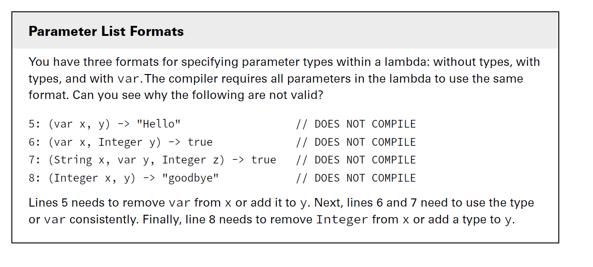
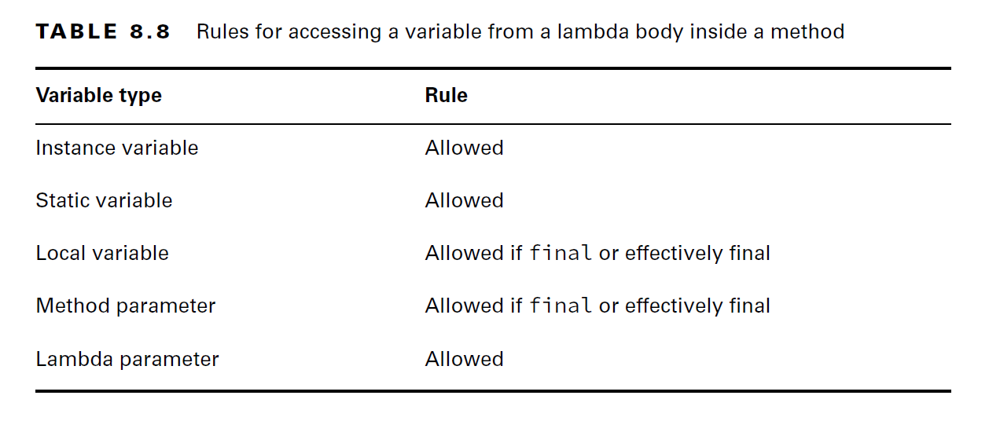

### Lambda Syntax Rules:

- In Lambda Expression Syntax we see majorly 3 parts

        1. Parameters & Parentheses 
        2. Arrow (->)
        3. Body ({})
__1. Parameters & Parentheses:__

- Parentheses are Optional: only one parameter without specifying the parameter type
- Parentheses are Mandatory:

      - Whenever lambda has no params 
      - When we specify the parameter type
      - More than one parameters

__2. Lambda Body:__

- `{}` Optional: When only one statement inside the body
- `{}` Mandatory: For more than one statement.
- `return` keyword:
- With single statement + no curly braces: then should not use return keyword
- If we use `{}` then return statement is mandatory. Return statement always ends with `;` semicolon  
           

### Variables Scope In Lambdas:

- Variables can appear in three places with respect to lambdas:

      - Parameter list
      - Local variables declared inside the lambda body
      - Outside Variables referenced from the lambda body.

#### 3.1 Parameters List:
- specifying the type of parameters is optional, we use `var` or respective type.

````java
Predicate<String> p = x -> true; //No type

Predicate<String> p = (var x) -> true; //var type

Predicate<String> p = (String x) -> true; //String type

````
- Lambda parameters are just like method parameters, you can add modifiers to them. Specifically, you can add the `final` modifier or an `annotation`, as shown in this example:

````java
public void counts(List<Integer> list) {
    list.sort((final var x, @Deprecated var y) -> x.compareTo(y));
}
//above the type of x, y is Integer, list is an integer list
````

- All parameters in Lambda should use the same format. we cannot use mixing of `no-type`, `type` and `var` as lambda params 



#### 3.2 Local variables declared inside the lambda body
- Lambda local variables have the same rules as any normal java block. 

````java
(a, b) -> { int c = 0; return 5; } //valid 'c' is new variable
        
(a, b) -> { int a = 0; return 5; } // DOES NOT COMPILE, here 'a' is already declared on lambda params so we cannot redeclare 

````
- __Note: Java does not let you create a local variable with the same name as one already declared in that scope.__

__How many syntax errors do you see in this method?__

````java
public void variables(int a) {
    int b = 1;
Predicate<Integer> p1 = a -> { //Error-1: cannot redeclare variable 'a'
        int b = 0; //Error-2: cannot redeclare variable 'a'
        int c = 0;
        return b == c; 
    } //Error-3: If we are assigning lambda to a variable then we have to end with semicolon(;)
}

````
- lambdas and method references are used in chained method calls. The shorter the lambda, the easier it is to read the code.

#### 3.3 Outside Variables referenced from the lambda body:

- a lambda can access an instance variable, method parameter, or local variable under certain conditions.
- Instance variables (and class variables) are always allowed.
- The only thing lambdas cannot access is variables that are not final or effectively final. If lambda tries to use not effective final variable, then we get a compilation errors
- Valid Lambda Scopes:

````java
public class Lambdas {
    public static void main(String[] args) {
        Crow crow = new Crow();
        crow.caw("Smiley");
    }


}

class Crow {
    private String color;
    static String greet = "Hello";
    public void caw(String name) {
        String volume = "loudly";
        color = "black";
        greet="Hey Buddy,";
        Consumer<String> consumer = s ->
                System.out.println(" ==> "+name + " <== says ==>" // DOES NOT COMPILE; Name is reassinged so not effectively final
                        + volume + " <== that she is ==>" + color+" <== With Greet: ==>"+greet+" <=="); // DOES NOT COMPILE; volume is reassinged after the lambda, so not effectively final
 
      consumer.accept(""); // ==> Smiley <== says ==>loudly <== that she is ==>black <== With Greet: ==>Hey Buddy, <==
   
      color = "White";
      greet = "Hey...!";
      consumer.accept(""); //==> Smiley <== says ==>loudly <== that she is ==>White <== With Greet: ==>Hey...! <==
    }
}

````

- Variable Scopes in Lambdas Summary:




#### Lambdas Cheat Sheet:

| Lambda                              | Valid/Invalid | Reason                                                                                                                                  |
|-------------------------------------|---------------|-----------------------------------------------------------------------------------------------------------------------------------------|
| __Parameters & Parenthesis__        |               |                                                                                                                                         |
| ()->true                            | Valid         | Can be mapped to BooleanSupplier SAM                                                                                                    |
| s ->{}                              | Valid         | Can be mapped to  Consumer SAM                                                                                                          |
| (s) ->{}                            | Valid         | Can be mapped to  Consumer SAM                                                                                                          |
| (String s) -> {}                    | Valid         | Can be mapped to  Consumer SAM                                                                                                          |
| (x,y) -> {}                         | Valid         | Can be mapped to BiConsumer SAM                                                                                                         |
| (String x, String y) -> {}          | Valid         | Can be mapped to BiConsumer SAM                                                                                                         |
|                                     |               |                                                                                                                                         |
| -> true                             | Invalid       | **Missing parentheses:**  Lambda has No params, So Parentheses are mandatory                                                            |
| String s -> {}                      | Invalid       | **Missing parentheses:**  When we specified the type, Parentheses are mandatory                                                         |
| x,y -> {}                           | Invalid       | **Missing parentheses:**  Lambda has more than one params, Parentheses are mandatory                                                    |
| ()->{}                              | Invalid       | **No Functional Interface**  No functional interface with the given SAM syntax                                                          |
|                                     |               |                                                                                                                                         |
| __Lambda Body__                     |               |                                                                                                                                         |
| ()->true                            | Valid         | Curly braces optional for single statement                                                                                              |
| s ->{ s+"hello";s+"world";}         | Valid         | Curly braces mandatory for more than one statement                                                                                      |
| s-> s.startsWith("hello")           | Valid         | Single statement without curly braces return keyword should not be used                                                                 |
| s-> {return s.startsWith("hello");} | Valid         | Single statement with curly braces + return keyword + semicolon is mandatory                                                            |
|                                     |               |                                                                                                                                         |
| s -> s+"hello";s+"world";           | Invalid       | __Missing Curly Braces__ More than one statements, curly braces are mandatory                                                           |
| s-> return s.startsWith("hello");   | Invalid       | __Invalid Usage of Return Statement__ Single statement without curly braces then should not use return keyword                          |
| s-> {s.startsWith("hello")}         | Invalid       | __Missing Return Statement__ + __Missing Semicolon:__ Single statement with curly braces return keyword + semicolon is mandatory        |
| s-> {return s.startsWith("hello")}  | Invalid       | __Missing Semicolon:__  Single statement with curly braces return keyword + semicolon is mandatory                                      |
| var a = s->true                     | Invalid       | __Less Context to infer the type:__ Java needs clear context to infer the functional interface type, so var type won't work for lambdas |
|                                     |               |                                                                                                                                         |
|                                     |               |                                                                                                                                         |
|                                     |               |                                                                                                                                         |
|                                     |               |                                                                                                                                         |


___

## Method References:

---

- While all method references can be turned into lambdas, the opposite is not always true.
__When to use Method References?__
- Whenever the lambda expression does nothing other than pass that parameter to another method.
- For Example:

````java
import java.util.List;

var names = List.of("Sam", "Ram", "John");

names.forEach(name->System.out.println(name)); //Here lambda is doing nothing except passing it's param to sout
        
names.forEach(System.out::println); //With Method Reference input param is directly passed to Method Reference

````

- Remember that `::` is like a lambda, and it is used for deferred execution with a functional interface.
- Variations of Method References:


    - Static Methods: Lambda directly reference a static method in any class
    - Instance Methods on Particular Objects: Lambda referencing a method on an object which is already defined in the context.
    - Instance Methods on a First Input Parameter: Lambda referencing a method on an object which is unknown during the compile time, it will be first input param for the lambda during runtime.
    - Constructor: uses `new` instead of a method and instantiates an object.

- Method References Summary:


---


