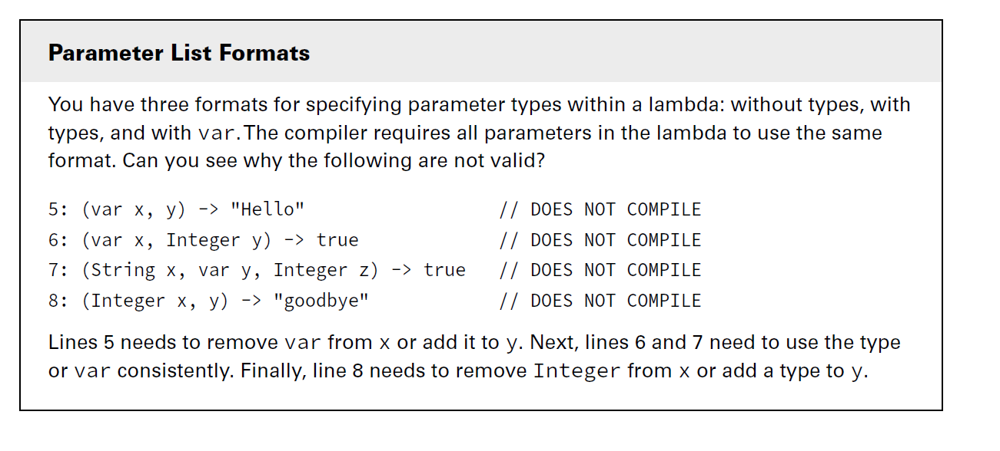
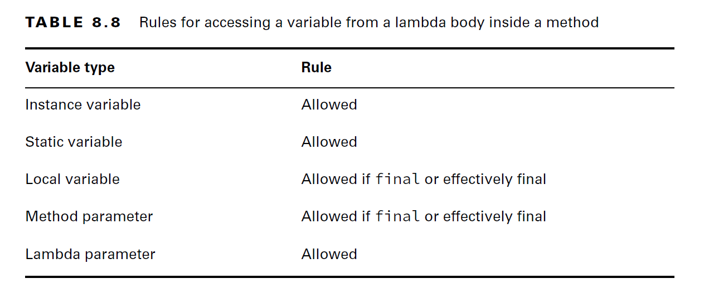
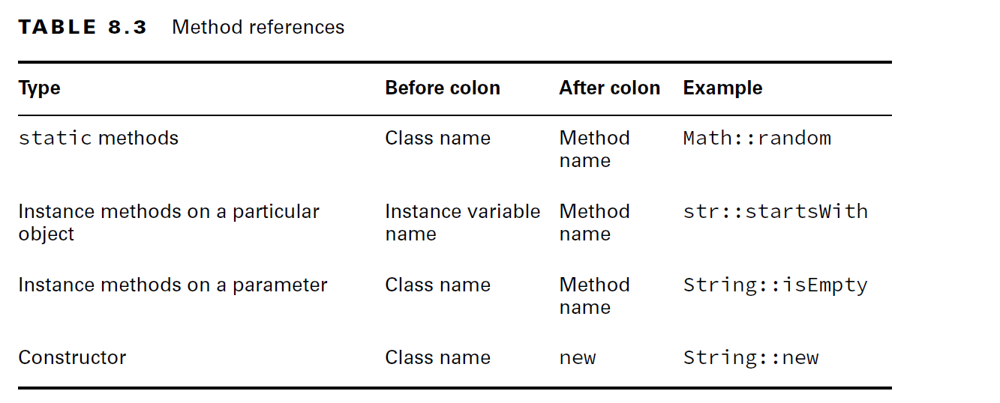

# Lambdas And Functional Interfaces

        - Lambda Expressions
        - Method References
        - Functional Interfaces
        

- Functional programming is the way of writing code more declarative than imperative. It specifies what to do, not how to do it.
- Examples for declarative languages: SQL, all functional programming languages

## Lambda Expressions
- A Lambda Expression is a block of code that passed around
- In java we can think of lambda as an unnamed method inside the anonymous class.
- Lambdas works based on the concept called **_Deferred Execution_** means code is specified now and it will run later

__Examples:__

````java
public record Bird(String name, boolean canFly, boolean canSwim) {
}

interface BirdChecker {
    //tests on the bird object
    boolean test(Bird b);
}

public class MainApp {

    static void flyChecker(Bird bird, BirdChecker checker) {
        System.out.println(" Is "+bird.name()+" Can Fly? " + checker.test(bird));
    }

    public static void main(String[] args) {
        BirdChecker checker = new BirdChecker() {
            @Override
            public boolean test(Bird b) {
                return b.canFly();
            }
        };
        
        Bird bird = new Bird("Sparrow", true, false);
        
        print(bird, checker);
    }

}
````

- In the above code we have an interface `BirdChecker` with a single abstract method `boolean test(Bird b);`
- Whenever we want to use `BirdChecker` as a dependency then we have to create an implementation class either Anonymous or regular class
- From Java-8 onwards if any interface follows Single Abstract Method (SAM) Rule that is called as **_Functional Interface_**
- Whenever we see a `Functional Interface` instead of creating an implementation class, we can simpy use lambda expressions.
- Let us use Lambda in the above code:
````java
public record Bird(String name, boolean canFly, boolean canSwim) {
}

interface BirdChecker {
    //tests on the bird object
    boolean test(Bird b);
}

public class MainApp {

    static void flyChecker(Bird bird, BirdChecker checker) {
        System.out.println(" Is "+bird.name()+" Can Fly? " + checker.test(bird));
    }

    public static void main(String[] args) {
        print(new Bird("Sparrow", true, false), b->b.canFly());
    }

}
````
````java
   b -> b.canFly();
````
- above is a lambda expression


### Lambda Syntax Rules:
- In Lambda Expression Syntax we see majorly 3 parts

        1. Parameters & Parentheses 
        2. Arrow (->)
        3. Body ({})
__1. Parameters & Parentheses:__

__Parentheses are optional:__ Only one parameter without specifying the parameter type

__Parentheses are Mandatory:__

      - Whenever lambda has no params 
      - When we specify the parameter type
      - More than one parameters

__2. Lambda Body:__
    
    - curly braces are optional {}: When only one statemnt inside the body
    - More than one statements curly braces are mandatory.
    - Without return: follow only curly braces rule
    - With return: 
            - with single statement + curly braces:  then mandatory to use return keyword+end with semicolon(;)
            - with single statement + no curly braces:  then should not use return keyword
            - with multiple statements: 
                - Mandatory to use curly braces
                - If return is required then include return keyword and it should end with semicolon(;) 

__3. Variables Scope In Lambdas:__

- Variables can appear in three places with respect to lambdas: 

      - Parameter list
      - Local variables declared inside the lambda body
      - Outside Variables referenced from the lambda body.
#### 3.1 Parameters List:
- specifying the type of parameters is optional
- `var` can be used in place of the specific type
- That means that all three of the below statements are interchangeable:

````java
Predicate<String> p = x -> true; //No type

Predicate<String> p = (var x) -> true; //var type

Predicate<String> p = (String x) -> true; //String type

````
- A lambda infers the types from the surrounding context. In the above all the variations the type of parameter is `String`. 
- Since lambda parameters are just like method parameters, you can add modifiers to them. Specifically, you can add the `final` modifier or an `annotation`, as shown in this example:

````java
public void counts(List<Integer> list) {
    list.sort((final var x, @Deprecated var y) -> x.compareTo(y));
}
//above the type of x, y is Integer, list is an integer list
````

#### Parameter Types Summary:


 
#### 3.2 Local variables declared inside the lambda body
- Lambda body can be a single expression, or it can have a block of code.
- Same rules as any normal java block. We can create new local variables

````java
(a, b) -> { int c = 0; return 5; } //valid 'c' is new variable
        
(a, b) -> { int a = 0; return 5; } // DOES NOT COMPILE, here 'a' is already declared on lambda params so we cannot redeclare 

````
- __Note: Java doesn’t let you create a local variable with the same name as one already declared in that scope.__

__How many syntax errors do you see in this method?__

````java
public void variables(int a) {
    int b = 1;
Predicate<Integer> p1 = a -> { //Error-1: cannot redeclare variable 'a'
        int b = 0; //Error-2: cannot redeclare variable 'a'
        int c = 0;
        return b == c; 
    } //Error-3: If we are assigning lambda to a variable then we have to end with semicolon(;)
}

````
- lambdas and method references are used in chained method calls. The shorter the lambda, the easier it is to read the code.

#### 3.3 Outside Variables referenced from the lambda body:

- Lambda bodies are allowed to reference some variables from the surrounding code. The following code is legal:

````java
public class Crow {
    
    private String color;
    
    public void caw(String name) {
        String volume = "loudly";
        Consumer<String> consumer = s -> System.out.println(name + " says " + volume + " that she is " + color); // All are valid usages 
    }
}
````
- This shows that a lambda can access an instance variable, method parameter, or local variable under certain conditions. 
- Instance variables (and class variables) are always allowed.
- The only thing lambdas cannot access are variables that are not final or effectively final.

````java
public class Crow {
    private String color;
    public void caw(String name) {
      String volume = "loudly";
      
      name = "Caty";
      
      color = "black";
  
      Consumer<String> consumer = s ->
              System.out.println(name + " says " // DOES NOT COMPILE; Name is reassinged so not effectively final
                                    + volume + " that she is " + color); // DOES NOT COMPILE; volume is reassinged after the lambda, so not effectively final
        
        volume = "softly";
    }
}
//Error Message: local variables referenced from a lambda expression must be final or effectively final
````
- If lambda tries to use not effective final variable, then we get a compilation errors
- It’s not a problem to assign a value to a non-final variable. However, once the lambda tries to use it, we do have a problem.

- Valid Lambda Scopes

````java
public class Lambdas {
    public static void main(String[] args) {
        Crow crow = new Crow();
        crow.caw("Smiley");
    }


}

class Crow {
    private String color;
    static String greet = "Hello";
    public void caw(String name) {
        String volume = "loudly";
        color = "black";
        greet="Hey Buddy,";
        Consumer<String> consumer = s ->
                System.out.println(" ==> "+name + " <== says ==>" // DOES NOT COMPILE; Name is reassinged so not effectively final
                        + volume + " <== that she is ==>" + color+" <== With Greet: ==>"+greet+" <=="); // DOES NOT COMPILE; volume is reassinged after the lambda, so not effectively final
 
      consumer.accept(""); // ==> Smiley <== says ==>loudly <== that she is ==>black <== With Greet: ==>Hey Buddy, <==
   
      color = "White";
      greet = "Hey...!";
      consumer.accept(""); //==> Smiley <== says ==>loudly <== that she is ==>White <== With Greet: ==>Hey...! <==
    }
}

````

#### Variable Scopes in Lambdas Summary:




#### Lambdas Cheat Sheet:

| Lambda                              | Valid/Invalid | Reason                                                                                                                                  |
|-------------------------------------|---------------|-----------------------------------------------------------------------------------------------------------------------------------------|
| __Parameters & Parenthesis__        |               |                                                                                                                                         |
| ()->true                            | Valid         | Can be mapped to BooleanSupplier SAM                                                                                                    |
| s ->{}                              | Valid         | Can be mapped to  Consumer SAM                                                                                                          |
| (s) ->{}                            | Valid         | Can be mapped to  Consumer SAM                                                                                                          |
| (String s) -> {}                    | Valid         | Can be mapped to  Consumer SAM                                                                                                          |
| (x,y) -> {}                         | Valid         | Can be mapped to BiConsumer SAM                                                                                                         |
| (String x, String y) -> {}          | Valid         | Can be mapped to BiConsumer SAM                                                                                                         |
|                                     |               |                                                                                                                                         |
| -> true                             | Invalid       | **Missing parentheses:**  Lambda has No params, So Parentheses are mandatory                                                            |
| String s -> {}                      | Invalid       | **Missing parentheses:**  When we specified the type, Parentheses are mandatory                                                         |
| x,y -> {}                           | Invalid       | **Missing parentheses:**  Lambda has more than one params, Parentheses are mandatory                                                    |
| ()->{}                              | Invalid       | **No Functional Interface**  No functional interface with the given SAM syntax                                                          |
|                                     |               |                                                                                                                                         |
| __Lambda Body__                     |               |                                                                                                                                         |
| ()->true                            | Valid         | Curly braces optional for single statement                                                                                              |
| s ->{ s+"hello";s+"world";}         | Valid         | Curly braces mandatory for more than one statement                                                                                      |
| s-> s.startsWith("hello")           | Valid         | Single statement without curly braces return keyword should not be used                                                                 |
| s-> {return s.startsWith("hello");} | Valid         | Single statement with curly braces + return keyword + semicolon is mandatory                                                            |
|                                     |               |                                                                                                                                         |
| s -> s+"hello";s+"world";           | Invalid       | __Missing Curly Braces__ More than one statements, curly braces are mandatory                                                           |
| s-> return s.startsWith("hello");   | Invalid       | __Invalid Usage of Return Statement__ Single statement without curly braces then should not use return keyword                          |
| s-> {s.startsWith("hello")}         | Invalid       | __Missing Return Statement__ + __Missing Semicolon:__ Single statement with curly braces return keyword + semicolon is mandatory        |
| s-> {return s.startsWith("hello")}  | Invalid       | __Missing Semicolon:__  Single statement with curly braces return keyword + semicolon is mandatory                                      |
| var a = s->true                     | Invalid       | __Less Context to infer the type:__ Java needs clear context to infer the functional interface type, so var type won't work for lambdas |
|                                     |               |                                                                                                                                         |
|                                     |               |                                                                                                                                         |
|                                     |               |                                                                                                                                         |
|                                     |               |                                                                                                                                         |


___

## Method References:

---
- Method references are another way to make the code easier to read, such as simply mentioning the name of the method.
- Variations of Method References:


    - Static Methods
    - Instance Methods on Particular Objects
    - Instance Methods on a First Input Parameter
    - Constructor

__When to use Method References?__
- Whenever the lambda expression does nothing other than pass that parameter to another method.
- For Example:

````java
import java.util.List;

var names = List.of("Sam", "Ram", "John");

names.forEach(name->System.out.println(name)); //Here lambda is doing nothing except passing it's param to sout
        
names.forEach(System.out::println); //With Method Reference input param is directly passed to Method Reference

````

- The `::` operator tells Java to call the println() method later with the Input param.
- Remember that `::` is like a lambda, and it is used for deferred execution with a functional interface.

#### 1. Static Method References:
- If we want to directly reference a static method in any class from lambda then we can use static method reference
- For Example:

````java
interface Converter {
    long round(double num);
}
````

- Above `Converter` functional interface has round method which converts double to long. 
- In `java.lang.Math` class we have static method which does the same job, so we can reference that method directly.

````java
Converter methodRef = Math::round; //Static Method Reference
Converter lambda = x -> Math.round(x); //Lambda Expression

System.out.println(methodRef.round(100.1)); // 100
````

#### 2.Instance Methods on Particular Objects
- We have an object which is already defined, and we want to reference a method from that object
- For Example, functional interface checks if a String starts with a specified value:
````java

interface StringStart {
  boolean beginningCheck(String prefix);
}

var str = "Welcome to Lambdas and Functional Interfaces";
StringStart methodRef = str::startsWith;
StringStart lambda = s -> str.startsWith(s);

System.out.println(methodRef.beginningCheck("A")); // false
System.out.println(methodRef.beginningCheck("Welcome")); // true // Here we are passing input param directly to startsWith method

````
- A method reference doesn’t have to take any parameters.
- While all method references can be turned into lambdas, the opposite is not always true.
- For example, consider this code:
````java
  var str = "";
  StringChecker lambda = () -> str.startsWith("Zoo");

````
- How might we write this as a method reference? 
- You might try one of the following:
- 
````java
  StringChecker methodReference = str::startsWith; // DOES NOT COMPILE
  StringChecker methodReference = str::startsWith("Zoo"); // DOES NOT COMPILE

````
- Neither of these works! While we can pass the str as part of the method reference, there’s no way to pass the "Zoo" parameter with it.
- Therefore, it is not possible to write this lambda as a method reference.

#### 3. Instance Methods on a First Input Parameter

- In this variation, an object will be unknown during the compile time, it will be derived during runtime.
- For Example,

````java
interface StringParameterChecker {
    boolean check(String text);
}

StringParameterChecker methodRef = String::isEmpty;
StringParameterChecker lambda = s -> s.isEmpty();
System.out.println(methodRef.check("Zoo"));

````

- It looks like a static method, but it isn’t. 
- Instead, Java knows that isEmpty() is an instance method that does not take any parameters.
- Java uses the parameter supplied at runtime as the instance on which the method is called.
- You can even combine the two types of instance method references.
- For Example,
````java
interface StringTwoParameterChecker {
    boolean check(String text, String prefix);
}
//Pay attention to the parameter order when reading the implementation:
StringTwoParameterChecker methodRef = String::startsWith;
StringTwoParameterChecker lambda = (s, p) -> s.startsWith(p);

System.out.println(methodRef.check("Zoo", "A")); // false
````
- Since the functional interface takes two parameters, Java has to figure out what they represent. 
- The first one will always be the instance of the object for instance methods. Any others are to be method parameters.

#### 4.Constructor References

- A constructor reference is a special type of method reference that uses `new` instead of a method and instantiates an object.
- For Example,

````java
import java.util.function.Supplier;

Supplier<String> mref = String::new;
Supplier<String> lambda = ()-> new String();

interface StringCopier {
  String copy(String value);
}

StringCopier methodRef = String::new;
StringCopier lambda = x -> new String(x);

var myString = methodRef.copy("Zebra");
System.out.println(myString.equals("Zebra")); // true

````

#### Method References Summary:



---
## Functional Interfaces:

---

    - Annotaion: @FunctionalInterface
    - SAM: Single Abstract Method
    - Redeclaring java.lang.Object's methods
    - Commonly Used Built-in Functional Interfaces
    - Functional Interface's Convenience Methods
    - Functional Interfaces for Primitive Types


#### SAM & Annotation: @FunctionalInterface
- Any interface that follows (Single Abstract Method) SAM rule we call it as a **_Functional Interface_**
- When we are creating the functional interface, we can use optional annotation `@FunctionalInterface`
- Why not mandatory because of backward compatibility, we want to use Runnable, Comparator, ..etc interface as Functional Interfaces.
- Advantage of  `@FunctionalInterface` annotation: if you mark your interface as  `@FunctionalInterface` then you cannot add more than one Abstract Method, if you add you will get compilation error.
- Always remember that SAM rule is making an interface as a Functional Interface not the annotation. Annotation is optional

#### Re-declaring java.lang.Object's methods without violating SAM Rule:
- Functional Interfaces can declare object methods as abstract methods without violating SAM rule.
- Why?: Any class that implements the interface by default it will have the implementations of java.lang.Object methods it means
- Either it can override or default implementations are available in the superclass java.lang.Object

````java
@FunctionalInterface
interface FlyChecker {
    boolean canFly(Bird b);
  //java.lang.Object Methods
    String toString(); 
    boolean equals(Object o);
    int hashCode();
}
//Still, it is a valid Functional Interface
````
- Invalid Functional Interface:
````java
@FunctionalInterface
interface FlyChecker {
    String toString(); 
}
//It is considered toString() is not a abstract method and as No SAM in this functional interface it does not compile
//Unexpected @FunctionalInterface annotation  FlyChecker is not a functional interface no abstract method found in interface FlyChecker
````


#### Exam Notes:

__Functional Interfaces:__

- Annotation: ``@FunctionalInterface`` is Optional, if we use it then compiler will check for SAM rule.

- `java.lang.Object` methods

````java
public String toString();
public boolean equals(Object);
public int hashCode();
````


