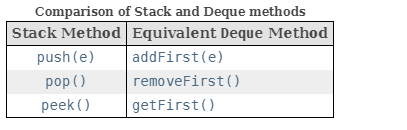

# Collection Framework:

The Collection Framework is an architecture that provides facilities to store and manipulate a group of objects. This allows the user to perform the basic functionalities on data such as searching, sorting, deletion, insertion, etc.

- There are four main interfaces in the Java Collections Framework.
- The interfaces are shown in rectangles, with the classes in rounded boxes.


**1. List:** A list is an ordered collection of elements that allows duplicate entries. Elements in a list can be accessed by an int index.

**2. Set:** A set is a collection that does not allow duplicate entries.

**3. Queue:** A queue is a collection that orders its elements in a specific order for processing. A Deque is a subinterface of Queue that allows access at both ends.


**4. Map:** A map is a collection that maps keys to values, with no duplicate keys allowed. The elements in a map are key/value pairs.

#### Iterable

- Implementing this interface allows an object to be the target of the enhanced for statement (sometimes called the "for-each loop" statement).
- Iterable Methods:
````java
default void forEach(Consumer<? super T> action);

Iterator<T> iterator();

default Spliterator<T> spliterator();
````
- The iterators returned by this class's iterator and listIterator methods are fail-fast: if the list is structurally modified at any time after the iterator is created, in any way except through the Iterator's own remove or add methods, the iterator will throw a ConcurrentModificationException.

#### Collection Interface Methods:
- The root interface in the collection hierarchy.
````java
//Adding
boolean add(E e);
boolean addAll(Collection<? extends E> c)

//Removing    
boolean remove(Object o);
boolean removeAll(Collection<?> c);
default boolean removeIf(Predicate<? super E> filter);//Removes all of the elements of this collection that satisfy the given predicate. 
void clear();
    
//Searching    
boolean contains(Object o);
boolean containsAll(Collection<?> c);

boolean isEmpty();
int size();

Object[] toArray();
<T> T[] toArray(T[] a);
````

## 1. List:
- The main thing all List implementations have in common is that they are ordered and
  allow duplicates.

__ArrayList:__

- An ArrayList is like a resizable array. 
- When you aren’t sure which collection to use, use an ArrayList.
- Lookup by index takes Constant Time
- Adding or removing an element is slower than accessing an element. 
- ArrayList is a good choice when you are reading more often than (or the same amount as) writing to the ArrayList.
 
__LinkedList:__

- Doubly linked list implementation of the **List** and **Deque** interfaces. It has all the methods of a List and Deque.
- **Note that this implementation is not synchronized.**
- The main benefits of a LinkedList are that you can access, add to, and remove from the beginning and end of the list in constant time. 
- The trade-off is that dealing with an arbitrary index takes linear time. 
- This makes a LinkedList a good choice when you’ll be using it as Deque.

#### Constructors:

- Most Collections have two constructors
````java
var linked1 = new LinkedList<String>();
var linked2 = new LinkedList<String>(linked1);
````
- The first says to create an empty LinkedList containing all the defaults. 
- The second tells Java that we want to make a copy of another LinkedList.

- ArrayList has an extra constructor you need to know.

````java
var list1 = new ArrayList<String>();
var list2 = new ArrayList<String>(list1);
var list3 = new ArrayList<String>(10);
````

- The first two are the common constructors you need to know for all Collections. 
- The final example says to create an ArrayList containing a specific number of slots, but again not to assign any. You can think of this as the size of the underlying array.
- 

#### List's Factory Methods:


````java
    String[] array = new String[] {"a", "b", "c"};
    List<String> asList = Arrays.asList(array); // [a, b, c]
    List<String> of = List.of(array); // [a, b, c]
    List<String> copy = List.copyOf(asList); // [a, b, c]

    array[0] = "z";
    System.out.println(asList); // [z, b, c]
    System.out.println(of); // [a, b, c]
    System.out.println(copy); // [a, b, c]

    asList.set(0, "x");
    System.out.println(Arrays.toString(array)); // [x, b, c]
        
    copy.add("y"); // UnsupportedOperationException
````

#### List Methods:
- The methods in the List interface are for working with indexes.
- In addition to the inherited Collection methods, the method signatures that you need to know:


#### Overloaded remove() method conflicts for Integer Type:
- Collection remove method will remove the object by it's value
- List remove method will remove the object by it's index.

````java
  boolean remove(Object o); //from collection remove by value
  E remove(int index); // from List Interface remove by index
````

##### Example:

````java
import java.util.ArrayList;

var list = new ArrayList<Integer>();
list.add(10);
list.add(20);
list.add(100);
//primitive checks for index
list.remove(100); //throws Exception java.lang.IndexOutOfBoundsException: Index 100 out of bounds for length 3
//object checks for value
list.remove(Integer.valueOf(100)); // removes the value successfully
````

### Converting from List to an Array
- Let’s start with turning a List into an array:
````java
List<String> list = new ArrayList<>();
list.add("hawk");
list.add("robin");
Object[] objectArray = list.toArray();
//The advantage of specifying a size of 0 for the parameter is that Java will create a new array of the proper size for the return value.
String[] stringArray = list.toArray(new String[0]); //specifies the type of the array
list.clear();
System.out.println(objectArray.length); // 2
System.out.println(stringArray.length); // 2

````
- The advantage of specifying a size of 0 for the parameter is that Java will create a new array of the proper size for the return value.
- If you like, you can suggest a larger array to be used instead. If the List fits in that array, it will be returned. 
- Otherwise, a new array will be created. 
- Notice that after clearing the original List. This does not affect either array. 
- The array is a newly created object with no relationship to the original List. It is simply a copy.


## 2. Set
- You use a Set when you don’t want to allow duplicate entries.


__HashSet:__

- A HashSet stores its elements in a hash table, which means the keys are a hash and the
  values are an Object. 
- This means that the HashSet uses the hashCode() method of the objects to retrieve them more efficiently. 
- Remember that a valid hashCode() doesn’t mean every object will get a unique value, but the method is often written so that hash values are spread out over a large range to reduce collisions.
- The main benefit is that adding elements and checking whether an element is in the set both have constant time. 
- The trade-off is that you lose the insertion order.


__TreeSet:__

- A TreeSet stores its elements in a sorted tree structure. 
- The main benefit is that the set is always in sorted order. 
- The trade-off is that adding and checking whether an element exists takes longer than with a HashSet, especially as the tree grows larger.

#### Set Factory Methods: Unmodifiable Sets

- The Set.of and Set.copyOf static factory methods provide a convenient way to create unmodifiable sets. 
- The Set instances created by these methods have the following characteristics:

      - They are unmodifiable. Elements cannot be added or removed. Calling any mutator method on the Set will always cause UnsupportedOperationException to be thrown. However, if the contained elements are themselves mutable, this may cause the Set to behave inconsistently or its contents to appear to change.
      - They disallow null elements. Attempts to create them with null elements result in NullPointerException.
      - They are serializable if all elements are serializable.
      - They reject duplicate elements at creation time. Duplicate elements passed to a static factory method result in IllegalArgumentException.
      - The iteration order of set elements is unspecified and is subject to change.
      - They are value-based. Programmers should treat instances that are equal as interchangeable and should not use them for synchronization, or unpredictable behavior may occur. For example, in a future release, synchronization may fail. Callers should make no assumptions about the identity of the returned instances. Factories are free to create new instances or reuse existing ones.
      - They are serialized as specified on the Serialized Form page.
      - Like a List, you can create an **immutable Set** in one line or make a copy of an existing one.

- Source: https://docs.oracle.com/en/java/javase/17/docs/api/java.base/java/util/Set.html


__Example:__

````java
Set<Character> lettersInvalid = Set.of('z', 'o', 'o'); // Exception java.lang.IllegalArgumentException: duplicate element: o
Set<Character> letters = Set.of('z','e','b','r','a');
Set<Character> copy = Set.copyOf(letters);
//Both are Immutable Sets
letters.add('h'); //Exception java.lang.UnsupportedOperationException
copy.add('h'); //Exception java.lang.UnsupportedOperationException

Set<Character> letters = Set.of('z','e','b','r','a',null); //Exception java.lang.NullPointerException: Cannot invoke "Object.hashCode()" because "pe" is null

Set<Character> set = new HashSet<>();
set.add(null); //Valid
````

#### equals() and hashcode():

- Remember that the equals() method is used to determine equality. 
- The hashCode() method is used to know which bucket to look in so that Java doesn’t have to look through the whole set to find out whether an object is there. 
- The best case is that hash codes are unique and Java has to call equals() on only one object. 
- The worst case is that all implementations return the same hashCode() i.e collisions and Java has to call equals() on every element of the set anyway.


## 3. Queue, Deque & Priority Queue

### Queue & Deque
- You use a Queue when elements are added and removed in a specific order. You can think of a queue as a line.
- This is a FIFO (first-in, first-out) queue.
- A Deque (double-ended queue), often pronounced “deck,”.
- It is different from a regular queue in that you can insert and remove elements from both the front (head) and back (tail).

__Queue & Deque Implementations:__

__Queue:__
- Besides basic Collection operations, queues provide additional insertion, extraction, and inspection operations. 
- Each of these methods exists in two forms: one throws an exception if the operation fails, the other returns a special value (either null or false, depending on the operation).


- The offer method inserts an element if possible, otherwise returning false. This differs from the Collection.add method, which can fail to add an element only by throwing an unchecked exception. The offer method is designed for use when failure is a normal, rather than exceptional occurrence, for example, in fixed-capacity (or "bounded") queues.
- The remove() and poll() methods remove and return the head of the queue.
- when the queue is empty: the remove() method throws an exception, while the poll() method returns null.
- The element() and peek() methods return, but do not remove, the head of the queue.
- Queue implementations generally do not allow insertion of null elements, although some implementations, such as LinkedList, do not prohibit insertion of null. Even in the implementations that permit it, null should not be inserted into a Queue, as null is also used as a special return value by the poll method to indicate that the queue contains no elements.

__Deque:__

- A linear collection that supports element insertion and removal at both ends. The name deque is short for "double ended queue" and is usually pronounced "deck". Most Deque implementations place no fixed limits on the number of elements they may contain, but this interface supports capacity-restricted deques as well as those with no fixed size limit.
- This interface defines methods to access the elements at both ends of the deque. Methods are provided to insert, remove, and examine the element. Each of these methods exists in two forms: one throws an exception if the operation fails, the other returns a special value (either null or false, depending on the operation). The latter form of the insert operation is designed specifically for use with capacity-restricted Deque implementations; in most implementations, insert operations cannot fail.
- The twelve methods described above are summarized in the following table:


````java
//Returns: true if an element was removed as a result of this call
public boolean removeFirstOccurrence(Object o); // Removes the first occurrence of the specified element from this deque.
public boolean removeLastOccurrence(Object o); // Removes the last occurrence of the specified element from this deque.
````
__Deque is Used as Queue:__
- This interface extends the Queue interface. When a deque is used as a queue, FIFO (First-In-First-Out) behavior results. 
- Elements are added at the end of the deque and removed from the beginning.


__Deque is Used as Stack:__

- Deques can also be used as LIFO (Last-In-First-Out) stacks. This interface should be used in preference to the legacy Stack class.
- When a deque is used as a stack, elements are pushed and popped from the beginning of the deque. Stack methods are equivalent to Deque methods as indicated in the table below:



- Unlike the List interface, this interface does not provide support for indexed access to elements.


__LinkedList:__
- The main benefit of a LinkedList is that it implements both the List and Deque interfaces. 
- The trade-off is that it isn’t as efficient as a “pure” queue. 
- You can use the ArrayDeque class if you don’t need the List methods.
- **_Null elements are allowed but not recommended to use it._**
- best suitable for Deque

__ArrayDeque:__

- Resizable-array implementation of the **Deque** interface. 
- ArrayDeques have no capacity restrictions
- **_Null elements are prohibited._** 
- This class is likely to be faster than Stack when used as a stack, and faster than LinkedList when used as a queue.
- Best suitable for Stack & Queue Operations.


__Priority Queues/Heaps:__

- The elements of the priority queue are ordered according to their natural ordering, or by a Comparator provided at queue construction time, depending on which constructor is used. A priority queue does not permit null elements. A priority queue relying on natural ordering also does not permit insertion of non-comparable objects (doing so may result in ClassCastException).

````java
PriorityQueue<Integer> minHeap = new PriorityQueue<Integer>();
PriorityQueue<Integer> maxHeap = new PriorityQueue<>(Comparator.reverseOrder());
````

__1. Max Heap:__ The root node contains the maximum value, and the values decrease as you move down the tree.

__2.Min Heap:__ The root node contains the minimum value, and the values increase as you move down the tree.

- The Iterator provided in method iterator() and the Spliterator provided in method spliterator() are not guaranteed to traverse the elements of the priority queue in any particular order. If you need ordered traversal, consider using Arrays.sort(pq.toArray()).
- Implementation note: this implementation provides O(log(n)) time for the enqueuing and dequeuing methods (offer, poll, remove() and add); linear time for the remove(Object) and contains(Object) methods; and constant time for the retrieval methods (peek, element, and size).

##### Sources:
1. Queue: https://docs.oracle.com/en/java/javase/17/docs/api/java.base/java/util/Queue.html
2. Deque: https://docs.oracle.com/en/java/javase/17/docs/api/java.base/java/util/Deque.html
3. ArrayDeque: https://docs.oracle.com/en/java/javase/17/docs/api/java.base/java/util/ArrayDeque.html
4. LinkedList: https://docs.oracle.com/en/java/javase/17/docs/api/java.base/java/util/LinkedList.html


## 4. Map


#### Exam Points:
1. Unboxing Nulls:
````java
var heights = new ArrayList<Integer>();
heights.add(null);
int h = heights.get(0); // NullPointerException

Integer h = heights.get(0); //Works Fine
````
- we try to unbox that null to an int primitive. Be careful when you see null in relation to autoboxing.

#### Refrences:
1. https://silvahansini.medium.com/an-introduction-to-the-collection-framework-in-java-d13e30530161
