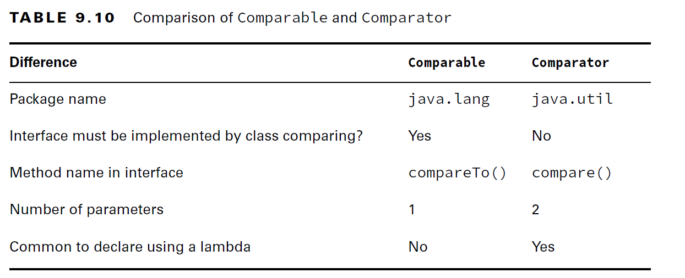
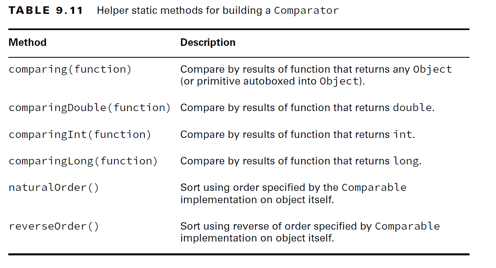
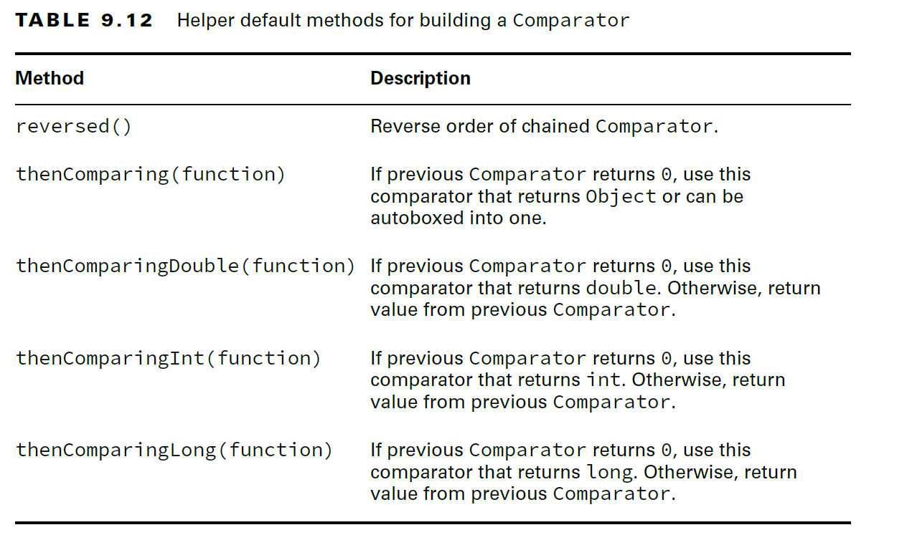

# Sorting Data

- Sorting Order is decided based on Data types.
- Natural Sorting Order: For numbers, order is numerical order. For String objects, order is defined according to the Unicode Character mapping.

- When working with a String, remember the order:
        
        - Numbers sort before letters
        - Uppercase letters sort before lowercase letters.

- `Collections.sort()` returns void because the method parameter is what gets sorted.
- Sorting functionality is defined by two interfaces

1. Comparable
2. Comparator

## 1. Comparable:
- If you want to define a default/natural sorting order for your class then the class should implement Comparable interface.
- Comparable `compareTo()` method considered as a natural sorting order for the class, and it is referred as its natural comparison method.
- When we use `Collections.sort()` or `Arrays.sort()` by default all elements are sorted as per Class's `compareTo()` method.
- Objects that implement this interface can be used as keys in a sorted map or as elements in a sorted set, without the need to specify a comparator.

__Note:__ All Wrapper Classes and String by default implements Comparable Interface.

```java
public interface Comparable<T> {
    int compareTo(T o); // a negative integer, zero, or a positive integer as this object is less than, equal to, or greater than the specified object.
}
```

#### Comparison Return Rules:

There are three rules to know: 

- The number 0 is returned when the current object is equivalent to the argument to compareTo().
- A negative number (less than 0) is returned when the current object is smaller than the argument to compareTo().
- A positive number (greater than 0) is returned when the current object is larger than the argument to compareTo().


#### Legacy Code:
Casting the compareTo() Argument
When dealing with legacy code or code that does not use generics, the compareTo() method
requires a cast since it is passed an Object.

````java
public class LegacyDuck implements Comparable { 
    
    private String name;
    
    public int compareTo(Object obj) {
        LegacyDuck d = (LegacyDuck) obj; // cast because no generics
        return name.compareTo(d.name);
    }
  
}
````

#### CompareTo logic with null checks

````java
public class MissingDuck implements Comparable<MissingDuck> {

    private String name;
    
    public int compareTo(MissingDuck quack) {
        if (quack == null)
            throw new IllegalArgumentException("Poorly formed duck!");
        
        if (this.name == null && quack.name == null)
            return 0;
        else if (this.name == null) return -1;
        else if (quack.name == null) return 1;
        else return name.compareTo(quack.name);
    }
}
````
- You are strongly encouraged to make your Comparable classes consistent with equals because not all collection classes behave predictably if the compareTo() and equals() methods are not consistent.

## 2. Comparator:

- Sometimes you want to sort an object that did not implement Comparable, or you want to sort objects in different ways at different times.
- For Example, if we are working with other library classes and we want to sort the collection.
- With comparator sorting logic is externalized
- With comparable we can  sort only one way, we can use different comparators to sort the same collection by different ways.

```java
public class Comparator<T> {
    public int compare(T obj1, T obj2);
}
```


```java
import java.util.ArrayList;
import java.util.Collections;
mport java.util.Comparator;

public class Duck implements Comparable<Duck> {
    private String name;
    private int weight;


    public int compareTo(Duck d) {
        return name.compareTo(d.name);
    }

    public static void main(String[] args) {
        Comparator<Duck> byWeight = (Duck d1, Duck d2) -> {
            return d1.getWeight() - d2.getWeight();
        };
        var ducks = new ArrayList<Duck>();
        ducks.add(new Duck("Quack", 7));
        ducks.add(new Duck("Puddles", 10));
        //It uses compareTo method to sort the list
        Collections.sort(ducks);

        System.out.println(ducks); // [Puddles, Quack]
      //it uses comparator sorting logic to sort by weight
        Collections.sort(ducks, byWeight);
        System.out.println(ducks); // [Quack, Puddles]
    }
}
```


#### Is Comparable a Functional Interface?

- Comparator is a functional interface because it has a single abstract method.
- Comparable is also a functional interface since it also has a single abstract method. 
- However, using a lambda for Comparable would be silly. The point of Comparable is to implement it inside the object being compared.


### Comparable Vs Comparator




### Comparing Multiple Fields

```java
public class Squirrel {
    int weight;
    String species;

}
```

- We want to write a Comparator to sort by species name. If two squirrels are from the same species, we want to sort the one that weighs the least first

```java
Comparator<Squirrel> comp = compare(Squirrel s1, Squirrel s2) -> {
    int result = s1.getSpecies().compareTo(s2.getSpecies());
    
    if (result != 0) return result;
    
    return s1.getWeight()-s2.getWeight();
}
```

```java
Comparator<Squirrel> c = Comparator.comparing(Squirrel::getSpecies)
        .thenComparingInt(Squirrel::getWeight);
```

- First, we create a Comparator on species ascending. Then, if there is a tie, we sort by weight.

#### Helper Methods to Build & Chain the Comparator

- helper methods you should know for building a Comparator.



- the methods that you can chain to a Comparator to further specify its behavior.




#### Binary Search
The binarySearch() method requires a sorted List.

````java
    List<Integer> list = Arrays.asList(6,9,1,8);
    
    Collections.sort(list); // [1, 6, 8, 9]
    
    System.out.println(Collections.binarySearch(list, 6)); // 1

    System.out.println(Collections.binarySearch(list, 3)); // -2
    

````

- Once the List is sorted, we can call binary search properly. 
- `Collections.binarySearch(list, 6)`: prints the index at which a match is found. 
-  `Collections.binarySearch(list, 3)`: prints one less than the negated index of where the requested value would need to be inserted. 
- The number 3 would need to be inserted at index 1 (after the number 1 but before the number 6). 
- Negating that gives us −1, and subtracting 1 gives us −2.

#### TreeSet & TreeMap: 
- If you want to create a TreeSet or TreeMap then the objects which are storing inside it either should be implemented Comparable Interface or we have to pass the Custom Comparator to the constructor.
- Otherwise, we get __ClassCastException__ _during first insert_

- 