# Building Blocks:

- An **_object_** is a runtime instance of a class in memory. A **_reference_** is a variable that points to an object.
- At most, one of the top-level types in the file is allowed to be public.
- If you do have a public type, it needs to match the filename.

````java
public final static void main(final String[] args) {
    
}
````
- In this example, both **_final_** modifiers are optional, and the main() method is a valid entry point with or without them.
- **Single-File Source-Code:** If you get tired of typing both javac and java every time you want to try a code example, there’s a shortcut. You can instead run ``java Zoo.java``, It compiles and run Zoo.java file
- **_packages:_** Logical groupings for classes.
- The **_import_** statement doesn’t bring in child packages, fields, or methods; it imports only classes directly under the package
````java
import java.util.*;
import java.util.concurrent.*;
import java.util.concurrent.atomic.*;
````

- You might think that including so many classes slows down your program execution, but it doesn’t. The compiler figures out what’s actually needed.
- Redundant Imports:
  - Everything in java.lang is automatically imported. importing package again is redundant
  - Another case of redundancy involves importing a class that is in the same package as the class importing it. Java automatically looks in the current package for other classes.
  - Files and Paths are both in the package java.nio.file. The exam may use packages you may never have seen before.

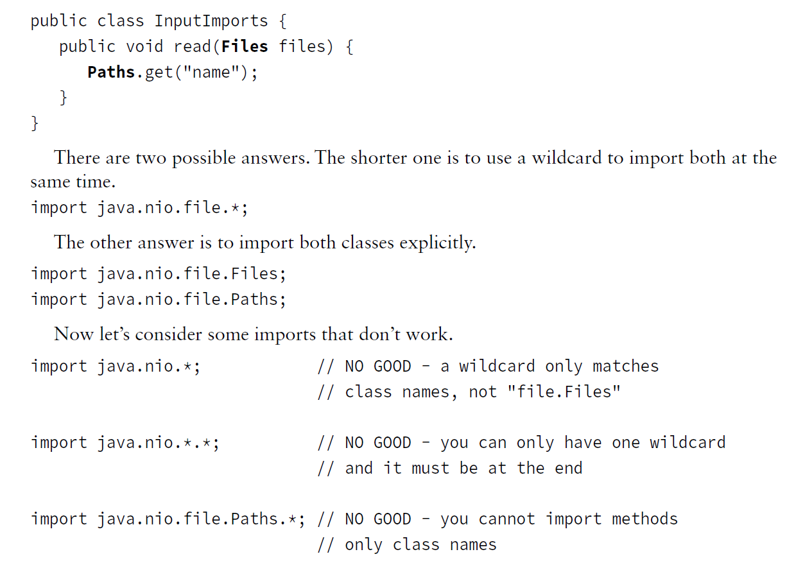

---

#### Packages:

````java
package packagea;
public class ClassA {}

package packageb;
import packagea.ClassA;
public class ClassB {
  public static void main(String[] args) {
    ClassA a;
    System.out.println("Got it");
  }
}

````

- compile: 
- ``javac packagea/ClassA.java packageb/ClassB.java``
- ``javac packagea/*.java packageb/*.java``
- you cannot use a wildcard to include subdirectories

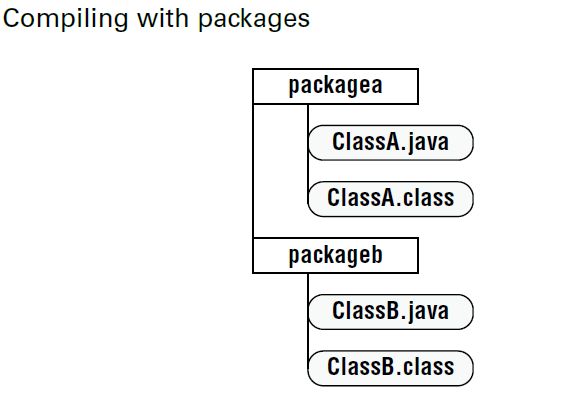
- Run: ``java packageb.ClassB``


- By default, the javac command places the compiled classes in the same directory as the source code. 
- Use ``-d`` option to place the class files into a different directory.
- Java options are **case sensitive**. This means you cannot pass ``-D`` instead of ``-d``.

- Compile with ``-d``
- ``javac -d` classes packagea/ClassA.java packageb/ClassB.java``
- 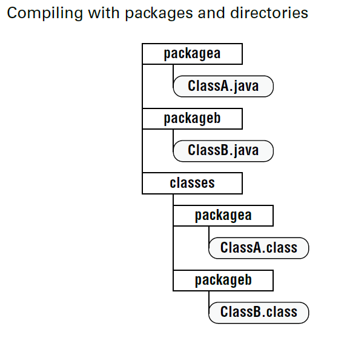
- To run the program, you specify the classpath so Java knows where to find the classes.
  There are three options you can use. All three of these do the same thing:
````java
  java -cp classes packageb.ClassB

  java -classpath classes packageb.ClassB

  java --class-path classes packageb.ClassB
````

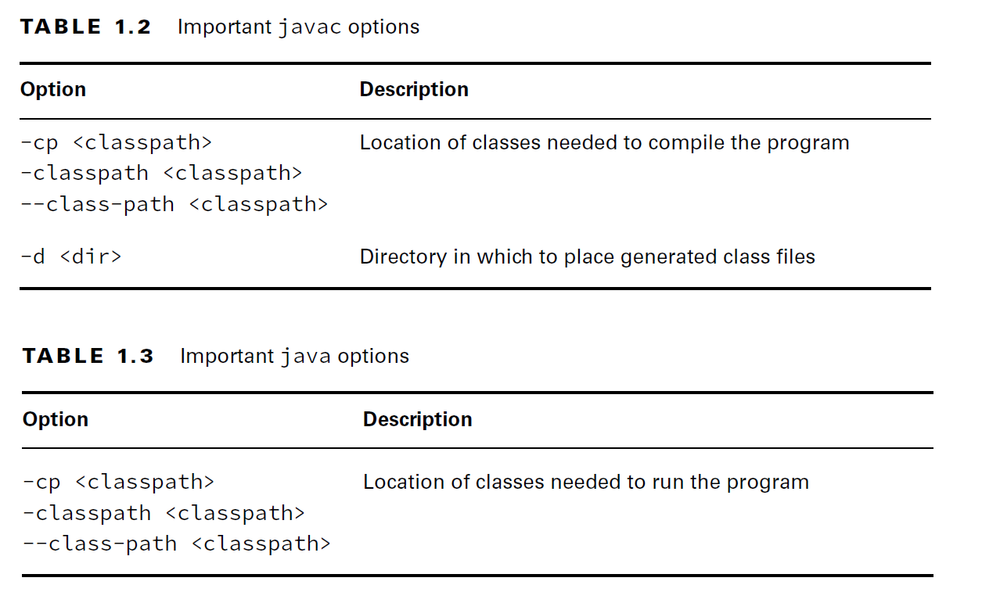

- If the class files are in separate JAR, you can also specify the location of the other files explicitly using a classpath
````java
java -cp ".;C:\temp\someOtherLocation;c:\temp\myJar.jar" myPackage.MyClass

java -cp "C:\temp\directoryWithJars\*" myPackage.MyClass 
//It won’t include any JARs in the classpath that are in a subdirectory of directoryWithJars.
````
- The period (.) indicates that you want to include the current directory in the classpath
- Windows uses semicolons (;) to separate parts of the classpath; other operating systems use colons(:).

___

#### Creating JAR fies:

````Bash
jar -cvf myNewFile.jar .
        
jar --create --verbose --file myNewFile.jar .

#Alternatively, you can specify a directory instead of using the current directory.
jar -cvf myNewFile.jar -C dir .
````

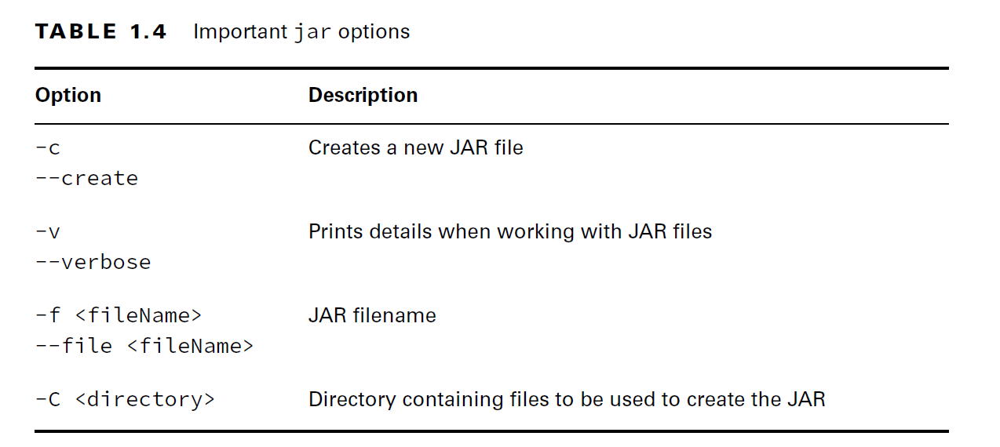

___

#### Ordering Elements inside the Class File:

- Comments can go anywhere in the code.

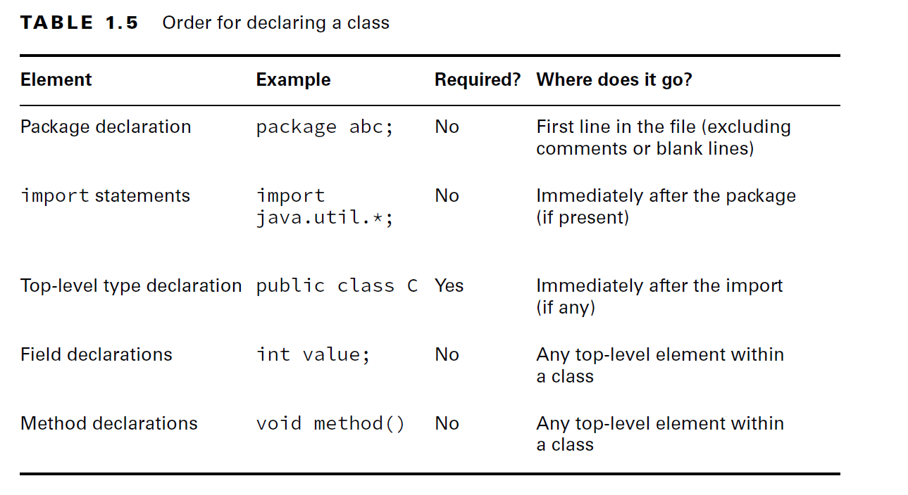

- Got all that? Think of the acronym PIC (picture): package, import, and class. 
- Fields and methods are easier to remember because they merely have to be inside a class.


___

#### Creating Objects:

- There are two key points to note about the constructor: 
  - The name of the constructor matches the name of the class
  - There’s no return type.
````java
public class Chick {
  public Chick() {
    System.out.println("in constructor");
  }
}
````

- **Executing Instance Initializer Blocks**
- Anywhere you see braces is a **code block**.
- Sometimes code blocks are inside a method. These are run when the method is called.
- Other times, code blocks appear outside a method. These are called instance initializers.

````java
public class Bird {
    public static void main(String[] args) {
         { System.out.println("Feathers"); } //code block: executed whenever main method is called 
    }
    
   { System.out.println("Snowy"); } //instance initializer: execute during object creation
}
````
- There are four code blocks in this example: 
  - a class definition, 
  - a method declaration, 
  - an inner block, 
  - and an instance initializer.

#### Order of Initialization:
- Fields and instance initializer blocks are run in the order in which they appear in the file.
- The constructor runs after all fields and instance initializer blocks have run.
- Order matters for the fields and blocks of code. You can’t refer to a variable before it has
  been defined:

````java
 { System.out.println(name); } // DOES NOT COMPILE: cannot find symbol name
  private String name = "Fluffy";
````
 
___

### Understanding Data Types:

- Java applications contain two types of data: primitive types and reference types.
- Java has eight built-in data types, referred to as the Java primitive types.
- all Java objects are just a complex collection of these primitive data types.
- A primitive is just a single value in memory, such as a number or character.

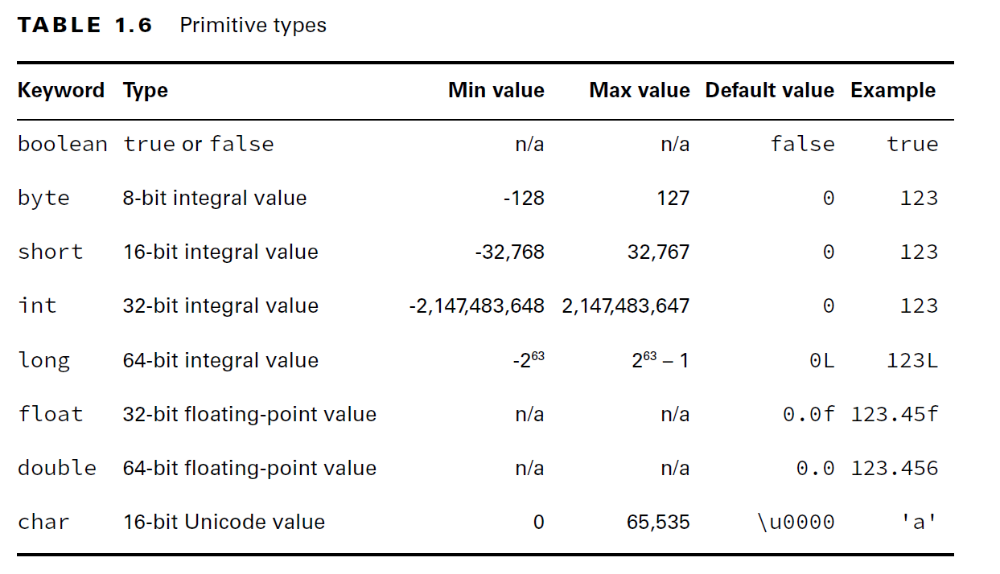

- The ``byte, short, int, and long`` types are used for integer values without decimal points.
- All of the numeric types are signed and reserve one of their bits to cover a negative range.
- For example, instead of byte covering 0 to 255 (or even 1 to 256) it actually covers -128 to 127.
- A long requires the letter l or L following the number so Java knows it is a long.
- Without an l or L, Java interprets a number without a decimal point as an int in most scenarios.
- A float requires the letter f or F following the number so Java knows it is a float. Without an f or F, Java interprets a decimal value as a double.
- Although floating point numbers are declared with ``f`` suffix, they are not printed with `f` suffix.

#### Signed and Unsigned: short and char:
- For the exam, you should be aware that short and char are closely related, as both are stored as integral types with the same 16-bit length.
- The primary difference is that short is signed, which means it splits its range across the positive and negative integers. 
- Alternatively, char is unsigned, which means its range is strictly positive, including 0.

#### Writing Literals:
- There are a few more things you should know about numeric primitives. When a number is
  present in the code, it is called a literal. By default, Java assumes you are defining an int value
  with a numeric literal.

````java
long max = 3123456789; // DOES NOT COMPILE
long max = 3123456789L; // Now Java knows it is a long
//please use the uppercase L. The lowercase l looks like the number 1.
````
- Another way to specify numbers is to change the “base.”
- **decimal number system: (digits 0-9):** 
- This numbering system is called base 10 since there are 10 possible values for each digit.
- Java allows you to specify digits in several other formats:
- **Octal (digits 0–7):**, which uses the number 0 as a prefix. for example, 017.
- **Hexadecimal (digits 0–9 and letters A–F/a–f):**, which uses 0x or 0X as a prefix. 
- For example, 0xFF, 0xff, 0XFf. Hexadecimal is case insensitive, so all of these examples mean the same value.
- **Binary (digits 0–1):**, which uses the number 0 followed by b or B as a prefix. 
- For example, 0b10, 0B10. 
- You won’t need to convert between number systems on the exam. You’ll have to recognize valid literal values that can be assigned to numbers.

#### Literals and the Underscore Character

- you can have underscores in numbers to make them easier to read:
- Numeric literals may contain underscores between two digits, such as 1_000, but not in other places,
  such as _100_.0_.
````java
  int million1 = 1000000;
  int million2 = 1_000_000;
````
- You can add underscores anywhere except:
  - at the beginning of a literal, 
  - the end of a literal, 
  - right before a decimal point, 
  - or right after a decimal point. 
  - You can even place multiple underscore characters next to each other.

````java
double notAtStart = _1000.00; // DOES NOT COMPILE
double notAtEnd = 1000.00_; // DOES NOT COMPILE
double notByDecimal = 1000_.00; // DOES NOT COMPILE
double annoyingButLegal = 1_00_0.0_0; // Ugly, but compiles
double reallyUgly = 1__________2; // Also compiles
````

___

### Using Reference Types:

A reference type refers to an object (an instance of a class). Unlike primitive types that hold
their values in the memory where the variable is allocated, references do not hold the value
of the object they refer to. Instead, a reference “points” to an object by storing the memoryaddress where the object is located, a concept referred to as a pointer.

- A value is assigned to a reference in one of two ways:
  - A reference can be assigned to another object of the same or compatible type.
  - A reference can be assigned to a **_new_** object using the new keyword.

````java
String s1 = "Hello";
String s2 = s1;
String s3 = new String("Hello World!");
````

- reference types can be used to call methods, assuming the reference is not null.
- reference types can be assigned null, which means they do not currently refer to an object.
- Primitive types will give you a compiler error if you attempt to assign them null.

#### Creating Wrapper Classes:

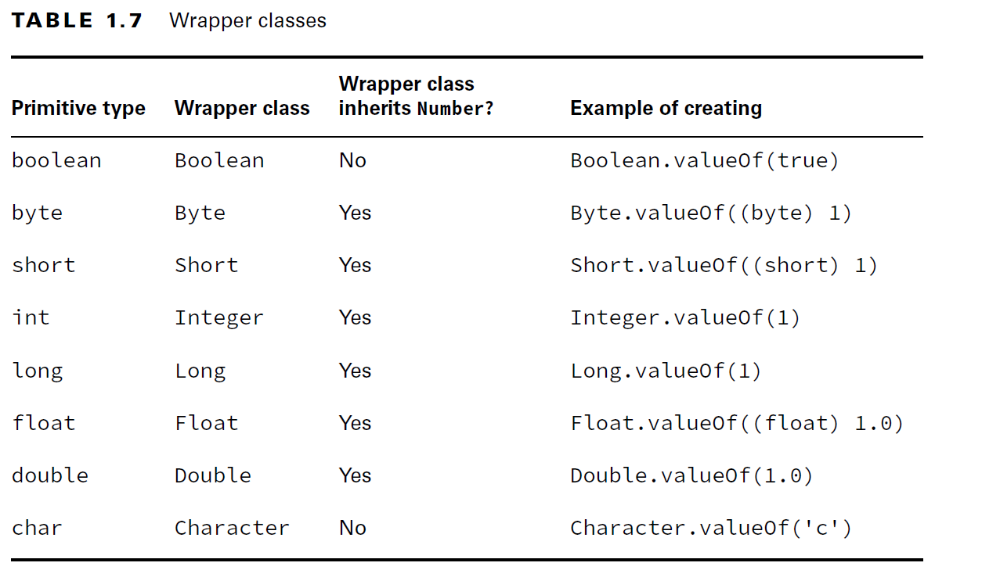

- There is also a valueOf() variant that converts a String into the wrapper class.
  For example:
- 
````java
  int primitive = Integer.parseInt("123"); //converts a String to an int primitive.
  Integer wrapper = Integer.valueOf("123");//converts a String to an Integer wrapper class.
````

- All the numeric classes extend the Number abstract class.
````java
byte byteValue(); //Returns the value of the specified number as a byte.

abstract double doubleValue(); // Returns the value of the specified number as a double.

abstract float floatValue(); //Returns the value of the specified number as a float.

abstract int intValue(); // Returns the value of the specified number as an int.

abstract long longValue(); // Returns the value of the specified number as a long.

short shortValue(); //Returns the value of the specified number as a short.
````

````java
Double apple = Double.valueOf("200.99");
System.out.println(apple.byteValue()); // -56 //there is no 200 in byte, so it wraps around to -56
System.out.println(apple.intValue()); // 200
System.out.println(apple.doubleValue()); // 200.99
````

- The Boolean and Character wrapper classes include booleanValue() and charValue(), respectively.
- These helper methods do their best to convert values but can result in a loss of precision.

___

#### Defining Text Blocks:
- Java has text blocks, also known as multiline strings.
- 
````java
String eyeTest = "\"Java Study Guide\"\n by Scott & Jeanne";

````

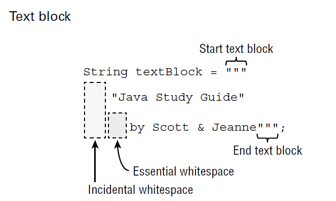

- A text block starts and ends with three double quotes ("""), and the contents don’t need to be escaped.
- **_Essential whitespace_** is part of your String and is important to you. 
- **_Incidental whitespace_** just happens to be there to make the code easier to read. 
- You can reformat your code and change the amount of incidental whitespace without any impact on your String value.

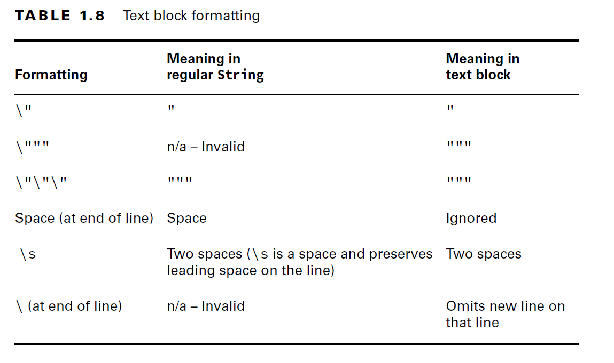

````java
String block = """doe"""; // DOES NOT COMPILE
//Text blocks require a line break after the opening """, making this one invalid.
````
- How many lines do you think are in this text block?
- 
````java
String block = """
  doe \
  deer""";
````
- Just one. The output is doe deer since the \ tells Java not to add a new line before deer.

````java
String block = """
                doe \n
                deer
                """;
````
- This time we have four lines. Since the text block has the closing """ on a separate line,
  we have three lines for the lines in the text block plus the explicit \n.
- What do you think this outputs?
````java
String block = """
"doe\"\"\"
\"deer\"""
""";
System.out.print("*"+ block + "*");
//The answer is
//* "doe"""
//"deer"""
````
- All of the \" escape the ". There is one space of essential whitespace on the doe and deer
  lines. All the other leading whitespace is incidental whitespace.

___

### Declaring Variables:

- A variable is a name for a piece of memory that stores data
- Giving a variable a value is called initializing a variable.

#### Identifying Identifiers:
- An identifier is the name of a variable, method, class, interface, or package.
- There are only four rules to remember for legal identifiers:


    - Identifiers must begin with a letter, a currency symbol, or a _ symbol. Currency symbols include dollar ($), yuan (¥), euro (€), and so on.
    - Identifiers can include numbers but not start with them.
    - A single underscore _ is not allowed as an identifier.
    - You cannot use the same name as a Java reserved word. 
    - Remember that Java is case sensitive, so you can use versions of the keywords that only differ in case.

- Reserved Keywords:

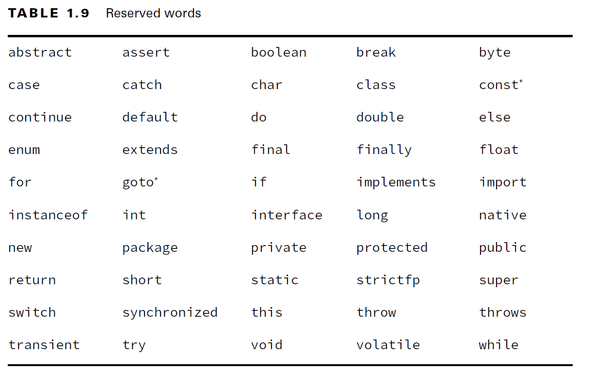

- here are other names that you can’t use. For example, true, false, and null are literal values, so they can’t be variable names
- Examples:
````java

long okidentifier;
float $OK2Identifier;
boolean _alsoOK1d3ntifi3r;
char __SStillOkbutKnotsonice$;

//These examples are not legal:
int 3DPointClass; // identifiers cannot begin with a number
byte hollywood@vine; // @ is not a letter, digit, $ or _
String *$coffee; // * is not a letter, digit, $ or _
double public; // public is a reserved word
short _; // a single underscore is not allowed
````

#### camelCase and snake_case:

- camel case has the first letter of each word capitalized.
- Method and variable names are typically written in camel case with the first letter lowercase, such as firstName, getFirstName(). 
- Class and interface names are also written in camel case, with the first letter uppercase, such as ArrayList, List.
- Another style is called snake case. It simply uses an underscore (_) to separate words.
- Java generally uses uppercase snake case for constants and enum values, such as NUMBER_FLAGS.


#### Declaring Multiple Variables

- You can also declare and initialize multiple variables in the same statement.
````java
void sandFence() {
    String s1, s2;
    String s3 = "yes", s4 = "no";
    int i1, i2, i3 = 0;
    //multivariables allowed only for same type.
    int num, String value; // DOES NOT COMPILE

    double d1, double d2; //DOES NOT COMPILE: type to is repeated
    int i1; int i2;// valid two statements
    int i3; i4; // Invalid: type is missing for i4
}
````

- You can declare many variables in the same declaration as long as they are all the same type. 
- You can also initialize any or all of those values inline.

#### Initializing Variables
- A local variable is a variable defined within a constructor, method, or initializer block.
- The final keyword can be applied to local variables and is equivalent to declaring constants in other languages.
- Local variables do not have a default value and must be initialized before use.
- the compiler will report an error if you try to read an uninitialized value.

````java
public int notValid() {
    int y = 10;
    int x;
    int z; // z is declared here but never initialized or used
    int reply = x + y; // DOES NOT COMPILE
    return reply;
}
````

#### Passing Constructor and Method Parameters
- Variables passed to a constructor or method are called constructor parameters or method parameters, respectively.
- These parameters are like local variables that have been pre-initialized.

````java
public void findAnswer(boolean check) {}

public void checkAnswer() {
    boolean value;
    findAnswer(value); // DOES NOT COMPILE: variable not initialized
}
````

#### Defining Instance and Class Variables

- An instance variable, often called a field, is a value defined within a specific instance of an object.
- Each instance of the class would have its own value for field.
- a class variable is one that is defined on the class level and shared among all instances of the class. 
- It can even be publicly accessible to classes outside the class and doesn’t require an instance to use.
- You can tell a variable is a class variable because it has the keyword **_static_** before it.
- Instance and class variables do not require you to initialize them. As soon as you declare these variables, they are given a default value.

#### Inferring the Type with var
- The formal name of this feature is **_local variable type inference_**.
- You have the option of using the keyword **var** instead of the type when declaring local variables under certain conditions.
- To use this feature, you just type **var** instead of the primitive or reference type.
- You can only use this feature for local variables.

````java
public class VarKeyword {
  var tricky = "Hello"; // DOES NOT COMPILE: var can be used only for local variables
}
````

- When you type var, you are instructing the compiler to determine the type for you. 
- The compiler looks at the code on the line of the declaration and uses it to infer the type.

````java
public void reassignment() {
    var number = 7;
    number = 4;
    number = "five"; // DOES NOT COMPILE
  var x = 1/0; //compiles but exception at runtime
}
````
- In Java, var is still a specific type defined at compile time. It does not change type at runtime.
- cannot use 'var' on variable without initializer
- the compiler looks only at the line with the declaration.
-  var is not allowed in multiple variable declaration
````java
public void doesThisCompile(boolean check) {
    var question; //DOES NOT COMPILE: cannot use 'var' on variable without initializer
    question = 1;

  int a, var b = 3; // DOES NOT COMPILE
  var n = null; // DOES NOT COMPILE
  var x = 10, y=20; // DOES NOT COMPILE: var is not allowed in multiple variable declaration
  
}
````

- While a var cannot be initialized with a null value without a type, it can be reassigned a null value after it is declared, provided that the underlying data type is a reference type.

````java
public int addition(var a, var b) { // DOES NOT COMPILE
  return a + b;
}
````
- In this example, a and b are method parameters. These are not local variables.
- var is not a reserved word and allowed to be used as an identifier. 
- It is considered a reserved type name. 
- A reserved type name means it cannot be used to define a type, such as a class, interface, or enum.

````java
//this code does compile
package var;
public class Var {
  public void var() {
    var var = "var";
  }
  public void Var() {
    Var var = new Var();
  }
}
````

#### Managing Variable Scope:

- Local variables can never have a scope larger than the method they are defined in.

````java
public void eatIfHungry(boolean hungry) {
    if (hungry) {
        int bitesOfCheese = 1;
    } // bitesOfCheese goes out of scope here
    System.out.println(bitesOfCheese); // DOES NOT COMPILE
}
````
- Each block of code has its own scope.
- **Local variables:** In scope from declaration to the end of the block
- **Method parameters:** In scope for the duration of the method
- **Instance variables:** In scope from declaration until the object is eligible for garbage collection
- **Class variables:** In scope from declaration until the program ends

___

### Destroying Objects:

- Garbage collection refers to the process of automatically freeing memory on the heap by deleting objects that are no longer reachable in your program.
- for the exam, you will need to know at any given moment which objects are eligible for garbage collection.
- Java includes a built-in
  method to help support garbage collection where you can suggest that garbage collection run.
- ``System.gc();``
- This method is not guaranteed to do anything.
- An object is no longer reachable when one of two situations occurs:

      - The object no longer has any references pointing to it.
      - All references to the object have gone out of scope.
- All references are the same size, no matter what their type is.
- An object sits on the heap and does not have a name. 
- Therefore, you have no way to access an object except through a reference. 
- Objects come in all different shapes and sizes and consume varying amounts of memory.
- is the object that gets garbage collected, not its reference.
- Object may never be garbage collected, such as if the program ends before the garbage collection runs.


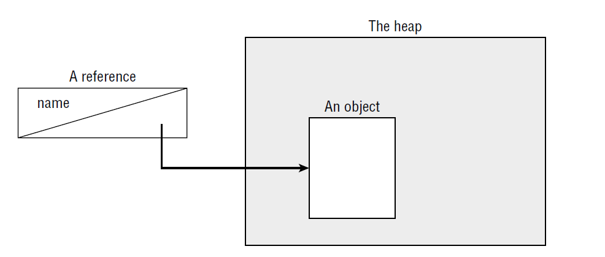

- 

