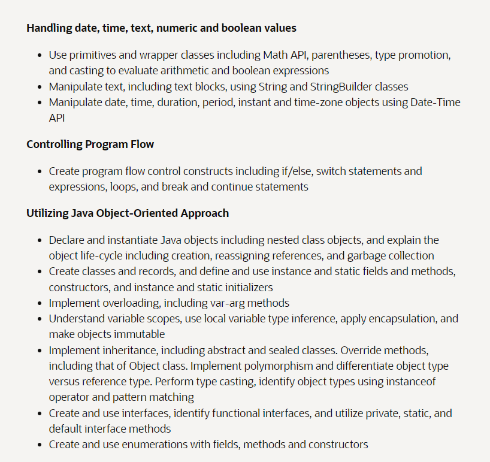
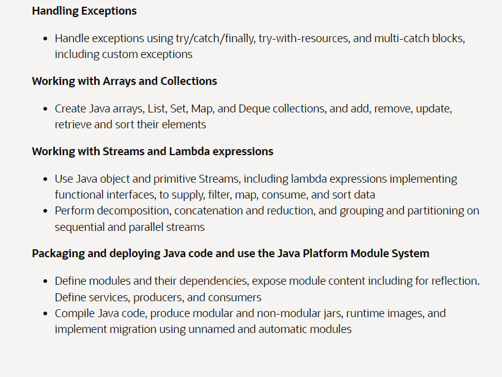
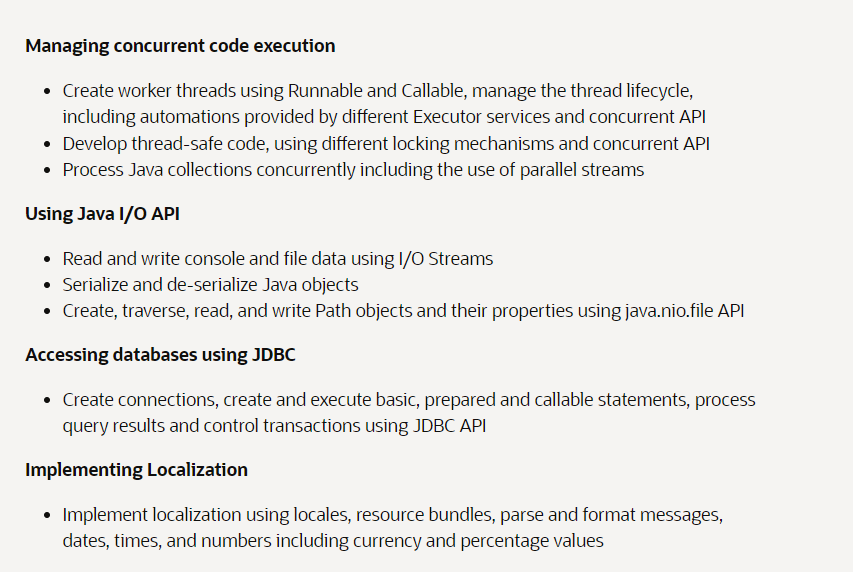
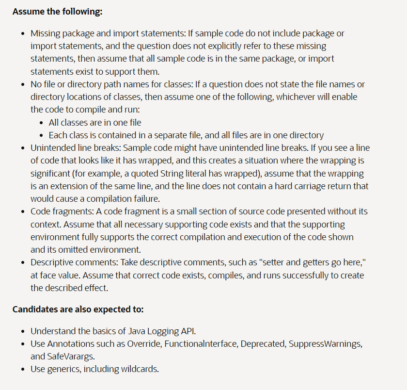
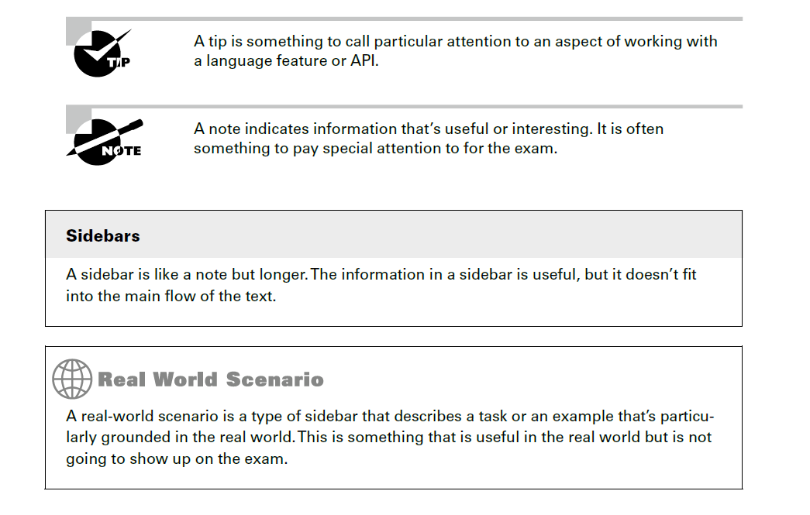

# Review Exam Topics










## About Exam:

#### Choosing the Correct Answer(s)

Each exam consists entirely of multiple-choice
questions. There are between four and seven
possible answers. If a question has more than one answer, the question specifically states
exactly how many correct answers there are.

### Reviewing Question Types

- the types of questions and oddities that you might come across on the exam.

Questions with Extra Information Provided Imagine the question includes a statement
that XMLParseException is a checked exception. It’s fine if you don’t know
what an XMLParseException is or what XML is, for that matter. (If you are wondering,
it is a format for data.) This question is a gift. You know the question is about
exception handling.
Questions with Embedded Questions To answer some questions on the exam, you
may have to answer two or three subquestions. For example, the question may contain
two blank lines and ask you to choose the two answers that fill in each blank. In some
cases, the two answer choices are not related, which means you’re really answering
multiple questions, not just one! These questions are among the most difficult and
time-consuming
on the exam because they contain multiple, often independent, questions
to answer. Unfortunately, the exam does not give partial credit, so take care when
answering questions like these.
Questions with Unfamiliar APIs If you see a class or method that wasn’t covered in
this book, assume that it works as you would expect. Some of these APIs you might
come across, such as SecurityManager, were on the Java 11 exam and are not part of
the Java 17 exams. Assume that the part of the code using that API is correct, and look
very hard for other errors.
Questions with Made-Up
or Incorrect Concepts In the context of a word problem, the
exam may bring up a term or concept that does not make any sense, such as saying an
interface inherits from a class, which is not a correct statement. In other cases, the exam
may use a keyword that does not exist in Java, like struct. For these, you just have to
read carefully and recognize when the exam is using invalid terminology.

Questions That Are Really Out of Scope When introducing new questions, Oracle
includes them as unscored questions at first. This allows the exam creators to see how
real exam takers do without impacting your score. You will still receive the number of
questions the exam lists. However, a few of them may not count. These unscored questions
may contain out-of-
scope
material or even errors. They will not be marked as
unscored, so you still have to do your best to answer them. Follow the previous advice
to assume that anything you haven’t seen before is correct. That will cover you if the
question is being counted!

### Book Organized:
Summary This section reviews the most important topics that were covered in the
chapter and serves as a good review.
Exam Essentials This section summarizes highlights that were covered in the chapter.
You should be able to convey the information described.
Review Questions Each chapter concludes with at least 20 review questions. You
should answer these questions and check your answers against the ones provided in the
Appendix. If you can’t answer at least 80 percent of these questions correctly, go back
and review the chapter, or at least those sections that seem to be giving you difficulty.


Conventions Used in This Book
This book uses certain typographic styles to help you quickly identify important information
and to avoid confusion over the meaning of words, such as on-screen
prompts. In particular,
look for the following styles:
■■ Italicized text indicates key terms that are described at length for the first time in a
chapter. (Italics are also used for emphasis.)

■ A monospaced font indicates code or command-line
text. We often use bold to highlight
important words or methods within a code sample.
■ Italicized monospaced text indicates a variable.
In addition to these text conventions, which can apply to individual words or entire paragraphs,
a few conventions highlight segments of text.



## Online References
- www.selikoff.net/ocp17
- www.wiley.com/go/Sybextestprep

The online test bank includes the following:
- Chapter wise Review questions
- Three Practice Exams.
- 500+ Flashcards.
- Additional Resources: A glossary of key terms from this book and their definitions is available as a fully searchable PDF.


## Applying Test-Taking Strategies:

- Ask for digital whiteboard

### Steps to Answer the Questions:
- Understanding the Question: The majority of questions on the exam contain code snippets and ask you to answer questions about them.
- 
1. First check for compiling code:  answer before attempting to solve the question is this: Does the code compile?
- there is no Does not compile option, consider that question a gift. 
- It means every line does compile, and you may be able to use information from this question to answer other questions!
2. If it compiles successfully, then understand what the program does
3. Tracking the state of primitive and reference variables. 
- For example, let’s say you encountered the following code snippet on a question about garbage collection:
````java
Object o = new Turtle();
Mammal m = new Monkey();
Animal a = new Rabbit();
o = m;
````

- It can be helpful to draw a diagram of the current state of the variable references. 

- Using the whiteboard to track state is also useful for complex questions 
- Remembering which functional interfaces take which generic arguments, it might be helpful to draw a table at the start of the exam.


#### Applying the Process of Elimination:

- Although you might not immediately know the correct answer to a question, if you can reduce the question from five answers to three, your odds of guessing the correct answer are markedly improved. 
- Moreover, if you can reduce a question from four answers to two, you’ll double your chances of guessing the correct answer!
- In some cases, you may be able to eliminate answer choices without even reading the question. 
- If you come across such questions on the exam, consider it a gift. 
- Can you correctly answer the following question in which the application code has been left out?
1. Which line, when inserted independently at line m1, allows the code to compile?
   -Code
   Omitted -A.
   public abstract final int swim();
   B. public abstract void swim();
   C. public abstract swim();
   D. public abstract void swim() {}
   E. public void swim() {}
   Without reading the code or knowing what line m1 is, we can eliminate three of the five
   answer choices. Options A, C, and D contain invalid declarations, leaving us with options B
   and E as the only possible correct answers.


Skipping Difficult Questions
The exam software includes an option to “mark” a question and review all marked questions
at the end of the exam. If you are pressed for time, answer a question as best you can
and then mark it to come back to later.
All questions are weighted equally, so spending 10 minutes answering five questions correctly
is a lot better use of your time than spending 10 minutes on a single question. If you
finish the exam early, you have the option of reviewing the marked questions as well as all of
the questions on the exam, if you choose.


Being Suspicious of Strong Words
Many questions on the exam include answer choices with descriptive sentences rather than
lines of code. When you see such questions, be wary of any answer choice that includes
strong words such as “must,” “all,” or “cannot.” If you think about the complexities of
programming languages, it is rare for a rule to have no exceptions or special cases. Therefore,
if you are stuck between two answers and one of them uses “must” while the other uses
“can” or “may,” you are better off picking the one with the weaker word since it is a more
ambiguous statement.

Choosing the Best Answer
Sometimes you read a question and immediately spot a compiler error that tells you exactly
what the question is asking. Other times, though, you may stare at a method declaration for
a couple of minutes and have no idea what the answer is. Unlike some other standardized
tests, there’s no penalty for answering a question incorrectly versus leaving it blank. If you’re
nearly out of time or you just can’t decide on an answer, select a random option and move
on. If you’ve been able to eliminate even one answer choice, then your guess is better than
blind luck.

Answer All Questions!
You should set a hard stop at five minutes of time remaining on the exam to ensure
that you’ve answered each and every question. Remember, if you fail to answer a question,
you’ll definitely get it wrong and lose points; but if you guess, there’s at least a chance
that you’ll be correct. There’s no harm in guessing!
When in doubt, we generally recommend picking a random answer that includes “Does not
compile” if available, although which choice you select is not nearly as important as making
sure that you do not leave any questions unanswered on the exam!

Getting a Good Night’s Rest
Although a lot of people are inclined to cram as much material as they can in the hours
leading up to an exam, most studies have shown that this is a poor test-taking
strategy.
The best thing we can recommend that you do before taking an exam is to get a good
night’s rest!
Given the length of the exam and the number of questions, the exam can be quite draining,
especially if this is your first time taking a certification exam. You might come in expecting
to be done 30 minutes early, only to discover that you are only a quarter of the way
through the exam with half the time remaining. At some point, you may begin to panic,
and it is in these moments that these test-taking
skills are most important. Just remember to
take a deep breath, stay calm, eliminate as many wrong answers as you can, and make sure
to answer every question. It is for stressful moments like these that being well rested with a
good night’s sleep is most beneficial!


