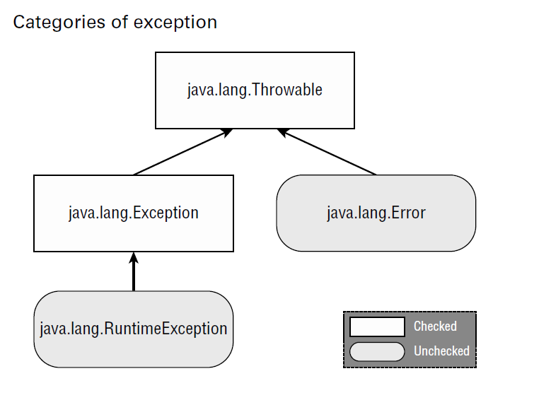
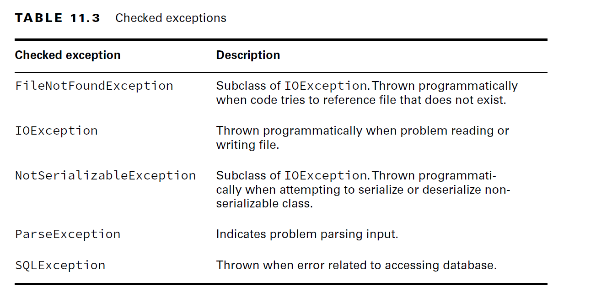
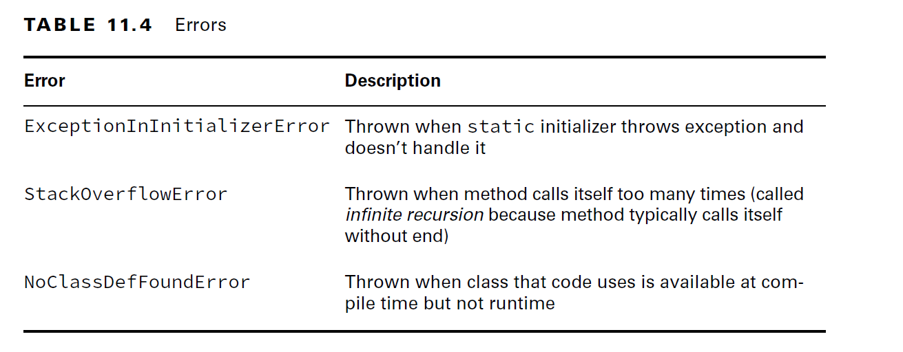
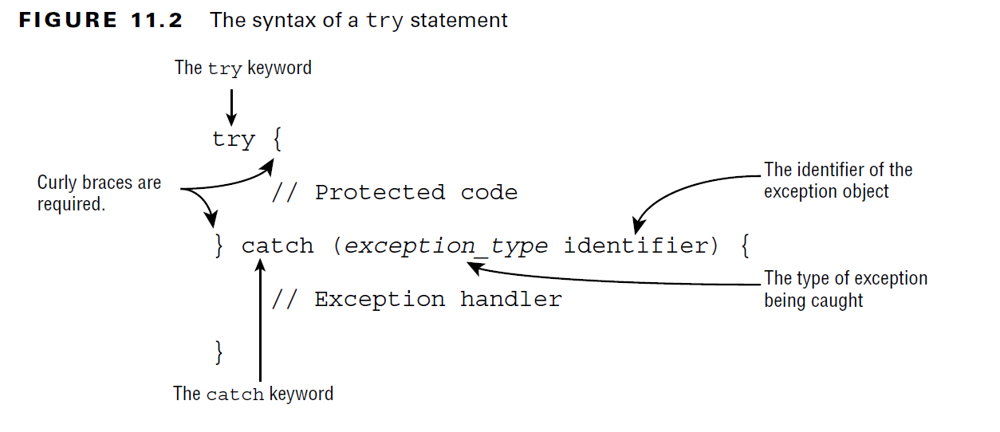
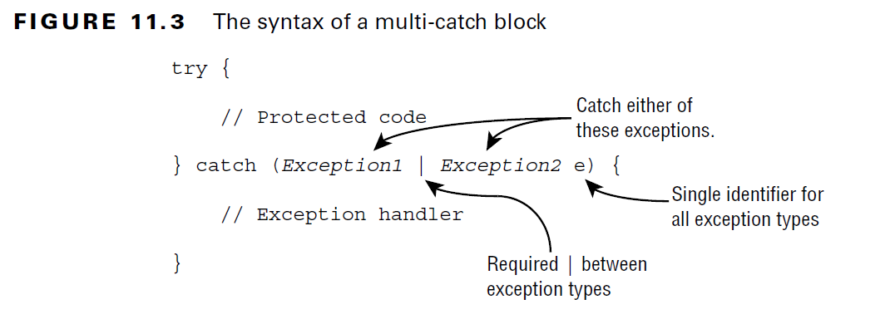
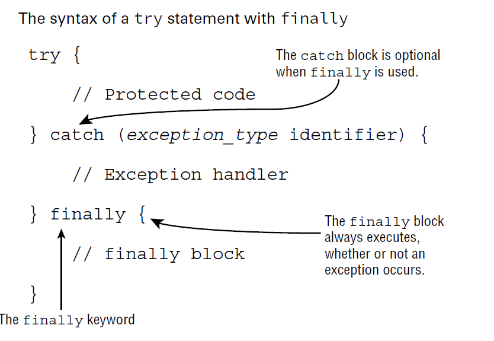
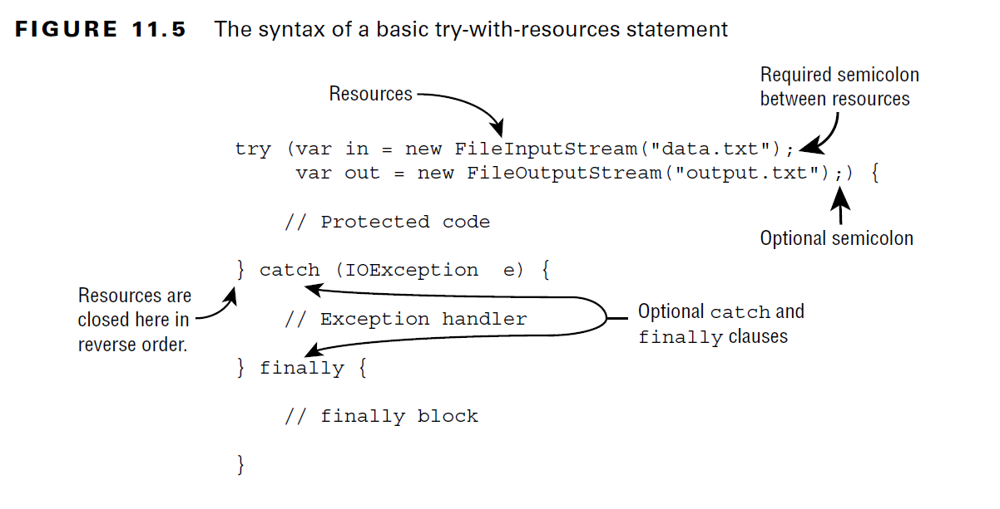

# 11.1 Exceptions

        
        - try/catch/finally blocks
        - try-with-resources
        - multi-catch blocks
        - cusstom exceptions

- An exception is Java’s way of saying, “I give up. I don’t know what to do right now. You deal with it.”



#### Checked Exceptions:
- A checked exception is an exception that must be declared or handled by the application code where it is thrown.
- checked exceptions all inherit Exception but not RuntimeException. 
- Checked exceptions tend to be more anticipated, for example, trying to read a file that doesn’t exist.
- Checked exceptions also include any class that inherits Throwable but not Error or RuntimeException, such as a class that directly extends Throwable. 
- For the exam, you just need to know about checked exceptions that extend Exception.


#### Unchecked Exceptions:

- An unchecked exception is any exception that does not need to be declared or handled by the application code where it is thrown.
- Unchecked exceptions are often referred to as runtime exceptions
- It is permissible to handle or declare an unchecked exception. 
- A runtime exception is defined as the RuntimeException class and its subclasses

<details>
<summary>2. Overriding Methods with Exceptions</summary>

### Overriding Methods with Exceptions:

- An overridden method may not declare any **new or broader checked** exceptions than the method it inherits.

```java
class CanNotHopException extends Exception {}

class Hopper {
    public void hop() {}
}
class Bunny extends Hopper {
    public void hop() throws CanNotHopException {} // DOES NOT COMPILE:  overridden method does not throw CanNotHopException
    public void hop() throws RuntimeException {} // WORKS:
}
```

- An overridden method in a subclass is allowed to declare fewer exceptions than the superclass or interface.
- This is legal because callers are already handling them.

````java
class Hopper {
    public void hop() throws CanNotHopException {}
}
class Bunny extends Hopper {
    public void hop() {} // This is fine
}
````

- An overridden method not declaring one of the exceptions thrown by the parent method is similar to the method declaring that it throws an exception it never actually throws.
- Similarly, a class is allowed to declare a subclass of an exception type.
- The superclass or interface has already taken care of a broader type.

#### NullPointerException:
- Fron Java-17 The JVM now tells you the object reference that triggered the NullPointerException! This new feature is called Helpful NullPointerExceptions.

````java
public class Frog {
    public void hop(String name, Integer jump) {
        System.out.print(name.toLowerCase() + " " + jump.intValue());
    }

    public static void main(String[] args) {
        new Frog().hop(null, 1); //Exception in thread "main" java.lang.NullPointerException: Cannot invoke "String.toLowerCase()" because "<parameter1>" is null
        new Frog().hop("Kermit", null);//java.lang.NullPointerException: Cannot invoke "java.lang.Integer.intValue()" because "<parameter2>" is null
    }
}
````
- By default, a NullPointerException on a local variable or method parameter is printed with a number indicating the order in which it appears in the method, such as <local2> or <parameter4>. 
- If you want the actual variable name to be shown, compile the code with the -g:vars flag, which adds debug info. 
- In the previous examples, <parameter1> and <parameter2> are then replaced with name and jump, respectively.
- Enabling/Disabling Helpful NullPointerExceptions:
- From java-15 onwards the default behavior was changed so that it is enabled by default, although it can still be disabled via the command-line argument.
````java
java -XX:-ShowCodeDetailsInExceptionMessages Frog

````






</details>

---

<details>
<summary>3. Handling Exceptions: try/catch/finally blocks</summary>



- Chaining catch blocks
````java
public void visitMonkeys() {
try {
    seeAnimal();
} catch (ExhibitClosedForLunch e) { // Subclass exception
    System.out.print("try back later");
} catch (ExhibitClosed e) { // Superclass exception
    System.out.print("not today");
}
}
````

- Exception order in catch block is matters. Always it should be first subclass then superclass type
````java
public void visitSnakes() {
    try {
    } catch (IllegalArgumentException e) {
    } catch (NumberFormatException e) { // DOES NOT COMPILE: unreachable code that does not compile.
    }
}
````
 
- Mutli-Catch Blocks:




````java
public static void main(String[] args) {
    try {
        System.out.println(Integer.parseInt(args[1]));
    } catch (ArrayIndexOutOfBoundsException | NumberFormatException e) {
        System.out.println("Missing or invalid input");
    }
}
````

- Invalid declarations:
````java
catch(Exception1 e | Exception2 e | Exception3 e) // DOES NOT COMPILE
catch(Exception1 e1 | Exception2 e2 | Exception3 e3) // DOES NOT COMPILE
catch(Exception1 | Exception2 | Exception3 e) //WORKS: single identifier
````
- Java intends multi-catch to be used for exceptions that aren’t related, and it prevents you from specifying redundant types in a multi-catch.

````java
try {
    throw new IOException();
} catch (FileNotFoundException | IOException p) {} // DOES NOT COMPILE: The exception FileNotFoundException is already caught by the alternative IOException
````
- Since FileNotFoundException is a subclass of IOException, this code will not compile.
- A multi-catch block follows rules similar to chaining catch blocks together
- both trigger compiler errors when they encounter unreachable code or duplicate exceptions being caught.
- The one difference between multi-catch blocks and chaining catch blocks is that order does not matter for a multi-catch block within a single catch expression.

### Adding a finally Block:
- The try statement also lets you run code at the end with a finally clause, regardless of whether an exception is thrown.



- The exam will try to trick you with missing clauses or clauses in the wrong order.
```java
try { // DOES NOT COMPILE: invalid order it should be: try-catch-finally
    fall();
} finally {
    System.out.println("all better");
} catch (Exception e) {
    System.out.println("get up");
}

try { // DOES NOT COMPILE: try without catch or finally 
    fall();
}

try { //WORKS
    fall();
} finally {
    System.out.println("all better");
}
```

- Finally block always executed.
- what would the return value be in each case?
```java
int goHome() {
    try {
        // Optionally throw an exception here
        System.out.print("1");
        return -1;
    } catch (Exception e) {
        System.out.print("2");
        return -2;
    } finally {
        System.out.print("3");
        return -3;
    }
}
```
- What is the return value of the goHome() method? In this case, it’s always -3.
- the finally block is executed shortly before the method completes, it interrupts the return statement from inside both the try and catch blocks.
#### System.exit() & finally block:

- There is one exception to “the finally block will always be executed” rule: 
- Java defines a method that you call as System.exit(). It takes an integer parameter that represents the status code that is returned.
````java
try {
    System.exit(0);
} finally {
    System.out.print("Never going to get here"); // Not printed
}

````
- System.exit() tells Java, “Stop. End the program right now. When System.exit() is called in the try or catch block, the finally block does not run.


</details>

<details>
<summary>Try-with-Resources: </summary>

- Java includes the try-with-resources statement to automatically close all resources opened in a try clause. This feature is also known as automatic resource management, because Java automatically takes care of the closing.
- Behind the scenes, the compiler replaces a try-with-resources block with a try and finally block.
- We refer to this “hidden” finally block as an implicit finally block since it is created and used by the compiler automatically. 
- You can still create a programmer-defined finally block when using a try-with-resources statement; just be aware that the implicit one will be called first.



- Notice that one or more resources can be opened in the try clause. 
- When multiple resources are opened, they are closed in the reverse of the order in which they were created.
- Also, notice that parentheses are used to list those resources, and semicolons are used to separate the declarations.
- Optional catch block when we handle the checked exception otherwise needed.

````java
public void readFile(String file) throws IOException {
    try (FileInputStream is = new FileInputStream("myfile.txt")) {  
        // Read file data
    }
}
````
- try-with-resources can go alone, no need of catch or finally blocks. Remember implicit finally block is added by compiler, because of that it works
- Only classes that implement the **_AutoCloseable_** interface can be used in a try-with-resources statement.
```java
try (String reptile = "lizard") {} // DOES NOT COMPILE:  (String cannot be converted to AutoCloseable)
```
- Inheriting AutoCloseable requires implementing a compatible close() method.
- From your studies of method overriding, this means that the implemented version of close() can choose to throw Exception or a subclass or not throw any exceptions at all.
- Since Closeable extends AutoCloseable, they are both supported in try-with-resources statements.
- The only difference between the two is that Closeable’s close() method declares IOException, while AutoCloseable’s close() method declares Exception.

### Declaring Resources:


```java
public class MyFileClass implements AutoCloseable {
    private final int num;
    public MyFileClass(int num) { this.num = num; }
  
    @Override
    public void close() {
        System.out.println("Closing: " + num);
    } 
}
```

- Invalid declarations: While try-with-resources does support declaring multiple variables, each variable must be declared in a separate statement.
- Each resource must include the data type and be separated by a semicolon (;)
````java
try (MyFileClass is = new MyFileClass(1), // DOES NOT COMPILE: commas(,) not allowed it should be ;
    os = new MyFileClass(2)) {
}
try (MyFileClass ab = new MyFileClass(1), // DOES NOT COMPILE
    MyFileClass cd = new MyFileClass(2)) {
}
````

- You can declare a resource using var as the data type in a try-with-resources statement, since resources are local variables.
- 
````java
try (var f = new BufferedInputStream(new FileInputStream("it.txt"))) { //WORKS
// Process file
} 
````

### Scope of Try-with-Resources:
- The resources created in the try clause are in scope only within the try block. This is another way to remember that the implicit finally runs before any catch/finally blocks
- The implicit close has run already, and the resource is no longer available to catch/finally blocks
````java
try (Scanner s = new Scanner(System.in)) {
    s.nextLine();
} catch(Exception e) {
    s.nextInt(); // DOES NOT COMPILE
} finally {
    s.nextInt(); // DOES NOT COMPILE
}
````
- Scanner has gone out of scope at the end of the try clause

#### Order of Operations:
- resources are closed in the reverse of the order in which they are created.
````java
public static void main(String... xyz) {
  try (MyFileClass bookReader = new MyFileClass(1);
    MyFileClass movieReader = new MyFileClass(2)) {
    System.out.println("Try Block");
    throw new RuntimeException();
  } catch (Exception e) {
    System.out.println("Catch Block");
  } finally {
    System.out.println("Finally Block");
  }
}
//Output:
//Try Block
//Closing: 2
//Closing: 1
//Catch Block
//Finally Block
````

#### Applying Effectively Final:
- While resources are often created in the try-with-resources statement, it is possible to declare them ahead of time, provided they are marked final or effectively final.
- The syntax uses the resource name in place of the resource declaration, separated by a semicolon (;).

````java
public static void main(String... xyz) {
    final var bookReader = new MyFileClass(4);
    MyFileClass movieReader = new MyFileClass(5);
    try (bookReader; var tvReader = new MyFileClass(6); movieReader) {
        System.out.println("Try Block");
    } finally {
        System.out.println("Finally Block");
    }
}
````

- Invalid:
````java
var writer = Files.newBufferedWriter(path);
try (writer) { // DOES NOT COMPILE: writer is not effectively final
    writer.append("Welcome to the zoo!");
}
writer = null;
````
- Example-2:

````java
var writer = Files.newBufferedWriter(path);
writer.append("This write is permitted but a really bad idea!");
try (writer) {
    writer.append("Welcome to the zoo!");
}
writer.append("This write will fail!"); //  This code compiles but throws an exception IOException:
````

#### Understanding Suppressed Exceptions:
- What happens if the close() method throws an exception?

````java
public class JammedTurkeyCage implements AutoCloseable {
    public void close() throws IllegalStateException {
        throw new IllegalStateException("Cage door does not close");
    }

    public static void main(String[] args) {
        try (JammedTurkeyCage t = new JammedTurkeyCage()) {
            System.out.println("Put turkeys in");
        } catch (IllegalStateException e) {
            System.out.println("Caught: " + e.getMessage());
        }
    }
}
````

- The close() method is automatically called by try-with-resources. 
- It throws an exception, which is caught by our catch block and prints the following: Caught: Cage door does not close
- What happens if the try block also throws an exception?
- Java treats the first exception as the primary one
- When multiple exceptions are thrown, all but the first are called suppressed exceptions.

```java
public static void main(String[] args) {
    try (JammedTurkeyCage t = new JammedTurkeyCage()) {
        throw new IllegalStateException("Turkeys ran off"); //throws the primary exception
    } catch (IllegalStateException e) { 
        System.out.println("Caught: " + e.getMessage());
    for (Throwable t: e.getSuppressed())
        System.out.println("Suppressed: "+t.getMessage());
    }
}
//Output:
//Caught: Turkeys ran off
//Suppressed: Cage door does not close
```
- JammedTurkeyCage close() method throws an IllegalStateException, which is added as a suppressed exception.
- Java remembers the suppressed exceptions that go with a primary exception even if we don’t handle them in the code.
- If more than two resources throw an exception, the first one to be thrown becomes the primary exception, and the rest are grouped as suppressed exceptions. 
- And since resources are closed in the reverse of the order in which they are declared, the primary exception will be on the last declared resource that throws an exception.
- Keep in mind that suppressed exceptions apply only to exceptions thrown in the try clause.

````java
public static void main(String[] args) {
    try (JammedTurkeyCage t = new JammedTurkeyCage()) {
        throw new IllegalStateException("Turkeys ran off");
    } finally {
        throw new RuntimeException("and we couldn't find them"); //previous try exception + suppressed exceptions from try block is lost, only this exception is displayed
    }
}
````

</details>

#### Examp Points:
- Always check for whether throwing exception is checked or unchecked
- throw vs. throws:
- The ``throw`` keyword is used as a statement **inside a code block** to throw a new exception or rethrow an existing exception.
- while the ``throws`` keyword is used only at the **end of a method declaration** to indicate what exceptions it supports.
- Example1:

````java
class NoMoreCarrotsException extends Exception {}
public class Bunny {
    public static void main(String[] args) {
        eatCarrot(); // DOES NOT COMPILE: NoMoreCarrotsException is a checked exception
    }
    private static void eatCarrot() throws NoMoreCarrotsException {}
}
````

- Unreachable code in catch blocks: only for Checked Exceptions
````java
class NoMoreCarrotsException extends Exception {}
public void bad() {
    try {
        eatCarrot();
    } catch (NoMoreCarrotsException e) { // DOES NOT COMPILE:  exception NoMoreCarrotsException is never thrown in body of corresponding try statement
        System.out.print("sad rabbit");
    }
}

private void eatCarrot() {}

public void bad() {
    try {
        eatCarrot();
    } catch (RuntimeException e) { // WORKS
        System.out.print("ugly rabbit");
    }
}

public void test() throws NoMoreCarrotsException { //WORKS
    eatCarrot();
}
````

---

-  how exception messages are printed.

        - When you use System.out.println(exception), a stack trace is not printed. Just the name of the exception class and the message is printed.
        - When you use exception.printStackTrace(), a complete chain of the names of the methods called, along with the line numbers, is printed. It contains the names of the methods in the chain of method calls that led to the place where the exception was created going back up to the point where the thread, in which the exception was created, was started.
- 


