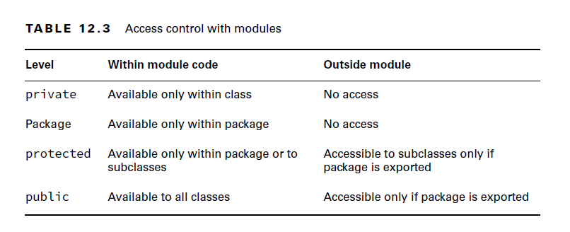
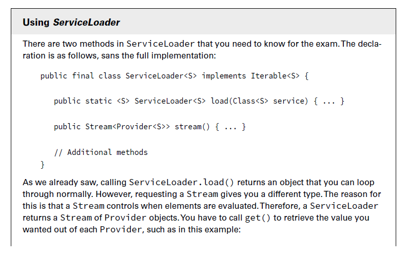
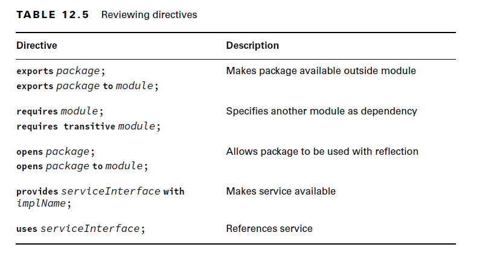
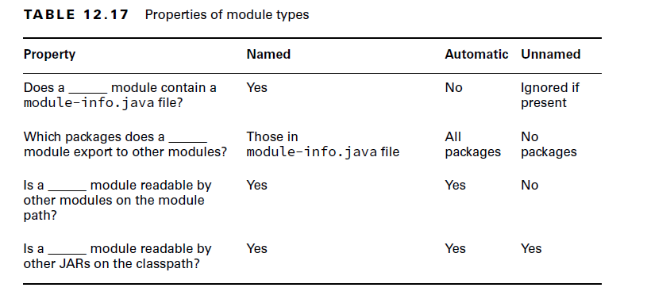
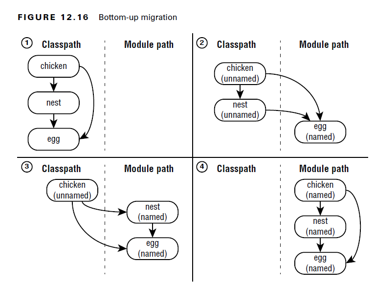

# Modules:


````shell
jar -cvf mods/zoo.animal.feeding.jar -C feeding/ .
java -p mods -m zoo.animal.feeding/zoo.animal.feeding.Task

````




````java
open module zoo.animal.talks {
}

open module zoo.animal.talks {
    opens zoo.animal.talks.schedule; // DOES NOT COMPILE: the packages are already open!
}
````












#### Exam Points:
<details>
<summary>1. How to execute a class inside a module?</summary>

- Given that a class named com.xyz.fx.Main is part of a module named xyz.fx packaged in fx.jar, which of the following commands can be used to execute this class?

````Bash
java -p fx.jar --module xyz.fx/com.xyz.fx.Main
#-p is the short form for --module-path
#-m is the short form for --module
java -classpath fx.jar com.xyz.fx.Main

#Structure of a module jar file is same as the regular jar file. That is why it is possible to treat the jar file of a module as a regular jar file containing classes and run a class that is present in the jar
````

</details>

---

- you are working on an application that is NOT structured as a modular application. 
- However, you need to use a third party library that is packaged as a modular jar named abc.utils.jar in your application.

Given that you launch your application using a class named Main, which of the following options should be used to make sure your application is able to access the classes in the third party jar?
(Assume that abc.utils.jar and your application classes are in current directory.)

````Bash
java -classpath .;abc.utils.jar Main
# A module jar is no different from a regular jar. It contains classes in the same structure and so, it can be used as a regular jar in a non-modular application.
````

---

---
- You are the maintainer of a library packaged as bondanalytics.jar, which is used by several groups in your company. It has the following two packages that are used by other applications:
  com.abc.bonds
  com.abc.bonds.analytics
- You want to modularize this jar with least impact to others. What will you do?
````text
Just add module-info.java to the jar with exports clauses for both the packages.
For example:
module bondanalytics{
  exports com.abc.bonds;
  exports com.abc.bonds.analytics;
}

- If you don't export a package then other modular jars cannot access classes from this jar.
- A modular jar can still be used like a regular jar. So, any non-modular application can use a modularized jar by putting that jar in the classpath just like any other jar.
````

---

---

#### Modules + Sealed Classes rules:
2. If a sealed class C is associated with a named module, then every class specified in the permits clause of C's declaration must be associated with the same module as C, or a compile-time error occurs.
2. If a sealed class C is associated with an unnamed module , then every class specified in the permits clause of C's declaration must belong to the same package as C, or a compile-time error occurs.

---

---
- requires transitive:
- requires transitive <module name> means that any module that reads the module containing this clause implicitly also reads the transitive module. This is very helpful when a module class's method returns a type defined in another module.
- For example, let's say you have two modules finance and accounts. finance module has a class named Report, which returns a list of Accounts through its getAccounts() method. The Account class, on the other hand, is defined in the accounts module.
- Now, any other module that calls Report.getAccounts(), will normally need to have two requires clauses - requires finance; and requires accounts;. But if the finance module contains requires transitive account; clause, the requires accounts; clause will not be necessary. Any module that requires the finance module will automatically allowed to use the accounts module.

---

---
````text
Which of the following is a valid module-info for a service user module that uses an Order service defined in OrderServiceAPI module and implemented by OrderServiceProvider module?
````
-Ans:
````text
//VALID:
module Customer{
   requires OrderServiceAPI;
   uses com.orderservice.api.Order;
}

//VALID:
module Customer{
   requires OrderServiceAPI;
   requires OrderServiceProvider; //the module that uses a service should not even be aware of the module that provides the service.  So, requires OrderServiceProvider; is unnecessary but it is technically valid.
   uses com.orderservice.api.Order;
}
````

### jmod:
````text
Jmod tool has 5 options: create, extract, list, describe, hash.

According to the documentation, JMOD enables aggregating files other than class files, metadata, and resources such as native codes and other things that cannot be stored in a JAR file. Therefore, JMOD files are designed to contain file types that cannot be contained by JAR files. However, unlike JARs, which are executable, the JMOD files cannot be executed. This means this files contained in JMOD can be used only at compile-time or link-time, but not at runtime.
````

## Summary Notes:


    - Every module must reside in a directory (or a jar) of its own. You cannot have more than one module in a directory.
    - Although you may package a module into a jar, put multiple such module jars in a directory, and put that directory (which contains multiple module jars) on the module path.
    - A module can specify packages as well as services.
    - Packages are exported and used using the exports and requires clauses respectively, while services are exported and used using the provides and uses clauses respectively.
    - Modular JDK is helpful in improving performance of an application. The JVM uses various optimization techniques to improve application performance. JSR 376 indicates that these techniques are more effective when it is known in advance that required types are located only in specific modules.
    - Java modules do allow a service consumer to find a service implementation, however, it is not done using dependecy injection. A service consumer has to loop through each available service implementation and pick the one it needs.
    - All subclasses of a sealed class must belong to the same module (or to the same package if the sealed class is not a part of a named module). So, even if a sealed class is visible outside a module, it cannot be extended by classes of other modules.


#### References:
1.  https://blogs.oracle.com/java/modular-development
2. 