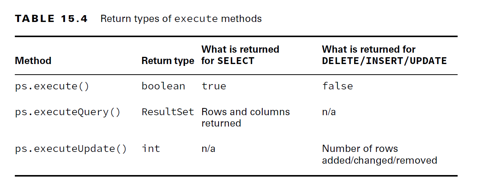
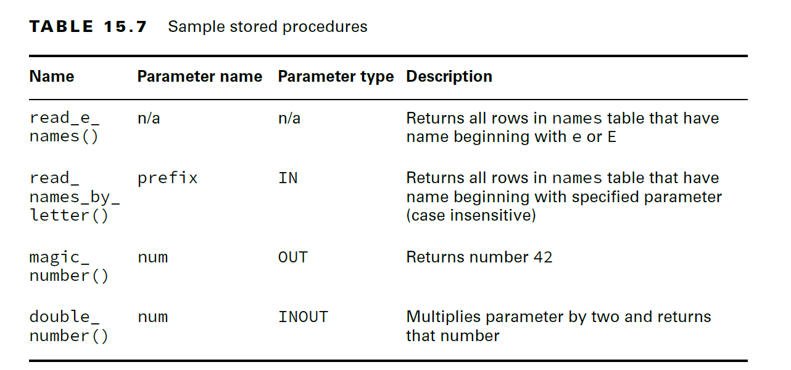

# JDBC:

        1. Driver
        2. DriverManager(only class)
        3. Connection
        4. Statement
        5. Prepared Statement
        6. ResultSet 
        7. Callable Statement

- The interfaces are declared in the JDK.
- This driver JAR contains an implementation of these key interfaces along with a number of other interfaces.
- With JDBC, you use only the interfaces in your code and never the implementation classes directly. In fact, they might not even be public classes.
- Interfaces:

  
    - Driver: Establishes a connection to the database
    - Connection: Sends commands to a database
    - PreparedStatement: Executes a SQL query
    - CallableStatement: Executes commands stored in the database
    - ResultSet: Reads the results of a query

- Using JDBC with Modules:
- if you do want to use JDBC code with modules, remember to update your module-info file to include the following:
````java
  requires java.sql;
```` 
---

<details>
<summary>1. Driver:</summary>

- Driver's implementation class should be provided by vendor
- Explicit loading of driver class is not mandatory from JDBC4.0, it means ``Class.formName(Driver)`` is not required
</details>

---

<details>
<summary>2.DriverManager & 3.Connection :</summary>
- JDBC URL


- Examples:
````java
jdbc:postgresql://localhost/zoo
jdbc:oracle:thin:@123.123.123.123:1521:zoo
jdbc:mysql://localhost:3306
jdbc:mysql://localhost:3306/zoo?profileSQL=true
````

#### DB Connection:
- There are two main ways to get a Connection: DriverManager and DataSource. DriverManager is the one covered on the exam.
- The DriverManager class is in the JDK
- ``Class.formName(Driver)`` is not required from JDBC 4.0
- How to get connection?
- java.sql.DriverManager class provides the following three static methods to retrieve a Connection object:
````java
static Connection getConnection(String url); //Attempts to establish a connection to the given database URL.

static Connection getConnection(String url, Properties info); 

static Connection getConnection(String url, String user, String password); 
````

- the preferred way of getting a Connection is to use a javax.sql.DataSource instead of java.sql.DriverManager.

</details>

---

<details>
<summary>4.Statement & 5.Prepared Statement:</summary>

### PreparedStatement:


- PreparedStatement and CallableStatement both are subinterfaces of Statement.
- A Statement and a PreparedStatement are similar to each other, except that a PreparedStatement takes parameters, while a Statement does not. 
- A Statement just executes whatever SQL query you give it.
- Using the Statement interface directly is not in scope for the JDBC exam
- How to create a Prepared Statement?
- Syntax:
````java
PreparedStatement prepareStatement(String sql); // Creates a PreparedStatement object for sending parameterized SQL statements to the database.

PreparedStatement prepareStatement(String sql, int autoGeneratedKeys);

PreparedStatement prepareStatement(String sql, int[] columnIndexes);

PreparedStatement prepareStatement(String sql, String[] columnNames);

PreparedStatement prepareStatement(String sql, int resultSetType, int resultSetConcurrency);

PreparedStatement prepareStatement(String sql, int resultSetType, int resultSetConcurrency, int resultSetHoldability);

````
- Passing a SQL statement when creating the object is mandatory.
- Examples:

````java
try (var ps = conn.prepareStatement()) { // DOES NOT COMPILE
}
````
- Methods on Prepared Statement:


````java
boolean execute(); // Executes any SQL statement in this PreparedStatement object, return true if ResultSet exists

default long executeLargeUpdate(); // Executes the SQL statement in this PreparedStatement object, which must be an SQL Data Manipulation Language (DML) statement, such as INSERT, UPDATE or DELETE; or an SQL statement that returns nothing, such as a DDL statement.

ResultSet executeQuery(); // Executes the SQL query in this PreparedStatement object and returns the ResultSet object generated by the query.

int executeUpdate(); // Executes the SQL statement in this PreparedStatement object, which must be an SQL Data Manipulation Language (DML) statement, such as INSERT, UPDATE or DELETE; or an SQL statement that returns nothing, such as a DDL statement.
````

- execute method return types:




#### Modifying Data with executeUpdate(): (DELETE, INSERT, or UPDATE.)
- DELETE, INSERT, or UPDATE SQL statements use method called executeUpdate(), which returns number of rows got affected for this query.
````java
var insertSql = "INSERT INTO exhibits VALUES(10, 'Deer', 3)";
var updateSql = "UPDATE exhibits SET name = '' WHERE name = 'None'";
var deleteSql = "DELETE FROM exhibits WHERE id = 10";

try (var ps = conn.prepareStatement(insertSql)) {
    int result = ps.executeUpdate();
    System.out.println(result); // 1: how many rows are affected
}

try (var ps = conn.prepareStatement(updateSql)) {
    int result = ps.executeUpdate();
    System.out.println(result); // 0
}

try (var ps = conn.prepareStatement(deleteSql)) {
    int result = ps.executeUpdate();
    System.out.println(result); // 1
}
````

#### Reading Data with executeQuery(): (SELECT)
- To execute SELECT queries we use executeQuery() method.
- Since we are running a query to get a result, the return type is ResultSet.

````java
var sql = "SELECT * FROM exhibits";
try (var ps = conn.prepareStatement(sql);
    ResultSet rs = ps.executeQuery() ) {

    // work with rs
}
````
#### Processing Data with execute(): (ANY Queries)
- third method called execute() that can run either a query or an update.
- It returns a boolean so that we know whether there is a ResultSet.

````java
boolean isResultSet = ps.execute();
if (isResultSet) {
  try (ResultSet rs = ps.getResultSet()) {
      System.out.println("ran a query");
  }
} else {
  int result = ps.getUpdateCount();
  System.out.println("ran an update");
}
````

#### Working with Parameters:
- JDBC starts counting columns with 1 rather than 0. A common exam question tests that you know this!
- bind variables are counted starting with 1 rather than 0.
- 
````java
public static void register(Connection conn, int key, int type, String name) throws SQLException {
    String sql = "INSERT INTO names VALUES(?, ?, ?)"; //three bind variables.
    try (PreparedStatement ps = conn.prepareStatement(sql)) {
        ps.setInt(1, key); //bind variables are counted starting with 1 rather than 0.
        ps.setString(3, name);
        ps.setInt(2, type);
        ps.executeUpdate();
    }
}
````
- Number of Bind variables and setting values should match otherwise we get SQLException
- If we either don't set values for all the Bind Varaibles or by setting more variables, both cases, the code compiles, and you get a SQLException during runtime.


##### Updating Multiple Records:

````java
var sql = "INSERT INTO names VALUES(?, ?, ?)";
try (var ps = conn.prepareStatement(sql)) {
  ps.setInt(1, 20); // only way to set bind value using index
  ps.setInt(2, 1);
  ps.setString(3, "Ester");
  ps.executeUpdate();
  
  ps.setInt(1, 21);
  ps.setString(3, "Elias");
  ps.executeUpdate();
}
````
</details>

---

<details>
<summary>6. Result Set: </summary>

## ResultSet:
- A ResultSet has a cursor, which points to the current location in the data.


- When working with a ResultSet, most of the time, you will write a loop to look at each row.
- Example:
````java
String sql = "SELECT id, name FROM exhibits";
var idToNameMap = new HashMap<Integer, String>();
try (var ps = conn.prepareStatement(sql); ResultSet rs = ps.executeQuery()) {
    while (rs.next()) {
        int id = rs.getInt("id"); //by column name
        String name = rs.getString(2);//by column number
        idToNameMap.put(id, name);
    }
    System.out.println(idToNameMap);
}
//output: {1=African Elephant, 2=Zebra}
````
- We did say the “best way” to get data was with column names. There is another way to access the columns. You can use an index, counting from 1 instead of a column name.
- When you want only one row, you use an if statement rather than a while loop.
````java
var sql = "SELECT count(*) FROM exhibits";
try (var ps = conn.prepareStatement(sql); var rs = ps.executeQuery()) {
    if (rs.next()) {
        int count = rs.getInt(1);
        System.out.println(count);
    }
}
````
- It is important to check that rs.next() returns true before trying to call a getter on the ResultSet.

````text
- Always use an if statement or while loop when calling rs.next().
- Column indexes begin with 1.
````


</details>

---

<details>
<summary> 7. CallableStatement</summary>

## CallableStatement:

- A stored procedure is code that is compiled in advance and stored in the database.
- stored procedures allow parameters to be for input only, output only, or both.



#### Calling a Procedure without Parameters:

````java
String sql = "{call read_e_names()}";
try (CallableStatement cs = conn.prepareCall(sql); ResultSet rs = cs.executeQuery()) {
    while (rs.next()) {
        System.out.println(rs.getString(3));
    }
}
````

#### Passing an IN Parameter:
````java
var sql = "{call read_names_by_letter(?)}";
try (var cs = conn.prepareCall(sql)) {
    cs.setString("prefix", "Z");
    try (var rs = cs.executeQuery()) {
        while (rs.next()) {
            System.out.println(rs.getString(3));
        }
    }
}
````
#### Returning an OUT Parameter:
````java
var sql = "{?= call magic_number() }";
try (var cs = conn.prepareCall(sql)) {
    cs.registerOutParameter(1, Types.INTEGER);
    cs.execute();
    System.out.println(cs.getInt("num"));
}
````
#### Working with an INOUT Parameter:
````java
var sql = "{?= call double_number(?)}";
try (var cs = conn.prepareCall(sql)) {
    cs.setInt(1, 8);
    cs.registerOutParameter(1, Types.INTEGER);
    cs.execute();
    System.out.println(cs.getInt("num"));
}
````
#### Using Additional Options:

- Both PreparedStatement and CallableStatement support ResultSet type and concurrency options.
- There are three ResultSet integer type values:

        
        1. ResultSet.TYPE_FORWARD_ONLY: Can go through the ResultSet only one row at a time
        
        2. ResultSet.TYPE_SCROLL_INSENSITIVE: Can go through the ResultSet in any order but will not see changes made to the underlying database table

        3. ResultSet.TYPE_SCROLL_SENSITIVE: Can go through the ResultSet in any order and will see changes made to the underlying database table
- There are two ResultSet integer concurrency mode values:


        1. ResultSet.CONCUR_READ_ONLY: The ResultSet cannot be updated.

        2. ResultSet.CONCUR_UPDATABLE: The ResultSet can be updated.
- These options are integer values, not enum values, which means you pass both as additional parameters after the SQL.

````java
conn.prepareCall(sql, ResultSet.TYPE_FORWARD_ONLY, ResultSet.CONCUR_READ_ONLY);

conn.prepareStatement(sql, ResultSet.TYPE_SCROLL_INSENSITIVE, ResultSet.CONCUR_UPDATABLE);
````
- Remember that type always comes first. Also, the methods that take type also take concurrency mode, so be wary of any question that only passes one option.

#### Summary:
- Braces ({})
- Bind variable (?) if it is an OUT parameter
- Call to registerOutParameter()

</details>

---

<details>
<summary>8. Transactions:</summary>

## Controlling Data with Transactions:

- A commit is like saving a file. On the exam, changes commit automatically unless otherwise specified.
- A transaction is when one or more statements are grouped with the final results committed or rolled back. 
- Rollback is like closing a file without saving. All the changes from the start of the transaction are discarded.

````java
public static void main(String[] args) throws SQLException {
    try (Connection conn = DriverManager.getConnection("jdbc:hsqldb:file:zoo")) {
        conn.setAutoCommit(false);
        var elephantRowsUpdated = updateRow(conn, 5, "African Elephant");
        var zebraRowsUpdated = updateRow(conn, -5, "Zebra");
        
        if (! elephantRowsUpdated || ! zebraRowsUpdated)
            conn.rollback();
        else {
            String selectSql = """
                    SELECT COUNT(*)
                    FROM exhibits
                    WHERE num_acres <= 0""";
            
            try (PreparedStatement ps = conn.prepareStatement(selectSql); ResultSet rs = ps.executeQuery()) {
                rs.next();
                int count = rs.getInt(1);
                if (count == 0)
                    conn.commit();
                else
                    conn.rollback();
            } 
        } 
    }
}
        
private static boolean updateRow(Connection conn, int numToAdd, String name) throws SQLException {
     String updateSql = """
            UPDATE exhibits
            SET num_acres = num_acres + ?
            WHERE name = ?""";
     try (PreparedStatement ps = conn.prepareStatement(updateSql)) {
        ps.setInt(1, numToAdd);
        ps.setString(2, name);
        return ps.executeUpdate() > 0;
     } 
}
````

#### Bookmarking with Savepoints:
- So far, we have rolled back to the point where autocommit was turned off. 
- You can use savepoints to have more control of the rollback point.
````java
conn.setAutoCommit(false);
Savepoint sp1 = conn.setSavepoint();
 // database code
Savepoint sp2 = conn.setSavepoint("second savepoint");
 // database code
conn.rollback(sp2);
 // database code
conn.rollback(sp1);
````
- Order matters. If we reversed lines rollback sp1 and sp2, the code would throw an exception.
- Rolling back to sp1 gets rid of any changes made after that, which includes the second savepoint!
- Similarly, calling conn.rollback() on would void both savepoints, and rollback of any savepoint would again throw an exception.


#### Summary:
- calling setAutoCommit(true) will automatically trigger a commit when you are not already in autocommit mode. 
- After that, autocommit mode takes effect, and each statement is automatically committed.
- if you have autocommit set to false and close your connection without rolling back or committing your changes. The answer is that the behavior is undefined.
- It may commit or roll back, depending solely on the driver

</details>

---

<details>
<summary>9. Closing Database Resources</summary>

- The resources need to be closed in a specific order. The ResultSet is closed first, followed by the PreparedStatement (or CallableStatement) and then the Connection.
- While it is a good habit to close all three resources, it isn’t strictly necessary.
- Closing a Connection also closes PreparedStatement (or CallableStatement) and ResultSet.
- Closing a PreparedStatement (or CallableStatement) also closes the ResultSet.
- It is important to close resources in the right order. This avoids both resource leaks and exceptions.

</details>

---

<details>
<summary>Exam Points: </summary>

## Exam Points:
- JDBC Driver JAR must implement the interfaces, Driver, Connection, Statement, PreparedStatement, CallableStatement and ResultSet
- Example-1:
- we get an exception because the driver can’t translate the query into the expected return type.
- We get a SQLException when using executeUpdate() with SQL that executes SELECT query.
- We get a SQLException when using executeQuery() with SQL that changes the database.
````java
var sql = "SELECT * FROM names";
try (var ps = conn.prepareStatement(sql)) {
    var result = ps.executeUpdate();//runtime exception: SQLException: statement does not generate a row count
    //We can’t get a compiler error since the SQL is a String.
}
````

- What about if you try to set more values than you have as bind variables?
- What about if you set fewer values than you have as bind variables?
- Both cases it compiles and throws SQLException during runtime
- How many ways to set Values to Bind Variables?
- Only one way that is by using index which starts from 1
- How many ways to retrieve the data from ResultSet?
- Two Ways: 1. by using column number(starts from 1) and 2. by using column name.

#### ResultSet Workbook
1. Attempting to access a column name or index that does not exist throws a SQLException
````java
var sql = "SELECT count(*) AS count FROM exhibits";
try (var ps = conn.prepareStatement(sql);
    var rs = ps.executeQuery()) {
    if (rs.next()) {
        var count = rs.getInt("total"); // SQLException: column name total not found
        System.out.println(count);
    }
}
````

````java
var sql = "SELECT * FROM exhibits where name='Not in table'";
try (var ps = conn.prepareStatement(sql);
    var rs = ps.executeQuery()) {
    rs.next(); //returns false
    rs.getInt(1); // SQLException
}
````

2. by default ResultSet cursor points at a location before the first row, so calling rs.next() is mandatory otherwise will get SQLException
````java
var sql = "SELECT count(*) FROM exhibits";
try (var ps = conn.prepareStatement(sql); var rs = ps.executeQuery()) {
    rs.getInt(1); // SQLException: rs is pointing before first-row
}
````

</details>


