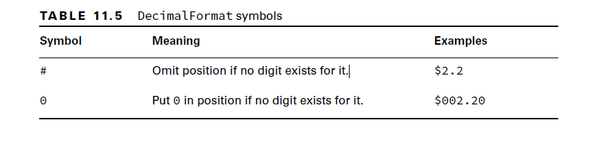

# Localization:

## Formating Values:

- NumberFormat helps you to format and parse numbers for any locale.
-  Your code can be completely independent of the locale conventions for decimal points, thousands-separators, or even the particular decimal digits used, or whether the number format is even decimal.
- NumberFormat is an abstract class

````java
//Below 4 methods returns same general-purpose NumberFormat Object
public static final NumberFormat getInstance();
public static NumberFormat getInstance(Locale inLocale);
public static final NumberFormat getNumberInstance();
public static NumberFormat getNumberInstance(Locale inLocale);

//Returns an integer number format for the current default FORMAT locale. The returned number format is configured to round floating point numbers to the nearest integer using half-even rounding 
public static final NumberFormat getIntegerInstance();
public static NumberFormat getIntegerInstance(Locale inLocale);

public static final NumberFormat getCurrencyInstance();
public static NumberFormat getCurrencyInstance(Locale inLocale);

public static final NumberFormat getPercentInstance();
public static NumberFormat getPercentInstance(Locale inLocale);

public static NumberFormat getCompactNumberInstance();
public static NumberFormat getCompactNumberInstance(Locale locale, NumberFormat.Style formatStyle);


````


- Format and Parse:
- Format takes the number and return String
- Parse: takes the String and returns the Number
````java
public Number parse(String source) throws ParseException; //checked Exception
public abstract Number parse(String source, ParsePosition parsePosition);

public final String format(double number);
public final String format(long number);
public abstract StringBuffer format(double number, StringBuffer toAppendTo, FieldPosition pos);
public abstract StringBuffer format(long number, StringBuffer toAppendTo, FieldPosition pos);

````



````java
double d = 1234.567;
NumberFormat f1 = new DecimalFormat("###,###,###.0");
System.out.println(f1.format(d)); // 1,234.6

NumberFormat f2 = new DecimalFormat("000,000,000.00000");
System.out.println(f2.format(d)); // 000,001,234.56700

NumberFormat f3 = new DecimalFormat("Your Balance $#,###,###.##");
System.out.println(f3.format(d)); // Your Balance $1,234.57
````


- Examples:
````java
int attendeesPerYear = 3_200_000;
int attendeesPerMonth = attendeesPerYear / 12;
var us = NumberFormat.getInstance(Locale.US);
System.out.println(us.format(attendeesPerMonth)); // 266,666
var gr = NumberFormat.getInstance(Locale.GERMANY);
System.out.println(gr.format(attendeesPerMonth)); // 266.666
var ca = NumberFormat.getInstance(Locale.CANADA_FRENCH);
System.out.println(ca.format(attendeesPerMonth)); // 266 666

````