# IO Notes:

## Paths

````java
static void paths(){
    var p1 = Paths.get("C:\\PR\\pg-git-repos\\local-practices\\ocjp17\\IOPathsDemo.java");
    
    System.out.println("File Name: "+p1.getFileName()); //File Name: IOPathsDemo.java
    System.out.println("Path: "+p1); //Path: C:\PR\pg-git-repos\local-practices\ocjp17\IOPathsDemo.java
    System.out.println("Root is: " + p1.getRoot()); //Root is: C:\
    
    System.out.println("getNameCount is: " + p1.getNameCount()); //getNameCount is: 5
    
    System.out.println("=========================Names==========================");
    for(int i=0;i<p1.getNameCount();i++){//Root will be ignored by getNameCount() and getName() methods
        System.out.println("i = "+i+" Path = "+p1.getName(i));
        
    }
    //i = 0 Path = PR
    //i = 1 Path = pg-git-repos
    //i = 2 Path = local-practices
    //i = 3 Path = ocjp17
    //i = 4 Path = IOPathsDemo.java
    
    
    System.out.println("===========================================================");
    // subpath(startInclusive, endExclusive)
    System.out.println("SubPath(0,2): "+p1.subpath(0, 2));//SubPath(0,2): PR\pg-git-repos
    //System.out.println("SubPath(1,3): "+p1.subpath(0, 0));//IllegalArgumentException: start == end
    //System.out.println("SubPath(1,3): "+p1.subpath(0, 10));//IllegalArgumentException: end>count
    System.out.println("SubPath(3,5): "+p1.subpath(3, 5));//SubPath(3,5): ocjp17\IOPathsDemo.java
}
````

## resolve(): concatenate paths in a manner similar to how we concatenate strings.

- p1.resolve(p2); if p2 is absolute paths then it returns output=p2 otherwise it appends p2 to p1 output: p1+p2
- If an absolute path is provided as input to the method, that is the value returned. 
- Simply put, you cannot combine two absolute paths using resolve().
- 
````java
static void resolvePaths(){
    var p1 = Paths.get("C:\\PR\\pg-git-repos\\local-practices\\ocjp17\\IOPathsDemo.java");
    
    var p = Path.of("C:\\PR\\pg-git-repos\\core-java\\..\\local-practices");
    
    System.out.println("Path: "+p);
    System.out.println("Resolve Relative Path: "+p.resolve("ocjp17"));
    System.out.println("Resolve Relative Path: "+p.resolve("../ocjp17"));
    
    System.out.println("Resolve Absolute Path: "+p.resolve("C:\\PR\\pg-git-repos\\ocjp17"));
    
    
}
````

## relativize(): constructing the relative path from one Path to another

- The idea is this: if you are pointed at a path in the file system, what steps would you need to take to reach the other path?
- For example, to get to fish.txt from friendly/birds.txt, you need to go up two levels (the file itself counts as one level) and then select fish.txt.
````text
friendly/birds.txt ==> ../  => friendly
friendly/birds.txt ==> ../../  => ./
````

- If both path values are relative: relativize() method computes the paths as if they are in the same current working directory
- if both path values are absolute, the method computes the relative path from one absolute location to another, regardless of the current working directory.
- For Windows absolute paths Drives(C:\\ or D:\\) also should be the same otherwise throws IllegalArgumentException
- if the types are mixed then it throws an exception: IllegalArgumentException

````java
static void relativizePaths(){
    var path1 = Path.of("fish.txt");
    var path2 = Path.of("friendly/birds.txt");
    System.out.println(path1.relativize(path2));//..\friendly\birds.txt
    System.out.println(path2.relativize(path1));//..\..\fish.txt
    
    Path path3 = Paths.get("E:\\habitat");
    Path path4 = Paths.get("E:\\sanctuary\\raven\\poe.txt");
    System.out.println(path3.relativize(path4));//..\sanctuary\raven\poe.txt
    System.out.println(path4.relativize(path3));//..\..\..\habitat
    
    Path path5 = Paths.get("/primate/chimpanzee");
    Path path6 = Paths.get("bananas.txt");
    System.out.println(path5.relativize(path6)); // IllegalArgumentException: 'other' is different type of Path

    Path path7 = Paths.get("C:\\primate\\chimpanzee");
    Path path8 = Paths.get("D:\\storage\\bananas.txt");
    path7.relativize(path8); // IllegalArgumentException
}
````

## normalize(): eliminate unnecessary redundancies in a path.

````java
var p1 = Path.of("./armadillo/../shells.txt");
System.out.println(p1.normalize()); // shells.txt

var p2 = Path.of("/cats/../panther/food");
System.out.println(p2.normalize()); // /panther/food

var p3 = Path.of("../../fish.txt");
System.out.println(p3.normalize()); // ../../fish.txt

var p1 = Paths.get("/pony/../weather.txt");
var p2 = Paths.get("/weather.txt");
System.out.println(p1.equals(p2)); // false
System.out.println(p1.normalize().equals(p2.normalize())); // true

````

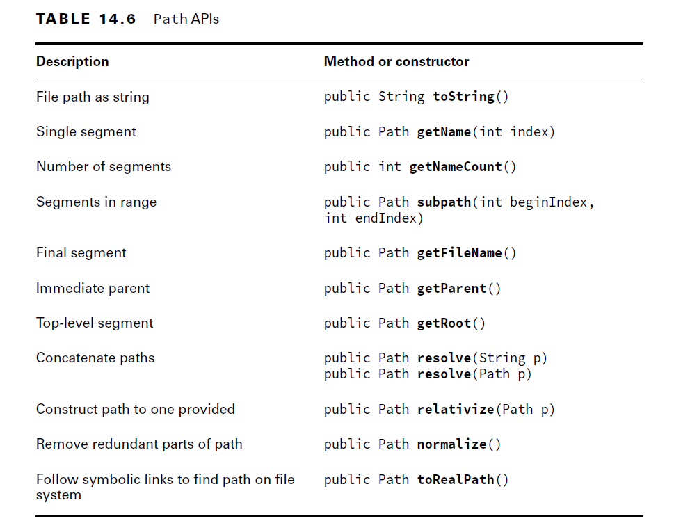

- __createDirectory():__ method will create a directory and throw an exception if it already exists or if the paths leading up to the directory do not exist.
- __createDirectories():__ method creates the target directory along with any nonexistent parent directories leading up to the path. 
- If all of the directories already exist, createDirectories() will simply complete without doing anything.
- This is useful in situations where you want to ensure a directory exists and create it if it does not.

````java
Files.createDirectory(Path.of("/bison/field"));
Files.createDirectories(Path.of("/bison/field/pasture/green"));
````

- copying files:
````java
public static Path copy(Path source, Path target, CopyOption... options) throws IOException;
Files.copy(Paths.get("/turtle"), Paths.get("/turtleCopy")); //shallow Copy
````

- A shallow copy means that the files and subdirectories within the directory are not copied. 
- A deep copy means that the entire tree is copied, including all of its content and subdirectories. 
- A deep copy typically requires recursion, where a method calls itself.

````java
Files.copy(Paths.get("book.txt"), Paths.get("movie.txt"), StandardCopyOption.REPLACE_EXISTING);
````

- Streams:

````java
public static long copy(InputStream in, Path target, CopyOption... options) throws IOException;

public static long copy(Path source, OutputStream out) throws IOException;
````

#### understand how the copy() or move() method operates on both files and directories.

````java
var file = Paths.get("food.txt");
var directory = Paths.get("/enclosure");
Files.copy(file, directory);
````

- if ``/enclosure`` exists it throws an exception otherwise it will create a file named ``enclosure`` and copies the`` food.txt`` content to it.
- Valid Copy to Directory:
````java
var file = Paths.get("food.txt");
var directory = Paths.get("/enclosure/food.txt");
Files.copy(file, directory);
````

### Moving or Renaming Paths with move():

````java
public static Path move(Path source, Path target, CopyOption... options) throws IOException
````

- Examples:

````java
Files.move(Path.of("C:\\zoo"), Path.of("C:\\zoo-new")); //Renaming
Files.move(Path.of("C:\\user\\addresses.txt"), Path.of("C:\\zoo-new\\addresses2.txt")); //Move
````

- Like copy(), move() requires REPLACE_EXISTING to overwrite the target if it exists; otherwise, it will throw an exception. 
- Also like copy(), move() will not put a file in a directory if the source is a file and the target is a directory. 
- Instead, it will create a new file with the name of the directory.

````java
Files.move(Path.of("mouse.txt"), Path.of("gerbil.txt"), StandardCopyOption.ATOMIC_MOVE);
````

- An atomic move is one in which a file is moved within the file system as a single indivisible operation. 
- Put another way, any process monitoring the file system never sees an incomplete or partially written file. 
- If the file system does not support this feature, an AtomicMoveNotSupportedException will be thrown.

## Deleting a File with delete() and deleteIfExists():
- delete a file or empty directory within the file system.

````java
public static void delete(Path path) throws IOException;

public static boolean deleteIfExists(Path path) throws IOException;
````

- To delete a directory, it must be empty. Both of these methods throw an exception if operated on a nonempty directory.

````java
Files.delete(Path.of("h1.txt"));
Files.delete(Path.of("h9.txt")); //NoSuchFileException: h9.txt
Files.delete(Path.of("d1")); //d1 is empty dir
Files.delete(Path.of("d2")); //.DirectoryNotEmptyException: d2
System.out.println(Files.deleteIfExists(Path.of("h2.txt")));//true
System.out.println(Files.deleteIfExists(Path.of("h10.txt")));//false
System.out.println(Files.deleteIfExists(Path.of("d3"))); //d3 is empty dir: true
System.out.println(Files.deleteIfExists(Path.of("d4"))); //DirectoryNotEmptyException: d4
````

- The delete() method throws an exception if the path does not exist, while the deleteIfExists() method returns true if the delete was successful or false otherwise.
- Similar to createDirectories(), deleteIfExists() is useful in situations where you want to ensure that a path does not exist and delete it if it does.

## Byte Streams and Char Streams:
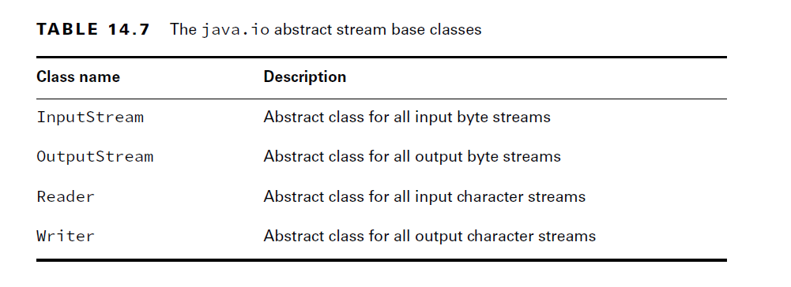

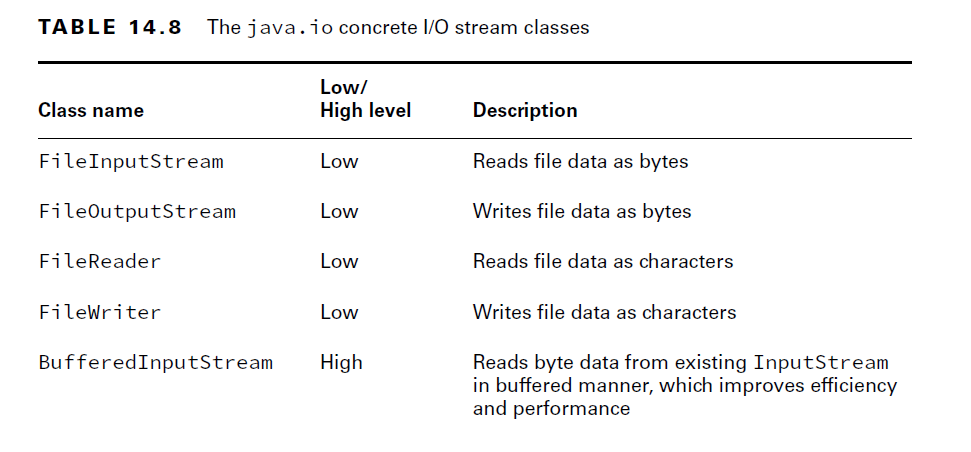
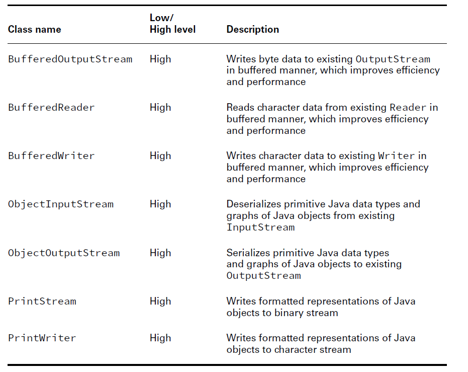

### InputStream:

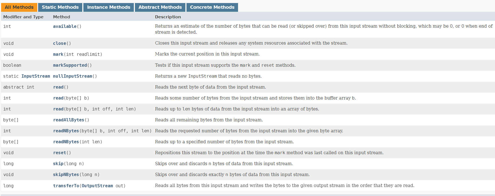

### Char Streams:

#### Reader

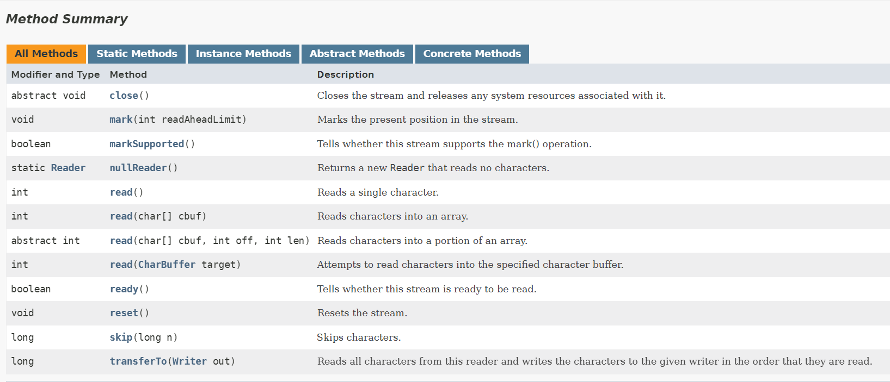


#### Buffered Reader: High-Level IO Streams:

````java
try (var br = new BufferedReader(new FileReader("zoo-data.txt"))) {
    System.out.println(br.readLine());
}
````

````java
void copyTextFile(File src, File dest) throws IOException {
    try (var reader = new BufferedReader(new FileReader(src));
        var writer = new BufferedWriter(new FileWriter(dest))) {
        String line = null;
        while ((line = reader.readLine()) != null) {
            writer.write(line);
            writer.newLine();
        }
    }
}
````

- Using PrintWriter:
````java
void copyTextFile(File src, File dest) throws IOException {
    try (var reader = new BufferedReader(new FileReader(src));
        var writer = new PrintWriter(new FileWriter(dest))) {
        String line = null;
        while ((line = reader.readLine()) != null)
        writer.println(line);
    }
}
````

- Files:
````java
private void copyPathAsString(Path input, Path output) throws IOException {
    String string = Files.readString(input);
    Files.writeString(output, string);
}

private void copyPathAsBytes(Path input, Path output) throws IOException {
    byte[] bytes = Files.readAllBytes(input);
    Files.write(output, bytes);
}
private void copyPathAsLines(Path input, Path output) throws IOException {
    List<String> lines = Files.readAllLines(input);
    Files.write(output, lines);
}
````
- You can read a Path as a String, a byte array, or a List. 
- Be aware that the entire file is read at once for all three of these, thereby storing all of the contents of the file in memory at the same time. 
- If the file is significantly large, you may trigger an OutOfMemoryError when trying to load all of it into memory.

````java
private void readLazily(Path path) throws IOException {
    try (Stream<String> s = Files.lines(path)) {
        s.forEach(System.out::println);
    }
}
````

````java
public static Stream<String> lines(Path path) throws IOException; //lazy reading
public static List<String> readAllLines(Path path) throws IOException; //complete file read at once in-memory
Files.readAllLines(Paths.get("birds.txt")).forEach(System.out::println);
Files.lines(Paths.get("birds.txt")).forEach(System.out::println);
````


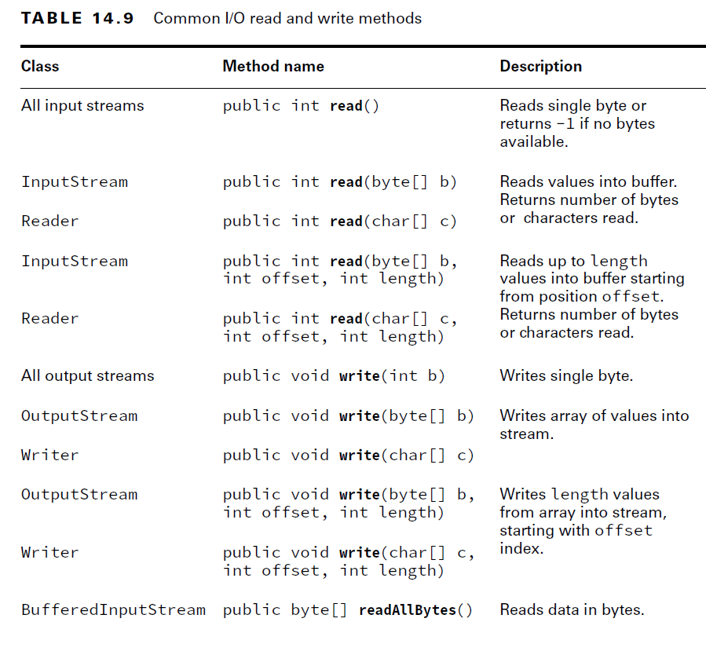

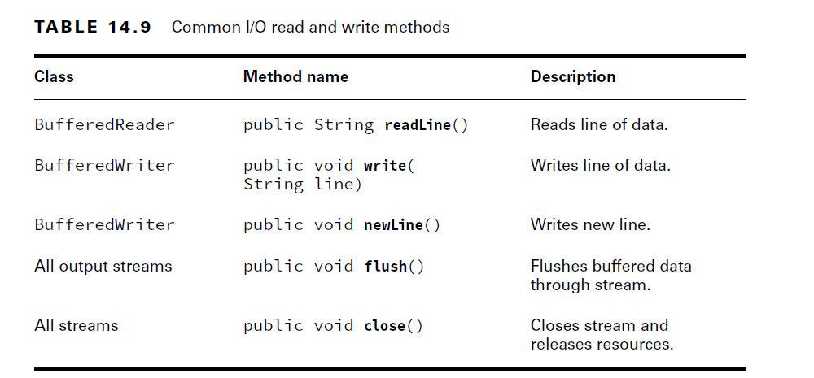

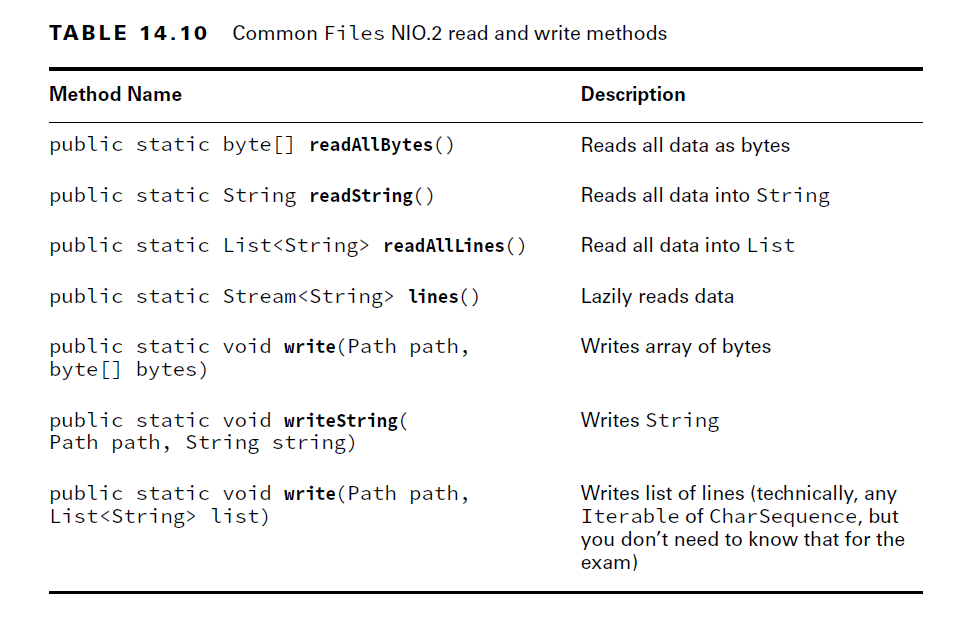


## Serialization:

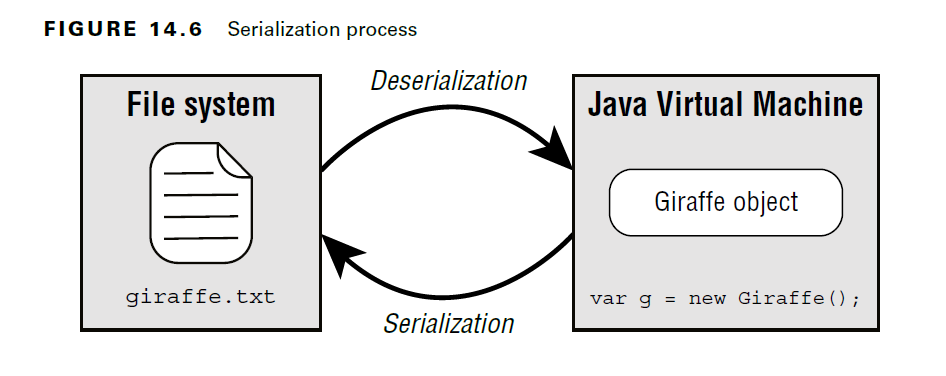

- The purpose of using the Serializable interface is to inform any process attempting to
  serialize the object that you have taken the proper steps to make the object serializable.

````java
import java.io.Serializable;
public class Gorilla implements Serializable {
    private static final long serialVersionUID = 1L;
    private String name;
    private int age;
    private Boolean friendly;
    private transient String favoriteFood; //Any field that is marked transient will not be saved to an I/O stream when the class is serialized.
    // Constructors/Getters/Setters/toString() omitted
}
````

- Marking static fields transient has little effect on serialization. Other than the serialVersionUID, only the instance members of a class are serialized.

- Any process attempting to serialize an object will throw a NotSerializableException if the class does not implement the Serializable interface properly.
- How to Make a Class Serializable
  
        - The class must be marked Serializable.
        - Every instance member of the class must be serializable, marked transient, or have a null value at the time of serialization.
        - Non-Serializable Parent class should contain No-Args Constructor otherwise: InvalidClassException: B; no valid constructor
        - if parent is serializable then subclass is by default serializable

````java
public class Cat implements Serializable {
    private Tail tail = new Tail();
}
public class Tail implements Serializable {
    private Fur fur = new Fur();
}
public class Fur {}
//cat is not serializable becuase of Fur is not serializable
````

- Fix: 
````java
public class Tail implements Serializable {
    private transient Fur fur = new Fur();
}
//OR

public class Fur implements Serializable {}

````

````java
record Record(String name) implements Serializable {}
````

### Storing Data with ObjectOutputStream and ObjectInputStream:

````java
// ObjectInputStream
public Object readObject() throws IOException, ClassNotFoundException;
// ObjectOutputStream
public void writeObject(Object obj) throws IOException;
````

````java
void saveToFile(List<Gorilla> gorillas, File dataFile) throws IOException {
    try (var out = new ObjectOutputStream( new BufferedOutputStream( new FileOutputStream(dataFile)))) {
        for (Gorilla gorilla : gorillas)
            out.writeObject(gorilla);
    }
}
````

- Read from file:
````java
List<Gorilla> readFromFile(File dataFile) throws IOException, ClassNotFoundException {
    var gorillas = new ArrayList<Gorilla>();
    try (var in = new ObjectInputStream(new BufferedInputStream( new FileInputStream(dataFile)))) {
        while (true) {
            var object = in.readObject();
            if (object instanceof Gorilla g)
                gorillas.add(g);
        }
    } catch (EOFException e) {
    // File end reached
    }
return gorillas;
}
````

- Deserialization Rules:

- When you deserialize an object, the constructor of the serialized class, along with any instance initializers are not called when the object is created.
- Java will call the no-arg constructor of the first **non-serializable parent class** it can find in the class hierarchy.
- any static or transient fields are ignored.
- Values that are not provided will be given their default Java value, such as null for String, or 0 for int values.

````java
import java.io.Serializable;
public class Chimpanzee implements Serializable {
  private static final long serialVersionUID = 2L;
  private transient String name;
  private transient int age = 10;
  private static char type = 'C';
  { this.age = 14; }

  public Chimpanzee() {
    this.name = "Unknown";
    this.age = 12;
    this.type = 'Q';
  }
  public Chimpanzee(String name, int age, char type) {
    this.name = name;
    this.age = age;
    this.type = type;
  }
// Getters/Setters/toString() omitted
}
````

````java
var chimpanzees = new ArrayList<Chimpanzee>();
chimpanzees.add(new Chimpanzee("Ham", 2, 'A'));
chimpanzees.add(new Chimpanzee("Enos", 4, 'B'));
File dataFile = new File("chimpanzee.data");
saveToFile(chimpanzees, dataFile);
var chimpanzeesFromDisk = readFromFile(dataFile);
System.out.println(chimpanzeesFromDisk);
//[[name=null,age=0,type=B],
//[name=null,age=0,type=B]]
````


### Interacting with Users:

- The System.in returns an InputStream and is used to retrieve text input from the user.
- It is commonly wrapped with a BufferedReader via an InputStreamReader to use the readLine() method.

````java
var reader = new BufferedReader(new InputStreamReader(System.in));
String userInput = reader.readLine();
System.out.println("You entered: " + userInput);
````

- Console:
````java
public String readLine()
public String readLine(String fmt, Object... args)
public char[] readPassword()
public char[] readPassword(String fmt, Object... args)
````


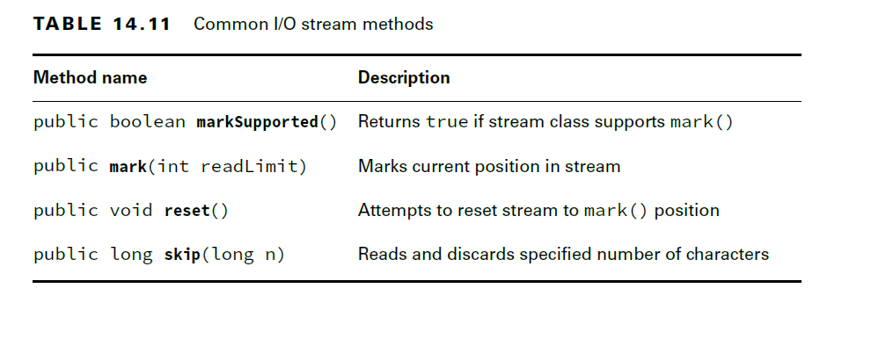


````java
public static Stream<Path> find(Path start, int maxDepth, BiPredicate<Path, BasicFileAttributes> matcher, FileVisitOption... options) throws IOException;
Path path = Paths.get("/bigcats");
long minSize = 1_000;
try (var s = Files.find(path, 10, (p, a) -> a.isRegularFile() && p.toString().endsWith(".java")
        && a.size() > minSize)) {
        s.forEach(System.out::println);
}
````


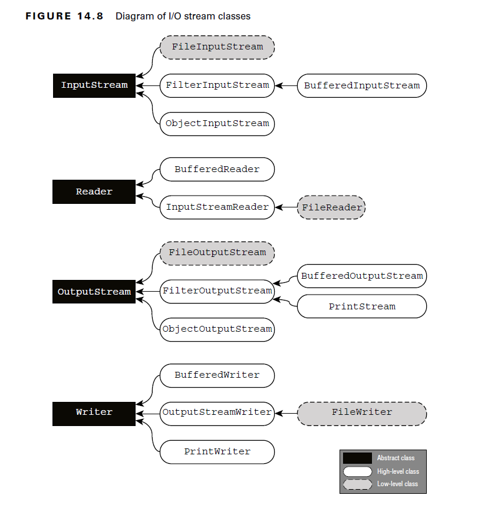


