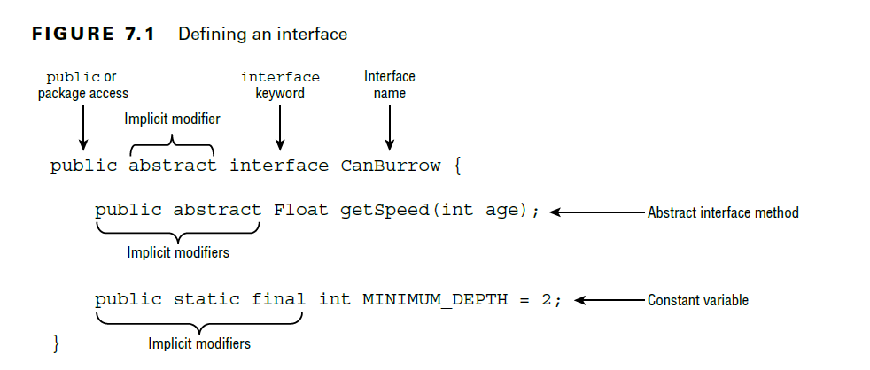
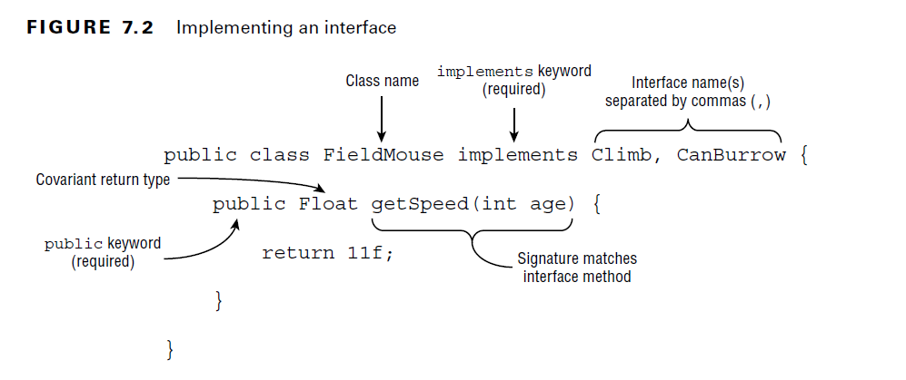
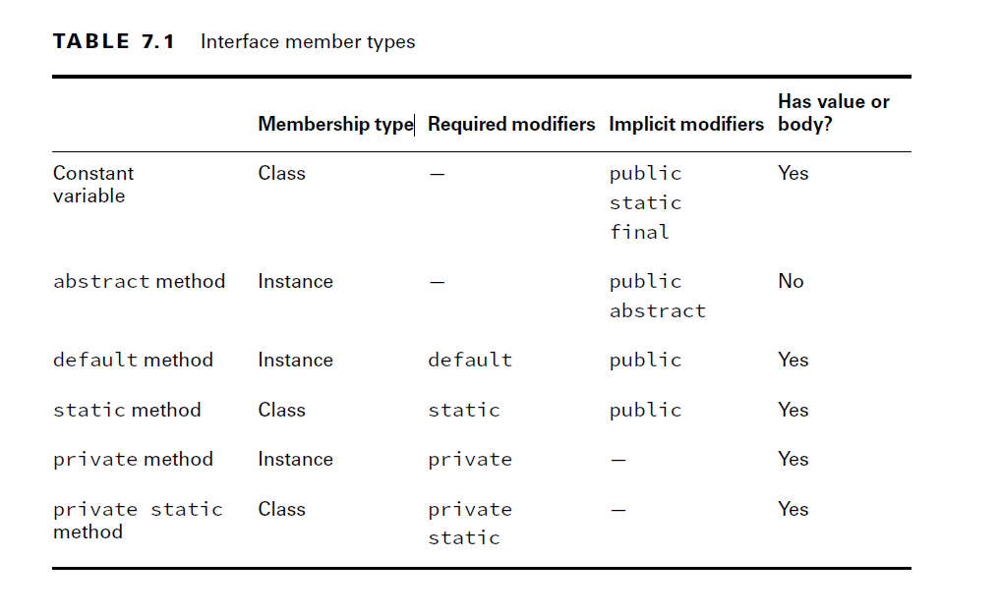
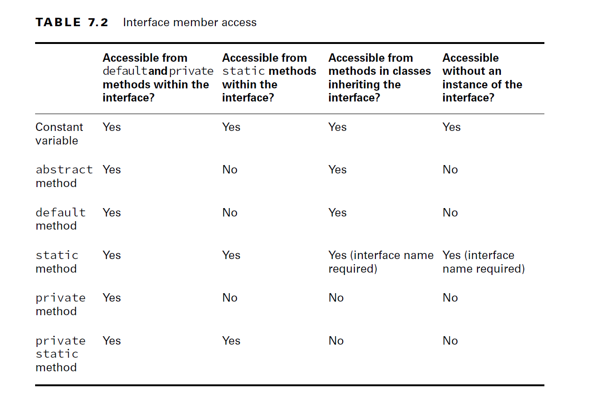
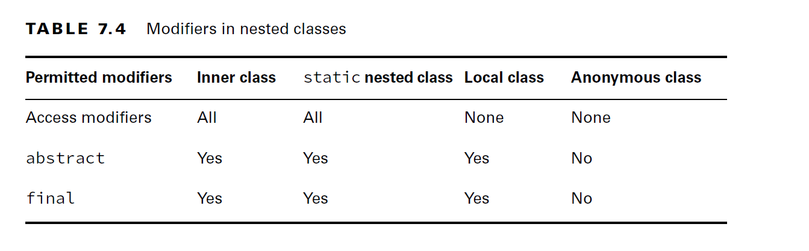
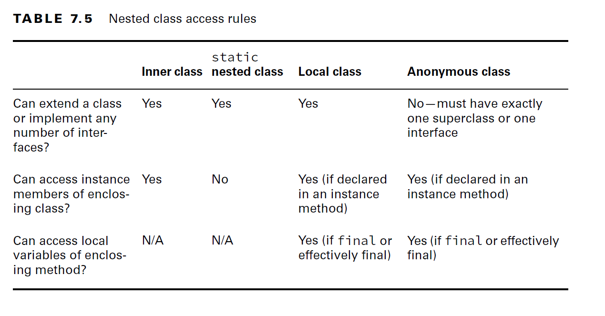
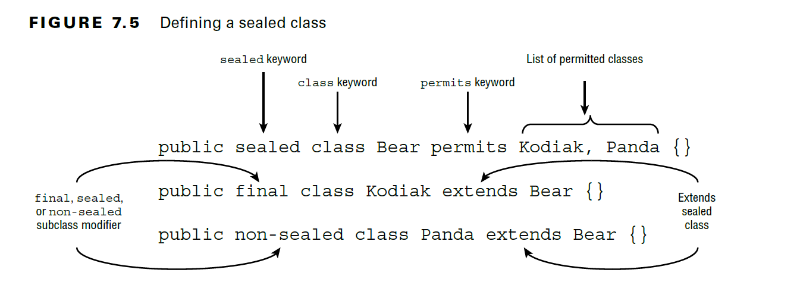
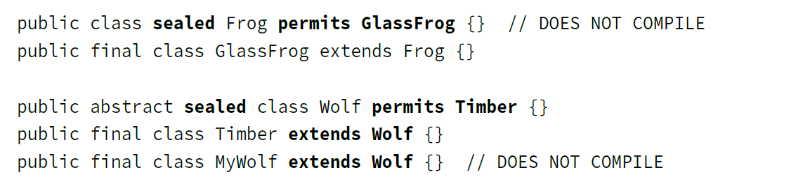

# Java Types:

        1. Classes
        2. Interfaces
        3. Enums
        4. Nested Classes
        5. Records
        6. sealed and non-sealed classes & interfaces


<details>
<summary>1. Classes:</summary>


</details>

___


<details>
<summary>2. Interfaces: </summary>





#### Inheriting Duplicate Abstract Methods:

````java
public interface Herbivore { public void eatPlants(); }
public interface Omnivore { public void eatPlants(); }

public class Bear implements Herbivore, Omnivore {
  public void eatPlants() {
    System.out.println("Eating plants");
  }
}
//Two interfaces are compatible. Below are incompatible due to different method declarations

public interface Herbivore { public void eatPlants(); }
public interface Omnivore { public int eatPlants(); }
public class Tiger implements Herbivore, Omnivore { // DOES NOT COMPILE
    
}

````

#### Interface Implicit Modifiers:

- An implicit modifier is a modifier that the compiler automatically inserts into the code.
  For example, an interface is always considered to be abstract, even if it is not marked so.
        
      - Interfaces are implicitly abstract.
 
      - Interface variables are implicitly public, static, and final.
 
      - Interface methods without a body are implicitly abstract.
 
      - Interface methods without the private modifier are implicitly public.


#### Declaring Concrete Interface Methods:

- Interface member types:



- interfaces now support private methods. They do not support package and protected access

#### Default Interface Method Definition Rules:


    1. A default method may be declared only within an interface.

    2. A default method must be marked with the default keyword and include a method body.

    3. A default method is implicitly public.

    4. A default method cannot be marked abstract, final, or static.

    5. A default method may be overridden by a class that implements the interface.

    6. If a class inherits two or more default methods with the same method signature, then the class must override the method.

#### Inheriting Duplicate default Methods:

````java
public interface Walk {
    public default int getSpeed() { return 5; }
}
public interface Run {
    public default int getSpeed() { return 10; }
}
public class Cat implements Walk, Run {} // DOES NOT COMPILE: 
//it is not clear whether the code should output 5 or 10.

//Solution:1 overriding by class
public class Cat implements Walk, Run {
  public int getSpeed() { return 1; }
}

//Solution:2 By using Interface name with super keyword

public class Cat implements Walk, Run {
  public int getSpeed() {
    return 1;
  }
  public int getWalkSpeed() {
    return Walk.super.getSpeed();
  } 
}
````

#### Static Interface Method Definition Rules:

    1. A static method must be marked with the static keyword and include a method body.

    2. A static method without an access modifier is implicitly public.

    3. A static method cannot be marked abstract or final.

    4. A static method is not inherited and cannot be accessed in a class implementing the interface without a reference to the interface name.


- Example for Rule-4:

````java
public interface Hop {
  static int getJumpHeight() {
    return 8;
  } 
}

public class Bunny implements Hop {
  public void printDetails() {
    System.out.println(getJumpHeight()); // DOES NOT COMPILE: Static methods are not inherited, so you have to use Interface name to access the static members
    System.out.println(Hop.getJumpHeight());//WORKS
  } 
}
````

#### Private Interface Method Definition Rules:

    1. A private interface method must be marked with the private modifier and include a method body.

    2. A private static interface method may be called by any method within the interface definition.

    3. A private interface method may only be called by default and other private non-static methods within the interface definition.

- a private interface method is only accessible to non-static methods defined within the interface. A private static interface method, on the other hand, can be accessed by any method in the interface.
- For both types of private methods, a class inheriting the interface cannot directly invoke them.
- default and private non-static methods can access abstract methods declared in the interface. This is the primary reason we associate these methods with instance membership.

````java
public interface ZooRenovation {
    public String projectName();
    abstract String status();
    default void printStatus() {
        System.out.print("The " + projectName() + " project " + status());
    } 
}
````



- quick tips for the exam:

      - Treat abstract, default, and non-static private methods as belonging to an instance of the interface.
      - Treat static methods and variables as belonging to the interface class object.
      - All private interface method types are only accessible within the interface declaration.


</details>

___


<details>
<summary>3. Enums: </summary>


</details>

---

<details>
<summary>4. Nested Classes:</summary>

## 3. Nested Classes:
- A nested class is a class that is defined within another class.

        - Inner class: A non-static type defined at the member level of a class
        - Static nested class: A static type defined at the member level of a class
        - Local class: A class defined within a method body
        - Anonymous class: A special case of a local class that does not have a name
- the term nested class to refer to all nested types, including nested interfaces, enums, records, and annotations.
- You might even come across literature that refers to all of them as inner classes.






#### 1. Inner Classes

- An inner class, also called a member inner class, is a non-static type defined at the member level of a class (the same level as the methods, instance variables, and constructors).

- Since an inner class is not static, it has to be called using an instance of the outer class. That means you have to create two objects.
- Examples:

````java
public class Home {
    private String greeting = "Hi"; // Outer class instance variable

    protected class Room { // Inner class declaration
        public int repeat = 3;
        public void enter() {
            for (int i = 0; i < repeat; i++) greet(greeting);
        }
        private static void greet(String message) {
            System.out.println(message);
        }
    }

    public void enterRoom() { // Instance method in outer class
        var room = new Room(); // Create the inner class instance
        room.enter();
    }
    public static void main(String[] args) {
        var home = new Home(); // Create the outer class instance
        home.enterRoom();
    } 
}
````

- How to create an instance of inner classes?
````java
public static void main(String[] args) {
    var home = new Home();
    Room room = home.new Room(); // Create the inner class instance
    room.enter();
    //or
    new Home().new Room().enter();
}
````
- **Note: Nested Classes Can Now Have static Members**
- Inner classes can have the same variable names as outer classes, making scope a little tricky.

````java
public class A {
    private int x = 10;
    class B {
        private int x = 20;
        class C {
            private int x = 30;
            public void allTheX() {
                System.out.println(x); // 30
                System.out.println(this.x); // 30
                System.out.println(B.this.x); // 20
                System.out.println(A.this.x); // 10
            } 
        } 
    }
    public static void main(String[] args) {
        A a = new A();
        A.B b = a.new B();
        A.B.C c = b.new C();
        c.allTheX();
    }
}
````

- Inner Classes Require an Instance:

````java
public class Fox {
    private class Den {}
    public void goHome() {
        new Den();//allowed because called from instance method
    }
    public static void visitFriend() {
     new Den(); // DOES NOT COMPILE: from static method
    }
}
public class Squirrel {
    public void visitFox() {
        new Den(); // DOES NOT COMPILE: outside of class scope + Den class is private
    }
}
````

### 2. static Nested Class:

- A static nested class is a static type defined at the member level.
- Unlike an inner class, a static nested class can be instantiated without an instance of the enclosing class.
- The trade-off, though, is that it can’t access instance variables or methods declared in the outer class.
- Examples:

````java
public class Park {
    private String greet = "hello";
    static class Ride {
        private int price = 6;

        void greet(){
            //System.out.println(greet); // DOES NOT COMPILE: error: non-static variable greet cannot be referenced from a static context

            System.out.println(new Park().greet); //WORKS
        }
    }
    public static void main(String[] args) {
        var ride = new Ride(); //directly created because of static nested class
        new Park.Ride().greet(); //WORKS
        System.out.println(ride.price);
        //new Park().new Ride(); //DOES NOT COMPILE:  qualified new of static class
    }
}
````

### 3. Local Class

- A local class is a nested class defined within a method, constructors, and initializers.
- Like local variables, a local class declaration does not exist until the method is invoked, and it goes out of scope when the method returns. 
- This means you can create instances only from within the method. Those instances can still be returned from the method. 
- This is just how local variables work.

- Examples:
````java
public class PrintNumbers {
    private int length = 5;
    public void calculate() {
        length=10; //WORKS
        final int width = 20;
        int x = 10;
        class Calculator {
            public void multiply() {
                System.out.print(length * width); //WORKS
                System.out.print(length * width*x);// DOES NOT COMPILE: error: local variables referenced from an inner class must be final or effectively final
            }
        }
        var calculator = new Calculator();
        calculator.multiply();
        x=20;
    }

    public static void addition(){

        class Calculator {
            public void add() {
                System.out.print(length+10); //DOES NOT COMPILE: non-static variable length cannot be referenced from a static context
            }
        }
        var cal = new Calculator();
        cal.add();
    }
    public static void main(String[] args) {
        var printer = new PrintNumbers();
        printer.calculate(); // 100
        printer.addition();
    }
}
````

#### Why Can Local Classes Only Access final or Effectively Final Variables?
- Earlier, we mentioned that the compiler generates a separate .class file for each inner class. 
- A separate class has no way to refer to a local variable. 
- However, if the local variable is final or effectively final, Java can handle it by passing a copy of the value or reference variable to the constructor of the local class. 
- If it weren’t final or effectively final, these tricks wouldn’t work because the value could change after the copy was made.

### 4. Anonymous Class

- An anonymous class is a specialized form of a local class that does not have a name. 
- It is declared and instantiated all in one statement using the new keyword, a type name with parentheses, and a set of braces {}. 
- Anonymous classes must extend an existing class or implement an existing interface. 
- They are useful when you have a short implementation that will not be used anywhere else.
- Example: Abstract class

````java
public class ZooGiftShop {
    abstract class SaleTodayOnly {
        abstract int dollarsOff();
    }
    public int admission(int basePrice) {
        SaleTodayOnly sale = new SaleTodayOnly() {
            int dollarsOff() { return 3; }
        }; // Don't forget the semicolon!
        return basePrice -sale.dollarsOff();
    }
}
````

- Example: Interface:
````java
public class ZooGiftShop {
    interface SaleTodayOnly {
        int dollarsOff();
    }
    public int admission(int basePrice) {
        SaleTodayOnly sale = new SaleTodayOnly() {
            public int dollarsOff() { return 3; } //it should be marked as public because all interface methods are public access level
        }; // Don't forget the semicolon!
        return basePrice -sale.dollarsOff();
    }
}
````

- The anonymous class is the same whether you implement an interface or extend a class! Java figures out which one you want automatically.
- what if we want to both implement an interface and extend a class? You can’t do so with an anonymous class unless the class to extend is java.lang.Object.
- You can even define anonymous classes outside a method body.

````java
public class Gorilla {
    interface Climb {}
    Climb climbing = new Climb() {};
}
````

#### Exam Points:
- A static nested class can contain a non - static inner class.
- Methods in all nested classes can be declared static.
- A nested class may be sealed. Yes, it is allowed as long as the class fulfills other requirements of a sealed class.
- In general, there is no restriction on what a nested class may or may not extend.

</details>

___

<details>

<summary> 4. Enums:</summary>

## 4. Enums:


#### WorkBooks:

````java
enum Title
{
    MR("Mr."), MS1("Ms."),AB("A"), MS2("Ms.");
    private String title;
    private Title(String s){
    title = s;
    }  
}

public class TestClass{
    public static void main(String[] args) {
        var ts = new TreeSet<Title>();
        ts.add(Title.MS2);
        ts.add(Title.MR);
        ts.add(Title.MS1);
        for(Title t :  ts){
            System.out.println(t);
        }
    }
}
//Output: MR,MS1,AB,MS2 this is the order which they are defined.
````
#### Examp Points:

- Every enum implements Comparable and the natural order of enums is **the order in which they are defined**.
- An enum with many constructors, fields, and methods may start to resemble a full-featured class.
</details>

---


<details>

<summary> 6. Sealed Classes</summary>

- A sealed class is a class that restricts which other classes may directly extend it.
- there is a way for a class not named in the sealed class declaration to extend it indirectly.
- we’re referring to subclasses that directly extend the sealed class.
- Is there any indirect way? Yes
- A sealed class declares a list of classes that can extend it, while the subclasses declare that they extend the sealed class



- Examples:



- Sealed classes are commonly declared with the abstract modifier, although this is certainly not required.
- 


</details>

---
